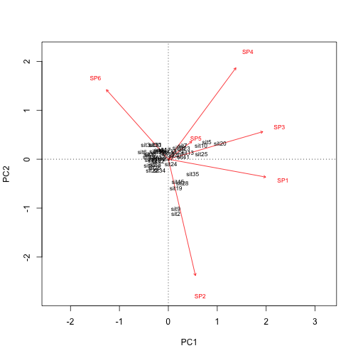
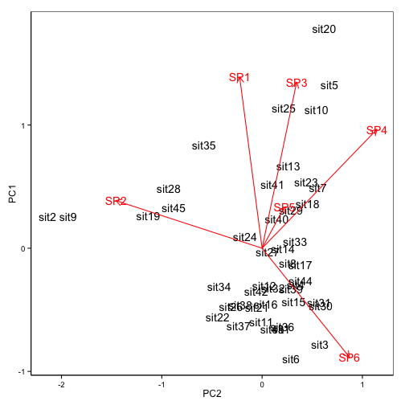

Day 3 - Bayesian
==================

```r
setwd("~/Documents/Monash/PhD/R/MurrayLoganStatCourse14")
```

With frequentist it is almost impossible *not* to disprove the null-hypothesis, as the probability of the data is calculated from the data. We are not interested in the sample, we are interested in the population. 

```
                   *Frequentist*       *Bayesian*
Observed data     One possible          Fixed, true
Parameters        Fixed, true           Random, distribution
Inferences        Data                  Parameters
Probability       Long-run frequence    Degree of belief
                    $(P|H)$               $P(H|D)$
```

With the Frequentist approach you get one point value for the slope, with the Bayesian you get a distribution. When 90% of this distribution lies above or below zero, you can consider that there is an effect in the data. 


*Bayes rule*

*P*(*H*|*D*) = (*P*(*D*|*H*) * P(*H*)) / *P*(*D*)

posterior probability = ( likelyhood x prior probability) / normalizing constant

Propability distribution: area under curve must be 1
Likelihood distribution: are under curve is unknown

Above formula normalizes the area under the curve and makes it equal to 1

**Bayesian is robust to:**

> unequal sample sizes

> balance

> collinearity

> pair-wise comparisons (no need for *post-hoc* tests)


**MCMC-Sampling**

Random walks on distribution. Will always accept a position with a higher probability and whether or not a lower probability point is accepted depends on the actual likelihood of that point. For this reason, we will get a better overview of more probable parts of the distribution. 
This chain of walks is called a chain!
- Run 3 chains to make sure this is the distribution
- Burning: run for example for a 1000 steps (50% of the actual iterations you want to run) and see what an appropriate distance per step is. After this burning, chuck this burning run out.
- Number of iterations: determined by diagnostics that are run

Start with 10000 iterations and make trace plots:
- needs to be total chaos, when not, include more iterations
- needs to be repeatable

Autocorrelation
- ACF plot
- thinning, thinning factor 10 means only sample every 10th point. When thinning, make sure to increase the number of iterations.

Distribution plots
- multiple modes --> not one single population sampled
- highly skewed --> take median or mode
- area under curve is 1
- credibility intervals (same as confidence interval)

MCMCglmm is not too highly developed in R... Alternative is WinBUGS or JAGS (C++). These programs use a Gibbs sampler. This changes one parameter at a time (for example first intercept, then slope). Better samplers exist, one of which is implemented in STAND. 

In C++ not everything has to be scripted in the same order, but everything **will be run simultaneously**

JAGS can be run through other platforms requires and 3 inputs:
- file with model statement
- data in the form of a list
- parameters that define the run (number of iterations, burning etc)

From R: R2Jags

Start as simple as possible, get something to compare to

```r
fert <- read.csv('fertilizer.csv',strip.white=T)
summary(lm(YIELD~FERTILIZER,data=fert))
```

```
## 
## Call:
## lm(formula = YIELD ~ FERTILIZER, data = fert)
## 
## Residuals:
##    Min     1Q Median     3Q    Max 
## -22.79 -11.07  -5.00  12.00  29.79 
## 
## Coefficients:
##             Estimate Std. Error t value Pr(>|t|)    
## (Intercept) 51.93333   12.97904   4.001  0.00394 ** 
## FERTILIZER   0.81139    0.08367   9.697 1.07e-05 ***
## ---
## Signif. codes:  0 '***' 0.001 '**' 0.01 '*' 0.05 '.' 0.1 ' ' 1
## 
## Residual standard error: 19 on 8 degrees of freedom
## Multiple R-squared:  0.9216,	Adjusted R-squared:  0.9118 
## F-statistic: 94.04 on 1 and 8 DF,  p-value: 1.067e-05
```


To get the contents of the package, type `MCMCpack:::`

This package only runs one chain at the time, so it should be run 3 times

```r
fert.mcmc1 <- MCMCregress(YIELD~FERTILIZER, data=fert,
                          burnin = 100, mcmc =1000, thin=1,seed=1)
```

Seed: the random seed, which dictates how the randomization works. So if you want to run another random run, select another seed:


```r
fert.mcmc2 <- MCMCregress(YIELD~FERTILIZER, data=fert,
                          burnin = 100, mcmc =1000, thin=1,seed=2)
fert.mcmc3 <- MCMCregress(YIELD~FERTILIZER, data=fert,
                          burnin = 100, mcmc =1000, thin=1,seed=3)
```

Now merge them together so you have one object which you can process together. 


```r
fert.mcmc <-as.mcmc.list(list(fert.mcmc1,fert.mcmc2,fert.mcmc3))
```

Now take advantage of things that are within coda, like the plotting function

```r
plot(fert.mcmc)
```

 

> Top row: intercept
> Middle row: slope
> Bottom row: variance

Colours of the lines, black, green and red (printed in that order) are the 3 runs. You want these runs to show the exact same. These are, so it's likely you have transfersed the entire prosterior. 

Notice that the slope and intercept are fairly normal, so to describe it a mean would be OK. The variance is skewed so to describe it a mode or median would be better.

We used a thinning of 1, which is a lag of one in the next output:

```r
autocorr.diag(fert.mcmc)
```

```
##          (Intercept)   FERTILIZER       sigma2
## Lag 0   1.000000e+00  1.000000000  1.000000000
## Lag 1   2.134962e-02  0.021334473  0.209033144
## Lag 5  -7.698278e-05 -0.011779817 -0.019172034
## Lag 10 -2.021870e-02 -0.030589123 -0.034440715
## Lag 50 -6.545629e-03  0.006366862 -0.003426807
```
We don't want to see high numbers in this plot. A high number is something higher that .2. We have one sigma2 value which is greater than .2, so we have quite a bit of correlation. So we need to re-run the chains with a different thinning factor. Now this output is obvious. Note that sometimes this autocorrelation loops back to higher value. 

Let's try a thin of 5 (now need to increase the number of iterations 5 times)


```r
fert.mcmc1 <- MCMCregress(YIELD~FERTILIZER, data=fert,
                          burnin = 100, mcmc =5000, thin=5,seed=2)
fert.mcmc2 <- MCMCregress(YIELD~FERTILIZER, data=fert,
                          burnin = 100, mcmc =5000, thin=5,seed=2)
fert.mcmc3 <- MCMCregress(YIELD~FERTILIZER, data=fert,
                          burnin = 100, mcmc =5000, thin=5,seed=3)
fert.mcmc <-as.mcmc.list(list(fert.mcmc1,fert.mcmc2,fert.mcmc3))
plot(fert.mcmc)
```

 

```r
autocorr.diag(fert.mcmc)
```

```
##         (Intercept)   FERTILIZER       sigma2
## Lag 0    1.00000000  1.000000000  1.000000000
## Lag 5   -0.01923931 -0.029998359 -0.036489106
## Lag 25  -0.01544306 -0.013277458 -0.022565790
## Lag 50  -0.02206422 -0.024020508 -0.007797309
## Lag 250 -0.01786679 -0.005201497  0.055493338
```

Now all looks good.

There is another diagnostic, the raftery diagnostic. Looks if you had enough samples in your chains

```r
raftery.diag(fert.mcmc)
```

```
## [[1]]
## 
## Quantile (q) = 0.025
## Accuracy (r) = +/- 0.005
## Probability (s) = 0.95 
## 
## You need a sample size of at least 3746 with these values of q, r and s
## 
## [[2]]
## 
## Quantile (q) = 0.025
## Accuracy (r) = +/- 0.005
## Probability (s) = 0.95 
## 
## You need a sample size of at least 3746 with these values of q, r and s
## 
## [[3]]
## 
## Quantile (q) = 0.025
## Accuracy (r) = +/- 0.005
## Probability (s) = 0.95 
## 
## You need a sample size of at least 3746 with these values of q, r and s
```

So we need at least 3746 samples in our chains, we had 5000, so yay.

Now summarize the data:

```r
summary(fert.mcmc)
```

```
## 
## Iterations = 101:5096
## Thinning interval = 5 
## Number of chains = 3 
## Sample size per chain = 1000 
## 
## 1. Empirical mean and standard deviation for each variable,
##    plus standard error of the mean:
## 
##                 Mean        SD Naive SE Time-series SE
## (Intercept)  51.6028  15.09567 0.275608       0.275694
## FERTILIZER    0.8136   0.09741 0.001778       0.001779
## sigma2      481.4807 326.87948 5.967975       6.082233
## 
## 2. Quantiles for each variable:
## 
##                 2.5%      25%      50%      75%    97.5%
## (Intercept)  22.6589  42.1738  51.3531  60.7618   83.090
## FERTILIZER    0.6177   0.7533   0.8145   0.8742    1.003
## sigma2      163.6239 280.8889 393.0157 567.4057 1304.868
```

We can now make the statement that the slope is between 0.62 and 1.0 with 95% probability. We CANNOT make the same statement with 95% confidence intervals.


```r
fert.mcmc <- rbind(fert.mcmc1, fert.mcmc2,fert.mcmc3)
head(fert.mcmc)
```

```
##      (Intercept) FERTILIZER   sigma2
## [1,]    55.38547  0.8549987 342.9582
## [2,]    46.22085  0.8643291 232.6710
## [3,]    45.03659  0.9064213 533.8965
## [4,]    91.29923  0.5449321 651.3404
## [5,]    84.76013  0.6310048 460.3705
## [6,]    40.13982  0.8640221 434.3334
```

We now have 3000 estimates of slopes (1000 per run).

We can now make a histogram with the distribution of the slopes.

```r
par(mfrow=c(1,2))
hist(fert.mcmc[,2])
```

 

The estimate of the slope is the mean or the median:

```r
mean(fert.mcmc[,2])
```

```
## [1] 0.8135513
```

And the credibility intervals are:

```r
HPDinterval(as.mcmc(fert.mcmc[,2]))
```

```
##          lower     upper
## var1 0.6134619 0.9973995
## attr(,"Probability")
## [1] 0.95
```

These intervals are density based, and don't have to be equal around the mean.

In library(plyr)

```r
fert.sum <- adply(fert.mcmc,2, function(x) {
  data.frame(Mean=mean(x), Median=median(x),HPDinterval(as.mcmc(x)))
})
```

```
## Error in eval(expr, envir, enclos): could not find function "adply"
```

In this formula, the 2 refers to the columns. 

```r
head(fert.sum)
```

```
## Error in head(fert.sum): object 'fert.sum' not found
```

We can now see how many times the estimate of the slope was greater than 0:count up the number of slopes greater than zero and devide this by 3000 (for the total number of iterations):

```r
table(fert.mcmc[,2]>0)
```

```
## 
## TRUE 
## 3000
```

```r
table(fert.mcmc[,2]>0)/length(fert.mcmc[,2])
```

```
## 
## TRUE 
##    1
```

We can now also test our distribution agains any hypothesis (e.g. the slope is .8):

```r
table(fert.mcmc[,2]>0.8)
```

```
## 
## FALSE  TRUE 
##  1312  1688
```

```r
table(fert.mcmc[,2]>0.8)/length(fert.mcmc[,2])
```

```
## 
##     FALSE      TRUE 
## 0.4373333 0.5626667
```

In JAGS/BUGS, things are written in terms of precision, not variance.

Model:
y(i) ~ N(mu(i),tau)
mu(i) = beta(0) + beta(1*x(i))

We are going to use some non-informative priors:

> beta(0) ~ *N*(0,0.000001) : the intercept is 0 with a very high uncertaincy
> beta(1) ~ *N*(0,0.000001) : the slope is 0 with a very high uncertaincy
> sigma ~ *Uniform*(0,100)

The model is (by using R to write the text file for you)

```r
modelString="
model {
  #Likelihood
  for (i in 1:n) {
    y[i]~dnorm(mu[i],tau)
    mu[i] <- beta0+beta1*x[i]
  }
  
  #Priors
  beta0 ~dnorm(0,1.0E-6)
  beta1 ~dnorm(0,1.0E-6)
  tau <- 1/ (sigma * sigma)
  sigma~dunif(0,100)
}
"
writeLines(modelString,con="regression.txt")
```

Now we need to create a list with out data in it. The above model is expecting x, y and n (number of rows)

```r
fert.list <- with(fert,
                  list(x=FERTILIZER,
                  y=YIELD,n=nrow(fert))
                  )
```

Now add the parameters

```r
params<- c("beta0","beta1","sigma")
```

Now put it in Jags
library(R2Jags)
Use the chache=TRUE command in the {r} for knitr, so it stores the data and it doesn't have to re-run every time you run knitter. Do this for any large amounts of data

```r
library("R2jags", lib.loc="/Library/Frameworks/R.framework/Versions/3.0/Resources/library")
fert.r2jags <- jags(data=fert.list,
                    inits=NULL,
                    parameters.to.save=params,
                    model.file="regression.txt",
                    n.chains=3,
                    n.iter=1000,
                    n.burnin=100,
                    n.thin=5
                    )
```

```
## module glm loaded
```

```
## Compiling model graph
##    Resolving undeclared variables
##    Allocating nodes
##    Graph Size: 50
## 
## Initializing model
```

In the output, the first line represents the burnin, the second one the iterations.
This has now come back from jags and we need to run diagnostics

`quartz()` can be used if figure margins are too large


```r
plot(as.mcmc(fert.r2jags))
```

```
## Error in character(ncol(y)): invalid 'length' argument
```

We are not too happy with the trace plots so re-run with more iterations and higher burnin


```r
library("R2jags", lib.loc="/Library/Frameworks/R.framework/Versions/3.0/Resources/library")
fert.r2jags2 <- jags(data=fert.list,
                    inits=NULL,
                    parameters.to.save=params,
                    model.file="regression.txt",
                    n.chains=3,
                    n.iter=10000,
                    n.burnin=1000,
                    n.thin=5
                    )
```

```
## module glm loaded
```

```
## Compiling model graph
##    Resolving undeclared variables
##    Allocating nodes
##    Graph Size: 50
## 
## Initializing model
```

```r
plot(as.mcmc(fert.r2jags2))
```

 

Auto-correlation plot:

```r
autocorr.diag(as.mcmc(fert.r2jags2))
```

```
## Error in complete.cases(object): not all arguments have the same length
```


```r
print(fert.r2jags)
```

```
## $model
## JAGS model:
## 
## 
## model {
##   #Likelihood
##   for (i in 1:n) {
##     y[i]~dnorm(mu[i],tau)
##     mu[i] <- beta0+beta1*x[i]
##   }
##   
##   #Priors
##   beta0 ~dnorm(0,1.0E-6)
##   beta1 ~dnorm(0,1.0E-6)
##   tau <- 1/ (sigma * sigma)
##   sigma~dunif(0,100)
## }
## 
## Fully observed variables:
##  n x y 
## 
## $BUGSoutput
## $n.chains
## [1] 3
## 
## $n.iter
## [1] 1000
## 
## $n.burnin
## [1] 100
## 
## $n.thin
## [1] 5
## 
## $n.keep
## [1] 180
## 
## $n.sims
## [1] 540
## 
## $sims.array
## , , beta0
## 
##            [,1]       [,2]       [,3]
##   [1,] 77.90309  37.891654  57.232413
##   [2,] 72.14328  30.571542  37.848025
##   [3,] 45.01422  64.212696  50.040130
##   [4,] 31.01531  24.747651  57.549357
##   [5,] 41.20492  63.462691  70.840486
##   [6,] 42.75106  68.820837  10.355595
##   [7,] 55.29945  37.777792  39.567621
##   [8,] 54.84640  58.316375  27.927736
##   [9,] 69.65026  66.103466  52.483056
##  [10,] 73.08428  47.959299  39.152711
##  [11,] 81.86409  54.601177  -1.984845
##  [12,] 58.09551  84.187914  55.041760
##  [13,] 49.01540  32.159274  72.533234
##  [14,] 47.19989  39.242239  70.763561
##  [15,] 69.89231  56.362910  51.725009
##  [16,] 53.35316  51.559865  64.997723
##  [17,] 72.62167  36.862189  48.256269
##  [18,] 39.87604  61.437841  52.763529
##  [19,] 66.77821  41.637487  34.117512
##  [20,] 46.80831  28.790751  69.892947
##  [21,] 54.92076  52.782817  70.502571
##  [22,] 61.58018  61.031031  68.817430
##  [23,] 69.39194  52.593145  50.076044
##  [24,] 50.36817  30.809066  65.258798
##  [25,] 69.00666  37.921343  57.708141
##  [26,] 35.21685  42.794529  46.826450
##  [27,] 46.46631  51.617243  40.129279
##  [28,] 31.05910  33.608694  48.602041
##  [29,] 56.25278  52.205238  59.640160
##  [30,] 32.33170  50.208453  56.690764
##  [31,] 46.24281  56.956127  32.393714
##  [32,] 48.98815  33.899096  64.670460
##  [33,] 42.61353  37.135538  68.866203
##  [34,] 57.69658  44.691626  30.735352
##  [35,] 53.00144  26.927484  44.512353
##  [36,] 49.42679  20.836191  43.102176
##  [37,] 45.46965  57.790703  54.213786
##  [38,] 51.49039  65.879918  64.445654
##  [39,] 47.70483  35.957849  63.309220
##  [40,] 61.91871  51.073669  38.624571
##  [41,] 42.01866  48.040361  58.010478
##  [42,] 54.96192  49.758138  51.402927
##  [43,] 49.65181  42.578927  63.550623
##  [44,] 63.92494  47.672272  32.281073
##  [45,] 59.17785  38.948839  44.139726
##  [46,] 39.88067  57.945193  38.905803
##  [47,] 52.76976  29.096009  59.353366
##  [48,] 37.37766  61.167223  43.219627
##  [49,] 80.47909  87.711368  47.124722
##  [50,] 61.27780  53.783100  58.904485
##  [51,] 54.35836  59.855986  43.366037
##  [52,] 80.82242 102.030662  47.109182
##  [53,] 29.11093  53.469993  21.553850
##  [54,] 13.87112  47.105650  82.411780
##  [55,] 52.29449  24.541615  63.735108
##  [56,] 41.17904  -4.204677  71.567554
##  [57,] 55.84767  78.072732  42.793378
##  [58,] 69.52698  42.197142  52.653377
##  [59,] 23.00185  46.060903  54.227303
##  [60,] 65.22351  28.980493  54.259261
##  [61,] 44.39762  55.401832  60.105232
##  [62,] 51.79551  33.685409  35.456965
##  [63,] 69.30817  24.787593  49.355557
##  [64,] 56.32197  51.403008  24.885209
##  [65,] 45.19207  60.605840  51.352237
##  [66,] 25.04494  63.484465  28.116240
##  [67,] 42.79759  51.786565  36.737128
##  [68,] 47.68214  58.311070  39.665905
##  [69,] 61.26595  64.660631  44.334054
##  [70,] 37.58924  36.421710  31.494965
##  [71,] 71.29597  60.487025  70.424751
##  [72,] 70.37574  84.310600  35.798178
##  [73,] 43.75019  57.639619  33.341012
##  [74,] 71.34133  64.198380  49.884001
##  [75,] 61.10047  42.584473  21.482123
##  [76,] 76.79579  49.727098  73.146469
##  [77,] 36.18002  57.700982  18.590485
##  [78,] 46.16292  64.733265  28.986063
##  [79,] 64.86272  50.469750  49.812402
##  [80,] 74.34282  65.970413  58.900653
##  [81,] 49.96075  22.300120  43.340808
##  [82,] 60.37189  85.758120  55.782336
##  [83,] 48.95882  55.767796  88.208864
##  [84,] 36.18107  49.503649  25.596118
##  [85,] 65.40999  66.249598  60.574429
##  [86,] 51.73016  40.171245  50.425361
##  [87,] 24.17343  63.626396  72.301969
##  [88,] 70.82334  60.238832  28.673661
##  [89,] 44.20321  51.914541  42.333542
##  [90,] 57.14633  51.077878  71.349315
##  [91,] 40.40647  57.702631  36.225943
##  [92,] 67.76381  23.680939  57.996799
##  [93,] 57.50883  53.398183  46.043080
##  [94,] 45.22815  56.353106  63.533069
##  [95,] 51.55179  72.463726  29.898680
##  [96,] 62.91169  31.597341  49.392783
##  [97,] 50.00628  45.574896  55.200253
##  [98,] 29.39090  45.034084  42.660351
##  [99,] 35.66871  43.859450  56.868464
## [100,] 51.18105  29.368006  56.857666
## [101,] 55.22516  62.759664  50.777730
## [102,] 59.94042  78.774134  83.153895
## [103,] 60.80205  76.046784  51.363907
## [104,] 30.81394  33.383757  34.767624
## [105,] 57.47932  62.936723  63.794648
## [106,] 59.19315  58.918461  46.193554
## [107,] 56.36900  66.148787  34.128237
## [108,] 63.16183  62.829038  49.160658
## [109,] 81.75272  81.442910  28.585495
## [110,] 38.09487  44.229310  77.439065
## [111,] 76.66485  84.306789  43.405348
## [112,] 22.96521  50.261000  46.104079
## [113,] 61.43181  56.274463  48.372212
## [114,] 58.01402  53.173346  63.201328
## [115,] 51.06787  31.633774  37.584150
## [116,] 60.03097  51.726770  48.269839
## [117,] 40.53318  64.080098  57.827536
## [118,] 55.06263  52.983645  51.089733
## [119,] 56.74077  41.869762  47.978001
## [120,] 49.21973  36.859289  37.310017
## [121,] 39.82955  38.153403  29.500311
## [122,] 69.69472  47.052969  47.811998
## [123,] 44.59718  56.220240  68.966096
## [124,] 39.69521  43.441937  25.811038
## [125,] 38.02944  31.064086  30.191120
## [126,] 52.30581   6.941834  26.589120
## [127,] 58.69933  57.666178  50.608020
## [128,] 57.20549  70.067218  62.503533
## [129,] 68.37969  51.069419  74.313515
## [130,] 66.78415  58.017283  41.116014
## [131,] 71.05243  61.461914  30.225744
## [132,] 39.59731  25.013655  47.586837
## [133,] 62.30630  56.184540  54.167018
## [134,] 71.69719  48.669529  50.470747
## [135,] 53.54447  51.951651  55.175718
## [136,] 52.10638  56.214983  67.676767
## [137,] 45.12976  55.734701  42.976482
## [138,] 41.25091  37.805535  55.539441
## [139,] 44.55249  56.154847  43.568805
## [140,] 67.24487  61.625053  34.095266
## [141,] 74.53742  38.854098   7.954745
## [142,] 38.03766  89.513615  33.452785
## [143,] 51.48092  45.715384  64.700192
## [144,] 66.23987  51.977499  77.098069
## [145,] 49.47309   5.876293  57.189944
## [146,] 51.94211  54.419302  49.830390
## [147,] 37.25350  59.593435  76.620672
## [148,] 84.73423  54.227605  41.667279
## [149,] 42.22177  45.577419  49.532029
## [150,] 42.82796  -9.112670  42.755183
## [151,] 38.65688  40.526237  54.087372
## [152,] 63.27948  64.794712  43.315465
## [153,] 63.01020  76.935575  62.720297
## [154,] 51.60562  54.193862  53.247826
## [155,] 42.89091  48.283516  54.811651
## [156,] 75.94877  67.777818  34.621271
## [157,] 14.57678  63.076736  54.835237
## [158,] 81.24598  49.819490  26.702933
## [159,] 53.81846  88.630172 106.560979
## [160,] 66.64479  23.714444  46.931399
## [161,] 36.19776  49.611746  49.988424
## [162,] 70.80411  52.786661  64.602921
## [163,] 48.52927  53.544604  52.534614
## [164,] 52.71667  72.775004  34.495001
## [165,] 31.17704  55.977809  39.744835
## [166,] 46.22037  31.723266  28.567222
## [167,] 48.33662  36.268143  47.289521
## [168,] 68.09639  45.657384  61.288267
## [169,] 45.06848  53.967293  55.650386
## [170,] 47.02498  52.848702  62.388917
## [171,] 32.07151  63.118460  29.059276
## [172,] 54.24636  82.222420  63.100373
## [173,] 42.20842  39.495963  43.523050
## [174,] 47.04834  66.276861  40.275760
## [175,] 58.34862  92.836417  40.499200
## [176,] 61.62793  39.158655  24.081415
## [177,] 66.50385  73.045054  47.699350
## [178,] 52.62902  36.265758  41.621181
## [179,] 38.01545  53.792120  43.923797
## [180,] 48.25115  36.695335  39.621762
## 
## , , beta1
## 
##             [,1]      [,2]      [,3]
##   [1,] 0.6538775 0.9456800 0.7585591
##   [2,] 0.6644241 0.9548068 0.9456600
##   [3,] 0.8617023 0.6828594 0.8471324
##   [4,] 0.9063204 0.8940281 0.7612722
##   [5,] 0.8416363 0.8098931 0.6810219
##   [6,] 0.8766048 0.7451504 0.9520094
##   [7,] 0.8247159 0.8227388 0.9605434
##   [8,] 0.7946871 0.8287518 0.9719925
##   [9,] 0.7521348 0.6936035 0.7397170
##  [10,] 0.6752700 0.8192477 0.8721601
##  [11,] 0.6578347 0.7791210 1.0683755
##  [12,] 0.7665937 0.6037457 0.8205488
##  [13,] 0.8480022 0.8620050 0.6962828
##  [14,] 0.8766174 0.8956744 0.7484295
##  [15,] 0.7119740 0.8330766 0.8346252
##  [16,] 0.8210406 0.8141126 0.6876485
##  [17,] 0.6788405 0.9024481 0.8884560
##  [18,] 0.8712727 0.7689773 0.7921979
##  [19,] 0.8074589 0.8596507 0.9536996
##  [20,] 0.8234777 0.9771099 0.7272371
##  [21,] 0.8710892 0.7715600 0.6737023
##  [22,] 0.7833810 0.8042923 0.7415219
##  [23,] 0.6784146 0.7472324 0.8375680
##  [24,] 0.8098688 0.9572765 0.7257849
##  [25,] 0.7727662 0.8682276 0.8492953
##  [26,] 0.9691626 0.8430324 0.8524982
##  [27,] 0.8193823 0.7707987 0.9378605
##  [28,] 0.9032286 0.9010878 0.8639909
##  [29,] 0.7062968 0.8365043 0.6969202
##  [30,] 0.9577749 0.8855114 0.7026028
##  [31,] 0.8216587 0.7944993 0.9214477
##  [32,] 0.8270485 0.8894407 0.6952547
##  [33,] 0.8662116 0.8472379 0.8085085
##  [34,] 0.7702616 0.8637157 0.8749440
##  [35,] 0.8792831 0.9647804 0.8538853
##  [36,] 0.7920673 0.9713151 0.8164203
##  [37,] 0.8841107 0.8415476 0.7892438
##  [38,] 0.8876719 0.7291473 0.7230728
##  [39,] 0.8020558 1.0035372 0.7526185
##  [40,] 0.7223206 0.8161566 0.8801425
##  [41,] 0.8894537 0.8392946 0.7924515
##  [42,] 0.7117359 0.8029169 0.8179257
##  [43,] 0.8434461 0.8774089 0.7894394
##  [44,] 0.7136931 0.8414235 0.9818275
##  [45,] 0.7833133 0.9041672 0.6477956
##  [46,] 0.9211362 0.7733722 0.8593682
##  [47,] 0.8733316 0.9764035 0.7599571
##  [48,] 0.7938204 0.7289641 0.9501017
##  [49,] 0.6694939 0.5710945 0.7700567
##  [50,] 0.7055726 0.7867868 0.8068047
##  [51,] 0.8245694 0.7727919 0.8553236
##  [52,] 0.6262290 0.7224086 0.8026133
##  [53,] 0.9030987 0.8387624 0.9837981
##  [54,] 1.0497247 0.9162806 0.6430943
##  [55,] 0.8409467 0.9595702 0.7029908
##  [56,] 0.8427878 0.9368876 0.6325701
##  [57,] 0.7462443 0.6256267 0.8735258
##  [58,] 0.6655723 0.8111593 0.7923947
##  [59,] 0.9743904 0.8279128 0.8739521
##  [60,] 0.7478843 1.0594378 0.7886511
##  [61,] 0.8956735 0.8385181 0.7719972
##  [62,] 0.8173497 0.9342741 0.8798110
##  [63,] 0.6948973 0.8948391 0.7850143
##  [64,] 0.8156141 0.9019203 1.0026027
##  [65,] 0.8854314 0.7140287 0.7767664
##  [66,] 0.9606195 0.6880196 1.0187215
##  [67,] 0.9279144 0.8465822 0.8908851
##  [68,] 0.7340722 0.8763643 0.8435618
##  [69,] 0.7618791 0.7220641 0.8575479
##  [70,] 0.9403084 0.8711635 0.9424207
##  [71,] 0.6538677 0.7941651 0.6877704
##  [72,] 0.6223053 0.6858344 0.9157247
##  [73,] 0.8174615 0.7558955 0.9307244
##  [74,] 0.6454402 0.7176755 0.7962436
##  [75,] 0.8019685 0.8394418 0.9639273
##  [76,] 0.7231161 0.8739930 0.6374051
##  [77,] 0.8903250 0.7559920 1.0261519
##  [78,] 0.8804017 0.7412649 1.0401220
##  [79,] 0.7884804 0.8992043 0.8008490
##  [80,] 0.6600617 0.7943497 0.7955924
##  [81,] 0.8463835 0.9473485 0.8957837
##  [82,] 0.7515603 0.5713864 0.8399689
##  [83,] 0.8746240 0.7153978 0.5453554
##  [84,] 0.8624241 0.8233075 1.0034529
##  [85,] 0.8135716 0.7261293 0.8427485
##  [86,] 0.8337125 0.9198731 0.8451829
##  [87,] 0.9518246 0.7385601 0.6612413
##  [88,] 0.6837196 0.6874561 0.9488820
##  [89,] 0.8859057 0.8477996 0.8469885
##  [90,] 0.8064469 0.7631978 0.7294724
##  [91,] 0.8636397 0.7588248 0.9440948
##  [92,] 0.7584048 0.9282835 0.8097212
##  [93,] 0.7110372 0.7906458 0.8434307
##  [94,] 0.9002299 0.7410747 0.7611426
##  [95,] 0.8517509 0.6404455 0.9389108
##  [96,] 0.7860544 0.9351229 0.8022860
##  [97,] 0.8682501 0.9604134 0.7963535
##  [98,] 0.9849308 0.8333570 0.9554125
##  [99,] 0.8938526 0.8672668 0.7852627
## [100,] 0.8033884 0.9453083 0.6952520
## [101,] 0.7823232 0.7251030 0.8142126
## [102,] 0.7512358 0.7108372 0.6082782
## [103,] 0.7880248 0.6154941 0.8013826
## [104,] 0.9598600 0.8925280 0.8574756
## [105,] 0.7436270 0.6994452 0.7769000
## [106,] 0.7566762 0.7568435 0.8334549
## [107,] 0.7912168 0.7157332 0.8832976
## [108,] 0.7540188 0.8492076 0.8446648
## [109,] 0.6314484 0.6782009 1.0396854
## [110,] 0.8368428 0.6800811 0.6623681
## [111,] 0.6792797 0.5865231 0.7977306
## [112,] 1.0313878 0.7484774 0.8678607
## [113,] 0.6862718 0.7849531 0.8634983
## [114,] 0.7335097 0.9176092 0.7953030
## [115,] 0.7958216 0.9635967 0.9057479
## [116,] 0.7404365 0.7566130 0.8489196
## [117,] 0.8734373 0.7554768 0.8131769
## [118,] 0.8933662 0.8235449 0.8430377
## [119,] 0.7697426 0.8934901 0.8433675
## [120,] 0.8874030 0.9308464 0.9729955
## [121,] 0.8655127 0.9082542 1.0415154
## [122,] 0.7470482 0.8015193 0.8649585
## [123,] 0.8596334 0.8415138 0.7239044
## [124,] 0.9086091 0.8835418 0.9695207
## [125,] 0.8847035 0.9236670 0.8787092
## [126,] 0.7201719 1.0378497 0.9688002
## [127,] 0.8049451 0.7584163 0.8069910
## [128,] 0.5803860 0.6824140 0.7585723
## [129,] 0.7528318 0.8979011 0.6868366
## [130,] 0.6864790 0.7602513 0.8453316
## [131,] 0.8179228 0.7493563 0.8823567
## [132,] 0.8819974 0.9903836 0.8295964
## [133,] 0.6315039 0.7505507 0.7576940
## [134,] 0.6718779 0.8753171 0.7644146
## [135,] 0.8808891 0.7953904 0.8221834
## [136,] 0.8104341 0.8110177 0.7179703
## [137,] 0.8147495 0.7974044 0.7622053
## [138,] 0.8971763 0.8836751 0.8412568
## [139,] 0.8517834 0.7818030 0.8846486
## [140,] 0.7636416 0.7729838 1.0339997
## [141,] 0.7016324 0.9244791 1.2528010
## [142,] 0.9655671 0.5725694 0.8266769
## [143,] 0.8553789 0.9265065 0.6107138
## [144,] 0.6945475 0.8055856 0.7041288
## [145,] 0.7731716 1.0742352 0.7622082
## [146,] 0.7633901 0.8270377 0.8076315
## [147,] 0.9236970 0.7496053 0.7208571
## [148,] 0.6007325 0.8297656 0.8307234
## [149,] 1.0199270 0.8126159 0.8875121
## [150,] 0.8549540 1.2803941 0.8523628
## [151,] 0.8551489 0.8771999 0.8294628
## [152,] 0.8574408 0.7053228 0.8360154
## [153,] 0.7942899 0.6843195 0.7423653
## [154,] 0.8009784 0.8114498 0.8638721
## [155,] 0.8902956 0.8297875 0.8344218
## [156,] 0.7431038 0.7244519 0.9461308
## [157,] 1.1485410 0.7062678 0.8344599
## [158,] 0.6363608 0.7813431 1.0024233
## [159,] 0.7631195 0.6879946 0.4816514
## [160,] 0.7141213 0.9075922 0.8586660
## [161,] 0.8747267 0.7650895 0.8546448
## [162,] 0.7458446 0.8544544 0.7770772
## [163,] 0.7969730 0.7977339 0.7791769
## [164,] 0.7966409 0.7226589 0.9933000
## [165,] 0.9188880 0.7695170 0.8309881
## [166,] 0.7373928 0.9980898 0.9580059
## [167,] 0.8618304 0.9534782 0.8609207
## [168,] 0.7038953 0.9067521 0.7564862
## [169,] 0.8538212 0.7882300 0.7683036
## [170,] 0.8495318 0.7169714 0.7572177
## [171,] 0.8937174 0.7551414 0.9746664
## [172,] 0.7735238 0.5757030 0.7638530
## [173,] 0.9146619 0.8915108 0.8577325
## [174,] 0.8067556 0.7156179 0.9170923
## [175,] 0.8183063 0.6217837 0.9347989
## [176,] 0.6715915 0.8803750 0.9626074
## [177,] 0.8271101 0.6820869 0.8393179
## [178,] 0.8518380 0.8930969 0.7620529
## [179,] 0.8911813 0.8547567 0.8482138
## [180,] 0.8273747 0.9136308 0.8987597
## 
## , , deviance
## 
##            [,1]      [,2]      [,3]
##   [1,] 91.73114  88.66707  86.54942
##   [2,] 88.43115  88.26986  88.32786
##   [3,] 85.48137  89.86272  85.65846
##   [4,] 88.23839  92.41228  85.55646
##   [5,] 87.84946  88.83102  92.00785
##   [6,] 86.58617  88.97836  97.59899
##   [7,] 87.05458  90.62844  89.96452
##   [8,] 85.13134  91.26292  90.50788
##   [9,] 88.31352  93.15728  89.95830
##  [10,] 88.06298  85.70138  87.13125
##  [11,] 90.40791  85.77566  97.22961
##  [12,] 85.50574  93.82391  85.70671
##  [13,] 86.89794  90.01149  87.77892
##  [14,] 86.33568  86.32414  88.65616
##  [15,] 87.20793  86.94511  85.43879
##  [16,] 85.55543  86.18056  88.22812
##  [17,] 88.08160  86.71819  87.54924
##  [18,] 86.16672  87.31073  86.16461
##  [19,] 90.39505  86.03891  88.21553
##  [20,] 85.74559  89.40507  88.16476
##  [21,] 89.63111  86.25155  88.08049
##  [22,] 86.77221  87.54316  87.71707
##  [23,] 87.87343  87.75675  85.31545
##  [24,] 85.73199  92.02727  88.17623
##  [25,] 89.73891  86.98733  92.65823
##  [26,] 90.16328  86.15865  88.02591
##  [27,] 85.84965  87.09224  88.36261
##  [28,] 90.71203  87.41549  86.79097
##  [29,] 91.00329  85.96989  88.84238
##  [30,] 90.72847  89.28486  91.36732
##  [31,] 87.35397  85.36060  88.01356
##  [32,] 87.03069  87.66844  87.77424
##  [33,] 85.73924  88.27731  94.25613
##  [34,] 86.04112  85.87219  93.79217
##  [35,] 88.82854  88.94419  86.25454
##  [36,] 87.08029  90.78968  89.97331
##  [37,] 86.91624  88.33052  86.24367
##  [38,] 89.86824  88.02676  88.13535
##  [39,] 91.90267  92.57171  85.98926
##  [40,] 87.75139  85.26336  91.11410
##  [41,] 86.44924  85.19154  87.00143
##  [42,] 89.78985  88.87906  85.04798
##  [43,] 85.98591  88.16479  87.51824
##  [44,] 87.05398  85.25950  91.24816
##  [45,] 85.95684  87.73616 100.77611
##  [46,] 88.39186  85.34398  87.52910
##  [47,] 89.12351  89.46102  91.68872
##  [48,] 92.00520  87.07347  90.49002
##  [49,] 90.12888  93.36142  88.48613
##  [50,] 90.13805  85.42657  88.10796
##  [51,] 86.16542  86.25650  87.53805
##  [52,] 90.92594 104.21260  87.61566
##  [53,] 89.63807  86.21206  91.32691
##  [54,] 92.82335  89.24828  91.06932
##  [55,] 86.05918  89.89865  87.51628
##  [56,] 88.09321 107.88571  90.60040
##  [57,] 86.57160  91.12190  86.19927
##  [58,] 88.71900  88.00239  85.80660
##  [59,] 91.35129  86.03516  89.17646
##  [60,] 89.64188  95.96879  86.79953
##  [61,] 86.98066  86.83214  88.12971
##  [62,] 85.36387  89.04117  87.32411
##  [63,] 87.43986  93.06404  86.81870
##  [64,] 86.20363  93.67566  94.84155
##  [65,] 87.83158  89.78488  86.21637
##  [66,] 89.84255  89.33897  92.09094
##  [67,] 88.64179  86.20954  87.03169
##  [68,] 91.94060  91.51964  88.79974
##  [69,] 85.71547  86.79050  88.10988
##  [70,] 90.49072  88.53102  88.50687
##  [71,] 89.09694  87.22919  88.78739
##  [72,] 91.26084  92.35758  88.17989
##  [73,] 90.61267  85.69713  87.44834
##  [74,] 91.55609  87.42004  87.15725
##  [75,] 87.01594  87.45140  90.62378
##  [76,] 91.88185  87.57528  89.66644
##  [77,] 86.90583  86.45294  91.31623
##  [78,] 86.74639  87.01485  96.39455
##  [79,] 87.98060  89.33410  85.61805
##  [80,] 88.77227  89.12404  87.42999
##  [81,] 86.58562  92.20365  87.24918
##  [82,] 85.79495  93.17410  87.07921
##  [83,] 88.38531  89.39519  93.65873
##  [84,] 88.38462  85.27111  91.45507
##  [85,] 90.08717  93.57837  90.17865
##  [86,] 86.04263  87.98389  85.56907
##  [87,] 93.59015  86.04894  89.73456
##  [88,] 88.82850  89.34630  88.42297
##  [89,] 87.57510  86.09130  87.93886
##  [90,] 85.80892  93.11558  88.09853
##  [91,] 86.36566  88.51168  88.59683
##  [92,] 88.04526  91.57637  87.07024
##  [93,] 89.95523  85.69022  89.71229
##  [94,] 89.13529  88.31176  86.19911
##  [95,] 86.24832  89.43710  88.36348
##  [96,] 87.75948  87.82307  85.90814
##  [97,] 87.71699  93.47750  85.12684
##  [98,] 91.27501  87.04830  90.71743
##  [99,] 86.99796  86.12015  85.58850
## [100,] 90.97489  88.40280  91.82650
## [101,] 86.18817  88.42043  85.30288
## [102,] 86.28155  90.75320  91.35573
## [103,] 87.57595  90.53430  85.18680
## [104,] 90.38772  87.98488  90.50859
## [105,] 86.70132  89.89966  90.29236
## [106,] 85.56028  85.57338  85.49657
## [107,] 86.06067  90.85109  92.57583
## [108,] 86.25347  92.04436  87.09156
## [109,] 92.80059  90.94808  97.66379
## [110,] 88.41552  98.09765  90.74580
## [111,] 89.21339  93.87844  89.17696
## [112,] 92.99430  95.84228  86.47170
## [113,] 89.58544  88.65679  86.08321
## [114,] 86.95682  92.31637  87.63483
## [115,] 85.39301  88.60068  86.65954
## [116,] 88.48595  87.68364  85.37231
## [117,] 90.05660  86.63464  86.97693
## [118,] 92.46732  85.48549  88.73600
## [119,] 90.47921  86.49245  85.45024
## [120,] 87.82171  87.58773  90.23022
## [121,] 86.24967  90.62112  93.12840
## [122,] 88.14706  86.50316  86.80085
## [123,] 85.55957  87.36833  87.21828
## [124,] 86.96774  88.07331  89.22123
## [125,] 86.62936  88.05991  91.25727
## [126,] 90.45676  98.29488  90.56420
## [127,] 86.94444  85.93930  87.52480
## [128,] 99.85686  90.83271  86.46192
## [129,] 89.27660  89.48182  88.29567
## [130,] 89.55329  85.62126  86.52139
## [131,] 93.80843  85.74601  89.63779
## [132,] 86.29903  95.68181  85.38839
## [133,] 93.83872  86.21777  89.46850
## [134,] 88.70234  87.28042  87.38107
## [135,] 89.27523  85.32902  87.30264
## [136,] 87.75637  86.80254  86.81447
## [137,] 86.80930  86.52997  94.41183
## [138,] 86.46582  86.78386  92.52810
## [139,] 86.17816  85.99512  86.51432
## [140,] 88.39058  92.56725  95.56941
## [141,] 88.86944  87.89894 107.42043
## [142,] 90.38033  92.81182  91.78564
## [143,] 88.44949  90.52222  94.15985
## [144,] 89.04157  89.17908  90.72040
## [145,] 87.12390  94.90184  85.64809
## [146,] 89.47707  99.44411  85.47006
## [147,] 87.12052  85.86690  92.88981
## [148,] 91.27207  86.04726  86.97386
## [149,] 97.82378  88.92497  88.13863
## [150,] 85.87121 101.26140  91.57291
## [151,] 87.20475  89.03121  85.83623
## [152,] 92.68858  92.31728  86.18520
## [153,] 88.15877  92.66678  85.99968
## [154,] 85.19075  85.97089  90.98603
## [155,] 97.58018  86.12207  89.65285
## [156,] 91.31075  91.65820  88.94190
## [157,] 99.68826  87.15624  88.29104
## [158,] 89.99650  86.44844  91.97033
## [159,] 86.21684  94.67858 101.35948
## [160,] 91.54391  93.96030  86.38971
## [161,] 87.24327  87.70952  87.54021
## [162,] 89.20521  87.01352  87.21023
## [163,] 87.89320  85.13011  86.06273
## [164,] 85.12781  88.62652  91.67358
## [165,] 90.56729  85.85304  87.87380
## [166,] 92.71537  91.51868  89.05648
## [167,] 89.19862  89.43472  86.37248
## [168,] 87.08223  88.05115  85.78193
## [169,] 88.27796  89.63670  89.42352
## [170,] 85.31995  90.13009  85.85609
## [171,] 88.41035  88.36274  89.34392
## [172,] 85.65525  92.71792  86.12944
## [173,] 89.04791  89.26557  86.84356
## [174,] 86.70571  86.59360  89.23896
## [175,] 87.35925  95.62269  88.24383
## [176,] 90.12453  86.19366  89.70877
## [177,] 92.03746  87.94953  85.62428
## [178,] 88.70306  88.09152  92.41228
## [179,] 86.50712  87.74104  87.67509
## [180,] 85.49710  86.86526  89.38643
## 
## , , sigma
## 
##            [,1]     [,2]     [,3]
##   [1,] 31.40342 17.67779 22.01812
##   [2,] 21.75882 19.09513 20.52944
##   [3,] 17.61999 27.11500 18.71251
##   [4,] 20.53088 28.32297 18.09524
##   [5,] 14.53007 22.12060 33.58943
##   [6,] 14.58644 25.81372 39.58616
##   [7,] 14.32274 16.87873 22.95093
##   [8,] 16.37610 31.95779 28.17715
##   [9,] 21.09589 36.74350 15.45936
##  [10,] 20.33371 19.88565 22.54748
##  [11,] 23.95385 14.94646 30.04366
##  [12,] 18.71523 35.16496 17.04870
##  [13,] 23.35473 23.85610 19.31369
##  [14,] 17.79461 19.08523 19.33966
##  [15,] 19.53797 17.37269 17.03290
##  [16,] 15.48051 13.61800 22.53135
##  [17,] 18.00440 17.11432 20.67414
##  [18,] 17.11565 13.71536 13.99016
##  [19,] 22.43044 19.43852 19.35798
##  [20,] 19.63250 23.95769 15.93915
##  [21,] 17.75630 19.99357 18.20063
##  [22,] 21.39309 16.34955 21.70166
##  [23,] 18.36632 18.34883 16.32093
##  [24,] 14.52871 33.12632 25.40826
##  [25,] 25.10404 20.60065 34.38788
##  [26,] 17.28969 16.17835 26.18561
##  [27,] 16.08000 22.11052 19.65843
##  [28,] 14.65501 19.46943 14.81668
##  [29,] 28.83510 20.12072 21.46893
##  [30,] 14.61212 25.97832 16.20678
##  [31,] 13.45956 17.89437 22.67705
##  [32,] 12.86561 20.43520 21.78780
##  [33,] 18.68343 21.76767 35.58056
##  [34,] 21.08184 15.30793 36.43813
##  [35,] 21.31950 19.79686 21.53720
##  [36,] 22.97741 20.40507 13.46283
##  [37,] 15.40603 18.00818 22.03636
##  [38,] 26.40159 14.00142 25.29591
##  [39,] 34.54578 21.11599 17.47902
##  [40,] 14.54280 15.35182 32.51185
##  [41,] 15.75365 16.61118 23.50425
##  [42,] 23.82132 28.05827 16.94468
##  [43,] 20.82128 26.04489 17.64154
##  [44,] 21.32209 16.20702 29.43150
##  [45,] 20.22757 24.03238 32.23325
##  [46,] 15.19857 16.55281 15.32801
##  [47,] 25.10399 24.31874 34.38191
##  [48,] 23.25104 22.30870 23.53060
##  [49,] 20.11330 19.58314 19.97021
##  [50,] 14.06590 19.04031 13.84255
##  [51,] 20.71722 21.35877 24.75439
##  [52,] 27.31848 33.82620 14.16949
##  [53,] 24.56569 19.43835 28.35537
##  [54,] 21.88736 19.84449 27.28451
##  [55,] 19.73262 24.64071 16.83097
##  [56,] 14.17796 29.25738 18.76215
##  [57,] 17.78836 28.48208 20.72029
##  [58,] 22.92418 21.16387 20.56186
##  [59,] 16.85980 20.62426 18.71235
##  [60,] 28.97403 37.14344 23.47921
##  [61,] 20.80889 17.80018 26.20393
##  [62,] 19.35547 14.85702 19.33582
##  [63,] 17.30639 31.26894 21.19222
##  [64,] 15.61433 35.93314 39.14141
##  [65,] 24.50123 13.78866 18.87923
##  [66,] 24.91052 25.78428 29.13925
##  [67,] 18.31905 19.93513 21.27587
##  [68,] 28.07124 21.56041 25.99436
##  [69,] 18.38371 21.14566 12.54681
##  [70,] 29.47269 15.03291 16.52713
##  [71,] 23.17097 22.78377 15.23018
##  [72,] 21.17674 23.47365 24.58217
##  [73,] 30.96434 17.85456 18.61762
##  [74,] 30.69395 14.97607 23.70676
##  [75,] 19.40562 14.21296 24.23689
##  [76,] 30.08242 22.54865 23.22058
##  [77,] 17.36796 21.65748 23.40607
##  [78,] 21.23230 22.38560 17.35993
##  [79,] 20.22068 19.88375 18.89193
##  [80,] 18.18262 22.77229 24.14433
##  [81,] 22.35432 17.32676 22.47126
##  [82,] 16.16648 31.05079 19.44120
##  [83,] 14.22525 17.67183 22.16007
##  [84,] 23.54363 18.83229 17.21739
##  [85,] 21.84291 38.35100 18.61763
##  [86,] 20.93632 23.35442 17.23507
##  [87,] 35.93599 18.43644 15.89322
##  [88,] 25.24235 20.84405 20.11880
##  [89,] 24.04066 18.38974 25.26097
##  [90,] 18.78141 36.78145 20.90156
##  [91,] 20.14595 27.07004 23.83502
##  [92,] 22.33838 18.47837 22.63678
##  [93,] 27.17824 20.26728 30.03934
##  [94,] 26.74244 14.28773 18.56533
##  [95,] 17.01209 20.90097 22.25984
##  [96,] 23.28967 20.71941 20.10180
##  [97,] 23.61831 19.79219 16.91666
##  [98,] 15.96741 23.45457 21.31560
##  [99,] 20.01357 20.77127 19.77708
## [100,] 10.82729 21.80572 30.27757
## [101,] 13.93524 26.06034 15.28776
## [102,] 21.13476 23.40646 19.24852
## [103,] 24.05025 24.05985 16.89810
## [104,] 28.64152 21.93943 28.49342
## [105,] 21.09705 14.22176 30.12116
## [106,] 17.60849 17.03647 18.74999
## [107,] 21.40649 31.67961 12.73788
## [108,] 15.85990 27.70510 23.95694
## [109,] 15.85737 19.94474 45.25747
## [110,] 21.81607 29.04956 28.78241
## [111,] 23.76650 34.64739 25.17741
## [112,] 32.09347 42.97483 21.65372
## [113,] 17.59316 11.86413 16.31516
## [114,] 16.60777 24.23474 18.24881
## [115,] 16.96567 21.68337 19.66806
## [116,] 26.60430 16.87301 17.72413
## [117,] 30.30825 15.68391 15.12601
## [118,] 30.59921 18.95834 27.55539
## [119,] 31.70659 16.10652 19.15839
## [120,] 20.77166 17.19710 23.49012
## [121,] 18.52525 31.12419 24.44738
## [122,] 18.31685 16.49132 22.34281
## [123,] 16.19537 19.37854 17.20094
## [124,] 21.07314 25.58894 21.94135
## [125,] 16.42115 21.67318 28.89222
## [126,] 19.31775 18.66932 28.16588
## [127,] 22.19544 20.01857 25.20335
## [128,] 33.97187 30.68179 21.25020
## [129,] 26.46437 22.06446 18.62347
## [130,] 27.32737 18.71715 17.17629
## [131,] 24.80699 17.14511 21.34883
## [132,] 19.84744 41.84645 18.89497
## [133,] 30.44743 18.36248 28.56417
## [134,] 16.59739 15.66071 20.14737
## [135,] 22.19665 18.35592 13.73345
## [136,] 25.87200 22.76986 19.75138
## [137,] 15.68274 13.49640 36.40873
## [138,] 16.61155 16.18207 12.02194
## [139,] 14.46250 14.19244 15.44074
## [140,] 23.66387 36.19313 36.24522
## [141,] 23.38609 22.96184 74.45794
## [142,] 18.32846 28.39865 25.89855
## [143,] 26.06636 27.21397 25.60159
## [144,] 26.39332 29.02605 27.57018
## [145,] 18.90835 31.69720 16.18142
## [146,] 28.16194 54.65984 19.05626
## [147,] 18.03638 19.21948 33.48721
## [148,] 21.38741 19.54890 19.70439
## [149,] 22.59586 13.07513 17.54600
## [150,] 16.00493 41.94862 33.96574
## [151,] 20.83066 27.92750 18.34595
## [152,] 26.95858 34.94204 19.50871
## [153,] 23.51754 14.22489 19.04113
## [154,] 17.77903 14.27831 31.04471
## [155,] 49.04241 13.89488 12.63766
## [156,] 25.86925 33.48350 15.82019
## [157,] 46.91390 18.52355 25.72610
## [158,] 21.75299 17.95268 30.80710
## [159,] 17.12268 26.84093 53.96907
## [160,] 33.28483 34.65310 21.81963
## [161,] 19.77106 18.41882 24.36952
## [162,] 24.70382 20.69214 19.59956
## [163,] 25.08904 16.13991 20.21102
## [164,] 17.01295 22.47985 18.80660
## [165,] 29.73016 20.16057 18.41957
## [166,] 29.94038 28.52486 24.00137
## [167,] 28.42523 25.53411 14.57966
## [168,] 20.23848 21.73121 18.96130
## [169,] 26.72292 29.95519 29.21137
## [170,] 17.83421 22.28625 18.21580
## [171,] 22.08712 13.05444 24.00475
## [172,] 18.67684 29.45597 18.33059
## [173,] 26.35083 28.26519 23.02173
## [174,] 15.05308 18.28676 27.20557
## [175,] 22.24834 36.83134 20.16437
## [176,] 21.78659 18.23323 22.91549
## [177,] 21.66039 19.22068 20.02589
## [178,] 26.47870 14.59055 26.80363
## [179,] 16.80848 16.29393 13.01442
## [180,] 19.59538 17.44792 28.42493
## 
## 
## $sims.list
## $sims.list$beta0
##              [,1]
##   [1,]  53.783100
##   [2,]  53.398183
##   [3,]  54.920755
##   [4,]  48.602041
##   [5,]  74.537425
##   [6,]  51.480917
##   [7,]  49.426795
##   [8,]  63.550623
##   [9,]  70.502571
##  [10,]  51.073669
##  [11,]  84.306789
##  [12,]  54.961921
##  [13,]  37.310017
##  [14,]  63.076736
##  [15,]  25.811038
##  [16,]  68.966096
##  [17,]  31.177036
##  [18,]  35.668708
##  [19,]  42.584473
##  [20,]   7.954745
##  [21,]  50.208453
##  [22,]  47.978001
##  [23,] 106.560979
##  [24,]  60.487025
##  [25,]  52.629022
##  [26,]  56.220240
##  [27,]  44.691626
##  [28,]  64.862716
##  [29,]  60.030967
##  [30,]  61.918710
##  [31,]  47.124722
##  [32,]  36.862189
##  [33,]  33.383757
##  [34,]  63.484465
##  [35,]  49.160658
##  [36,]  56.154847
##  [37,]  76.664852
##  [38,]  66.239870
##  [39,]  64.733265
##  [40,]  66.276861
##  [41,]  65.970413
##  [42,]  41.637487
##  [43,]  48.283516
##  [44,]  61.277797
##  [45,]  38.905803
##  [46,]  62.936723
##  [47,]  32.071513
##  [48,]  51.077878
##  [49,]  39.567621
##  [50,]  23.680939
##  [51,]  81.442910
##  [52,]  45.068476
##  [53,]  39.621762
##  [54,]  61.431812
##  [55,]  31.015310
##  [56,]  72.143280
##  [57,]  56.214983
##  [58,]  55.734701
##  [59,]  43.441937
##  [60,]  44.229310
##  [61,]  54.213786
##  [62,]  31.059103
##  [63,]  51.181048
##  [64,]  52.294494
##  [65,]  49.611746
##  [66,]  64.700192
##  [67,]  51.559865
##  [68,]  58.904485
##  [69,]  46.060903
##  [70,]  42.976482
##  [71,]  51.795512
##  [72,]  57.790703
##  [73,]  33.899096
##  [74,]  71.341329
##  [75,]  71.697193
##  [76,]   6.941834
##  [77,]  31.494965
##  [78,]  49.015397
##  [79,]  37.891654
##  [80,]  55.299451
##  [81,]  31.064086
##  [82,]  54.419302
##  [83,]  63.279479
##  [84,]  49.219733
##  [85,]  34.767624
##  [86,]  38.153403
##  [87,]  47.105650
##  [88,]  49.651807
##  [89,]  66.249598
##  [90,]  61.031031
##  [91,]  34.128237
##  [92,]  56.184540
##  [93,]  49.812402
##  [94,]  39.744835
##  [95,]  32.159274
##  [96,]  71.295974
##  [97,]  23.714444
##  [98,]  58.014020
##  [99,]  40.171245
## [100,]  41.116014
## [101,]  72.301969
## [102,]  38.854098
## [103,]  65.223510
## [104,]  27.927736
## [105,]  58.017283
## [106,]  43.340808
## [107,]  49.830390
## [108,]  59.353366
## [109,]  47.024985
## [110,]  55.650386
## [111,]  78.774134
## [112,]  38.948839
## [113,]  51.730161
## [114,]  43.859450
## [115,]  47.959299
## [116,]  60.574429
## [117,]  35.798178
## [118,]  57.702631
## [119,]  68.866203
## [120,]  53.173346
## [121,]  36.421710
## [122,]  47.109182
## [123,]  34.095266
## [124,]  45.657384
## [125,]  42.797593
## [126,]  34.117512
## [127,]  28.980493
## [128,]  61.461914
## [129,]  18.590485
## [130,]  53.792120
## [131,]  70.840486
## [132,]  63.924939
## [133,]  29.898680
## [134,]  38.094867
## [135,]  51.089733
## [136,]  56.956127
## [137,]  46.826450
## [138,]  56.868464
## [139,]  66.103466
## [140,]  39.876039
## [141,]  33.608694
## [142,]  66.644792
## [143,]  63.735108
## [144,]  24.747651
## [145,]  26.702933
## [146,]  24.885209
## [147,]  46.220369
## [148,]  66.778210
## [149,]  48.336625
## [150,]  46.808307
## [151,]  44.397618
## [152,]  88.630172
## [153,]  40.526237
## [154,]  37.253496
## [155,]  36.268143
## [156,]  21.553850
## [157,]  61.580185
## [158,]  46.931399
## [159,]  69.006659
## [160,]  29.500311
## [161,]  24.787593
## [162,]  25.596118
## [163,]  62.503533
## [164,]  50.425361
## [165,]  25.044943
## [166,]  59.593435
## [167,]  83.153895
## [168,]  23.001847
## [169,]  69.526981
## [170,]  46.162919
## [171,]  52.106384
## [172,]  70.763561
## [173,]  47.289521
## [174,]  53.247826
## [175,]  29.096009
## [176,]  54.358364
## [177,]  58.316375
## [178,]  84.310600
## [179,]  62.388917
## [180,]  50.006277
## [181,]  45.034084
## [182,]  49.355557
## [183,]  80.822424
## [184,]  52.848702
## [185,]  54.259261
## [186,]  57.996799
## [187,]  26.927484
## [188,]  63.309220
## [189,]  42.208419
## [190,]  58.900653
## [191,]  63.626396
## [192,]  56.353106
## [193,]  52.763529
## [194,]  92.836417
## [195,]  42.333542
## [196,]  42.793378
## [197,]  68.820837
## [198,]  28.790751
## [199,]  49.503649
## [200,]  42.197142
## [201,]  54.811651
## [202,]  58.699333
## [203,]  57.232413
## [204,]  73.045054
## [205,]  50.040130
## [206,]  41.667279
## [207,]  62.306298
## [208,]  13.871121
## [209,]  62.829038
## [210,]  56.857666
## [211,]  44.512353
## [212,]  46.466306
## [213,]  26.589120
## [214,]  55.977809
## [215,]  76.795791
## [216,]   5.876293
## [217,]  64.794712
## [218,]  43.923797
## [219,]  77.439065
## [220,]  60.105232
## [221,]  42.751056
## [222,]  59.640160
## [223,]  14.576776
## [224,]  30.571542
## [225,]  42.660351
## [226,]  40.499200
## [227,]  55.175718
## [228,]  37.805535
## [229,]  70.067218
## [230,]  58.348616
## [231,]  55.062628
## [232,]  -9.112670
## [233,]  37.589242
## [234,]  42.613532
## [235,]  39.695211
## [236,]  59.177849
## [237,]  47.699350
## [238,]  52.716665
## [239,]  66.784148
## [240,]  34.621271
## [241,]  49.727098
## [242,]  64.198380
## [243,]  10.355595
## [244,]  50.368167
## [245,]  63.010203
## [246,]  49.532029
## [247,]  44.597181
## [248,]  37.777792
## [249,]  41.621181
## [250,]  73.146469
## [251,]  51.067868
## [252,]  56.740769
## [253,]  51.402927
## [254,]  36.197756
## [255,]  54.601177
## [256,]  52.483056
## [257,]  53.469993
## [258,]  63.533069
## [259,]  81.752722
## [260,]  30.813939
## [261,]  51.617243
## [262,]  84.734229
## [263,]  39.495963
## [264,]  42.827956
## [265,]  63.100373
## [266,]  72.775004
## [267,]  52.593145
## [268,]  81.245982
## [269,]  36.737128
## [270,]  50.777730
## [271,]  57.827536
## [272,]  21.482123
## [273,]  29.110929
## [274,]  40.275760
## [275,]  45.228148
## [276,]  54.167018
## [277,]  84.187914
## [278,]  42.221774
## [279,]  57.666178
## [280,]  57.708141
## [281,]  52.205238
## [282,]  55.847668
## [283,]  37.848025
## [284,]  40.533176
## [285,]  46.242812
## [286,]  43.568805
## [287,]  42.794529
## [288,]  28.673661
## [289,]  48.529274
## [290,]  57.508825
## [291,]  56.362910
## [292,]  43.523050
## [293,]  -4.204677
## [294,]  43.102176
## [295,]  48.372212
## [296,]  47.811998
## [297,]  67.244874
## [298,]  54.193862
## [299,]  54.227605
## [300,]  61.437841
## [301,]  69.892947
## [302,]  51.786565
## [303,]  52.786661
## [304,]  38.656881
## [305,]  30.735352
## [306,]  52.653377
## [307,]  50.469750
## [308,]  64.445654
## [309,]  77.903091
## [310,]  64.080098
## [311,]  68.096389
## [312,]  70.424751
## [313,]  54.087372
## [314,]  63.161832
## [315,]  65.258798
## [316,]  64.670460
## [317,]  24.081415
## [318,]  61.100467
## [319,]  57.696585
## [320,]  38.029438
## [321,]  60.371887
## [322,]  37.584150
## [323,]  25.013655
## [324,]  51.726770
## [325,]  53.001436
## [326,]  52.534614
## [327,]  57.945193
## [328,]  42.755183
## [329,]  31.633774
## [330,]  47.199887
## [331,]  51.490387
## [332,]  71.349315
## [333,]  36.180016
## [334,]  52.305811
## [335,]  68.379685
## [336,]  39.158655
## [337,]  28.585495
## [338,]  51.551787
## [339,]  45.574896
## [340,]  48.669529
## [341,]  49.884001
## [342,]  53.544604
## [343,]  70.804111
## [344,]  51.069419
## [345,]  74.313515
## [346,]  51.977499
## [347,]  44.139726
## [348,]  28.116240
## [349,]  78.072732
## [350,]  38.624571
## [351,]  45.014221
## [352,]  47.586837
## [353,]  55.539441
## [354,]  41.204917
## [355,]  52.782817
## [356,]  67.763813
## [357,]  32.281073
## [358,]  48.988146
## [359,]  56.321974
## [360,]  69.650259
## [361,]  61.627934
## [362,]  34.495001
## [363,]  31.723266
## [364,]  24.541615
## [365,]  61.265950
## [366,]  52.769763
## [367,]  51.352237
## [368,]  57.700982
## [369,]  57.639619
## [370,]  54.846404
## [371,]  76.046784
## [372,]  69.391942
## [373,]  88.208864
## [374,]  53.353157
## [375,]  45.577419
## [376,]  61.288267
## [377,]  75.948767
## [378,]  41.250914
## [379,]  64.602921
## [380,]  22.300120
## [381,]  69.892306
## [382,]  36.859289
## [383,]  32.393714
## [384,]  43.750195
## [385,]  57.205495
## [386,]  44.203212
## [387,]  45.715384
## [388,]  57.479321
## [389,]  63.462691
## [390,]  42.018656
## [391,]  47.682144
## [392,]  31.597341
## [393,]  46.043080
## [394,]  51.363907
## [395,]  29.368006
## [396,]  54.835237
## [397,]  43.366037
## [398,]  85.758120
## [399,] 102.030662
## [400,]  30.809066
## [401,]  87.711368
## [402,]  57.189944
## [403,]  37.921343
## [404,]  76.620672
## [405,]  53.818464
## [406,]  43.315465
## [407,]  49.988424
## [408,]  55.767796
## [409,]  62.720297
## [410,]  49.473090
## [411,]  54.227303
## [412,]  63.201328
## [413,]  69.694716
## [414,]  65.409995
## [415,]  50.608020
## [416,]  58.095512
## [417,]  63.794648
## [418,]  64.212696
## [419,]  47.672272
## [420,]  56.274463
## [421,]  46.104079
## [422,]  67.676767
## [423,]  59.193154
## [424,]  38.037664
## [425,]  89.513615
## [426,]  33.685409
## [427,]  59.855986
## [428,]  71.052432
## [429,]  20.836191
## [430,]  41.179035
## [431,]  35.957849
## [432,]  30.225744
## [433,]  49.758138
## [434,]  53.967293
## [435,]  82.222420
## [436,]  45.469646
## [437,]  60.605840
## [438,]  30.191120
## [439,]  58.010478
## [440,]  48.256269
## [441,]  38.015453
## [442,]  51.725009
## [443,]  76.935575
## [444,]  50.261000
## [445,]  52.983645
## [446,]  48.040361
## [447,]  72.463726
## [448,]  42.890908
## [449,]  49.960755
## [450,]  81.864089
## [451,]  66.148787
## [452,]  29.059276
## [453,]  47.052969
## [454,]  39.665905
## [455,]  72.621667
## [456,]  57.146328
## [457,]  45.129757
## [458,]  55.782336
## [459,]  32.331699
## [460,]  71.567554
## [461,]  48.269839
## [462,]  35.456965
## [463,]  59.940422
## [464,]  39.152711
## [465,]  39.829547
## [466,]  60.802046
## [467,]  67.777818
## [468,]  51.403008
## [469,]  36.225943
## [470,]  69.308168
## [471,]  63.118460
## [472,]  55.225157
## [473,]  73.084281
## [474,]  39.242239
## [475,]  48.251152
## [476,]  56.368995
## [477,]  70.823344
## [478,]  60.238832
## [479,]  54.246364
## [480,]  47.704827
## [481,]  51.605618
## [482,]  40.406468
## [483,]  55.041760
## [484,]  48.958824
## [485,]  33.341012
## [486,]  68.817430
## [487,]  42.578927
## [488,]  51.914541
## [489,]  61.625053
## [490,]  62.911694
## [491,]  56.252778
## [492,]  49.819490
## [493,]  43.405348
## [494,]  37.377664
## [495,]  40.129279
## [496,]  58.918461
## [497,]  35.216849
## [498,]  62.759664
## [499,]  61.167223
## [500,]  -1.984845
## [501,]  22.965208
## [502,]  45.192071
## [503,]  44.552493
## [504,]  77.098069
## [505,]  51.942105
## [506,]  55.401832
## [507,]  58.311070
## [508,]  47.048343
## [509,]  50.076044
## [510,]  36.265758
## [511,]  82.411780
## [512,]  43.219627
## [513,]  33.452785
## [514,]  74.342823
## [515,]  39.597310
## [516,]  72.533234
## [517,]  51.951651
## [518,]  41.869762
## [519,]  46.193554
## [520,]  39.880666
## [521,]  24.173426
## [522,]  53.544467
## [523,]  80.479087
## [524,]  28.986063
## [525,]  57.549357
## [526,]  65.879918
## [527,]  50.470747
## [528,]  49.392783
## [529,]  56.690764
## [530,]  29.390896
## [531,]  36.695335
## [532,]  55.200253
## [533,]  66.503854
## [534,]  44.334054
## [535,]  28.567222
## [536,]  37.135538
## [537,]  36.181073
## [538,]  70.375744
## [539,]  64.997723
## [540,]  64.660631
## 
## $sims.list$beta1
##             [,1]
##   [1,] 0.7867868
##   [2,] 0.7906458
##   [3,] 0.8710892
##   [4,] 0.8639909
##   [5,] 0.7016324
##   [6,] 0.8553789
##   [7,] 0.7920673
##   [8,] 0.7894394
##   [9,] 0.6737023
##  [10,] 0.8161566
##  [11,] 0.5865231
##  [12,] 0.7117359
##  [13,] 0.9729955
##  [14,] 0.7062678
##  [15,] 0.9695207
##  [16,] 0.7239044
##  [17,] 0.9188880
##  [18,] 0.8938526
##  [19,] 0.8394418
##  [20,] 1.2528010
##  [21,] 0.8855114
##  [22,] 0.8433675
##  [23,] 0.4816514
##  [24,] 0.7941651
##  [25,] 0.8518380
##  [26,] 0.8415138
##  [27,] 0.8637157
##  [28,] 0.7884804
##  [29,] 0.7404365
##  [30,] 0.7223206
##  [31,] 0.7700567
##  [32,] 0.9024481
##  [33,] 0.8925280
##  [34,] 0.6880196
##  [35,] 0.8446648
##  [36,] 0.7818030
##  [37,] 0.6792797
##  [38,] 0.6945475
##  [39,] 0.7412649
##  [40,] 0.7156179
##  [41,] 0.7943497
##  [42,] 0.8596507
##  [43,] 0.8297875
##  [44,] 0.7055726
##  [45,] 0.8593682
##  [46,] 0.6994452
##  [47,] 0.8937174
##  [48,] 0.7631978
##  [49,] 0.9605434
##  [50,] 0.9282835
##  [51,] 0.6782009
##  [52,] 0.8538212
##  [53,] 0.8987597
##  [54,] 0.6862718
##  [55,] 0.9063204
##  [56,] 0.6644241
##  [57,] 0.8110177
##  [58,] 0.7974044
##  [59,] 0.8835418
##  [60,] 0.6800811
##  [61,] 0.7892438
##  [62,] 0.9032286
##  [63,] 0.8033884
##  [64,] 0.8409467
##  [65,] 0.7650895
##  [66,] 0.6107138
##  [67,] 0.8141126
##  [68,] 0.8068047
##  [69,] 0.8279128
##  [70,] 0.7622053
##  [71,] 0.8173497
##  [72,] 0.8415476
##  [73,] 0.8894407
##  [74,] 0.6454402
##  [75,] 0.6718779
##  [76,] 1.0378497
##  [77,] 0.9424207
##  [78,] 0.8480022
##  [79,] 0.9456800
##  [80,] 0.8247159
##  [81,] 0.9236670
##  [82,] 0.8270377
##  [83,] 0.8574408
##  [84,] 0.8874030
##  [85,] 0.8574756
##  [86,] 0.9082542
##  [87,] 0.9162806
##  [88,] 0.8434461
##  [89,] 0.7261293
##  [90,] 0.8042923
##  [91,] 0.8832976
##  [92,] 0.7505507
##  [93,] 0.8008490
##  [94,] 0.8309881
##  [95,] 0.8620050
##  [96,] 0.6538677
##  [97,] 0.9075922
##  [98,] 0.7335097
##  [99,] 0.9198731
## [100,] 0.8453316
## [101,] 0.6612413
## [102,] 0.9244791
## [103,] 0.7478843
## [104,] 0.9719925
## [105,] 0.7602513
## [106,] 0.8957837
## [107,] 0.8076315
## [108,] 0.7599571
## [109,] 0.8495318
## [110,] 0.7683036
## [111,] 0.7108372
## [112,] 0.9041672
## [113,] 0.8337125
## [114,] 0.8672668
## [115,] 0.8192477
## [116,] 0.8427485
## [117,] 0.9157247
## [118,] 0.7588248
## [119,] 0.8085085
## [120,] 0.9176092
## [121,] 0.8711635
## [122,] 0.8026133
## [123,] 1.0339997
## [124,] 0.9067521
## [125,] 0.9279144
## [126,] 0.9536996
## [127,] 1.0594378
## [128,] 0.7493563
## [129,] 1.0261519
## [130,] 0.8547567
## [131,] 0.6810219
## [132,] 0.7136931
## [133,] 0.9389108
## [134,] 0.8368428
## [135,] 0.8430377
## [136,] 0.7944993
## [137,] 0.8524982
## [138,] 0.7852627
## [139,] 0.6936035
## [140,] 0.8712727
## [141,] 0.9010878
## [142,] 0.7141213
## [143,] 0.7029908
## [144,] 0.8940281
## [145,] 1.0024233
## [146,] 1.0026027
## [147,] 0.7373928
## [148,] 0.8074589
## [149,] 0.8618304
## [150,] 0.8234777
## [151,] 0.8956735
## [152,] 0.6879946
## [153,] 0.8771999
## [154,] 0.9236970
## [155,] 0.9534782
## [156,] 0.9837981
## [157,] 0.7833810
## [158,] 0.8586660
## [159,] 0.7727662
## [160,] 1.0415154
## [161,] 0.8948391
## [162,] 1.0034529
## [163,] 0.7585723
## [164,] 0.8451829
## [165,] 0.9606195
## [166,] 0.7496053
## [167,] 0.6082782
## [168,] 0.9743904
## [169,] 0.6655723
## [170,] 0.8804017
## [171,] 0.8104341
## [172,] 0.7484295
## [173,] 0.8609207
## [174,] 0.8638721
## [175,] 0.9764035
## [176,] 0.8245694
## [177,] 0.8287518
## [178,] 0.6858344
## [179,] 0.7572177
## [180,] 0.8682501
## [181,] 0.8333570
## [182,] 0.7850143
## [183,] 0.6262290
## [184,] 0.7169714
## [185,] 0.7886511
## [186,] 0.8097212
## [187,] 0.9647804
## [188,] 0.7526185
## [189,] 0.9146619
## [190,] 0.7955924
## [191,] 0.7385601
## [192,] 0.7410747
## [193,] 0.7921979
## [194,] 0.6217837
## [195,] 0.8469885
## [196,] 0.8735258
## [197,] 0.7451504
## [198,] 0.9771099
## [199,] 0.8233075
## [200,] 0.8111593
## [201,] 0.8344218
## [202,] 0.8049451
## [203,] 0.7585591
## [204,] 0.6820869
## [205,] 0.8471324
## [206,] 0.8307234
## [207,] 0.6315039
## [208,] 1.0497247
## [209,] 0.8492076
## [210,] 0.6952520
## [211,] 0.8538853
## [212,] 0.8193823
## [213,] 0.9688002
## [214,] 0.7695170
## [215,] 0.7231161
## [216,] 1.0742352
## [217,] 0.7053228
## [218,] 0.8482138
## [219,] 0.6623681
## [220,] 0.7719972
## [221,] 0.8766048
## [222,] 0.6969202
## [223,] 1.1485410
## [224,] 0.9548068
## [225,] 0.9554125
## [226,] 0.9347989
## [227,] 0.8221834
## [228,] 0.8836751
## [229,] 0.6824140
## [230,] 0.8183063
## [231,] 0.8933662
## [232,] 1.2803941
## [233,] 0.9403084
## [234,] 0.8662116
## [235,] 0.9086091
## [236,] 0.7833133
## [237,] 0.8393179
## [238,] 0.7966409
## [239,] 0.6864790
## [240,] 0.9461308
## [241,] 0.8739930
## [242,] 0.7176755
## [243,] 0.9520094
## [244,] 0.8098688
## [245,] 0.7942899
## [246,] 0.8875121
## [247,] 0.8596334
## [248,] 0.8227388
## [249,] 0.7620529
## [250,] 0.6374051
## [251,] 0.7958216
## [252,] 0.7697426
## [253,] 0.8179257
## [254,] 0.8747267
## [255,] 0.7791210
## [256,] 0.7397170
## [257,] 0.8387624
## [258,] 0.7611426
## [259,] 0.6314484
## [260,] 0.9598600
## [261,] 0.7707987
## [262,] 0.6007325
## [263,] 0.8915108
## [264,] 0.8549540
## [265,] 0.7638530
## [266,] 0.7226589
## [267,] 0.7472324
## [268,] 0.6363608
## [269,] 0.8908851
## [270,] 0.8142126
## [271,] 0.8131769
## [272,] 0.9639273
## [273,] 0.9030987
## [274,] 0.9170923
## [275,] 0.9002299
## [276,] 0.7576940
## [277,] 0.6037457
## [278,] 1.0199270
## [279,] 0.7584163
## [280,] 0.8492953
## [281,] 0.8365043
## [282,] 0.7462443
## [283,] 0.9456600
## [284,] 0.8734373
## [285,] 0.8216587
## [286,] 0.8846486
## [287,] 0.8430324
## [288,] 0.9488820
## [289,] 0.7969730
## [290,] 0.7110372
## [291,] 0.8330766
## [292,] 0.8577325
## [293,] 0.9368876
## [294,] 0.8164203
## [295,] 0.8634983
## [296,] 0.8649585
## [297,] 0.7636416
## [298,] 0.8114498
## [299,] 0.8297656
## [300,] 0.7689773
## [301,] 0.7272371
## [302,] 0.8465822
## [303,] 0.8544544
## [304,] 0.8551489
## [305,] 0.8749440
## [306,] 0.7923947
## [307,] 0.8992043
## [308,] 0.7230728
## [309,] 0.6538775
## [310,] 0.7554768
## [311,] 0.7038953
## [312,] 0.6877704
## [313,] 0.8294628
## [314,] 0.7540188
## [315,] 0.7257849
## [316,] 0.6952547
## [317,] 0.9626074
## [318,] 0.8019685
## [319,] 0.7702616
## [320,] 0.8847035
## [321,] 0.7515603
## [322,] 0.9057479
## [323,] 0.9903836
## [324,] 0.7566130
## [325,] 0.8792831
## [326,] 0.7791769
## [327,] 0.7733722
## [328,] 0.8523628
## [329,] 0.9635967
## [330,] 0.8766174
## [331,] 0.8876719
## [332,] 0.7294724
## [333,] 0.8903250
## [334,] 0.7201719
## [335,] 0.7528318
## [336,] 0.8803750
## [337,] 1.0396854
## [338,] 0.8517509
## [339,] 0.9604134
## [340,] 0.8753171
## [341,] 0.7962436
## [342,] 0.7977339
## [343,] 0.7458446
## [344,] 0.8979011
## [345,] 0.6868366
## [346,] 0.8055856
## [347,] 0.6477956
## [348,] 1.0187215
## [349,] 0.6256267
## [350,] 0.8801425
## [351,] 0.8617023
## [352,] 0.8295964
## [353,] 0.8412568
## [354,] 0.8416363
## [355,] 0.7715600
## [356,] 0.7584048
## [357,] 0.9818275
## [358,] 0.8270485
## [359,] 0.8156141
## [360,] 0.7521348
## [361,] 0.6715915
## [362,] 0.9933000
## [363,] 0.9980898
## [364,] 0.9595702
## [365,] 0.7618791
## [366,] 0.8733316
## [367,] 0.7767664
## [368,] 0.7559920
## [369,] 0.7558955
## [370,] 0.7946871
## [371,] 0.6154941
## [372,] 0.6784146
## [373,] 0.5453554
## [374,] 0.8210406
## [375,] 0.8126159
## [376,] 0.7564862
## [377,] 0.7431038
## [378,] 0.8971763
## [379,] 0.7770772
## [380,] 0.9473485
## [381,] 0.7119740
## [382,] 0.9308464
## [383,] 0.9214477
## [384,] 0.8174615
## [385,] 0.5803860
## [386,] 0.8859057
## [387,] 0.9265065
## [388,] 0.7436270
## [389,] 0.8098931
## [390,] 0.8894537
## [391,] 0.7340722
## [392,] 0.9351229
## [393,] 0.8434307
## [394,] 0.8013826
## [395,] 0.9453083
## [396,] 0.8344599
## [397,] 0.8553236
## [398,] 0.5713864
## [399,] 0.7224086
## [400,] 0.9572765
## [401,] 0.5710945
## [402,] 0.7622082
## [403,] 0.8682276
## [404,] 0.7208571
## [405,] 0.7631195
## [406,] 0.8360154
## [407,] 0.8546448
## [408,] 0.7153978
## [409,] 0.7423653
## [410,] 0.7731716
## [411,] 0.8739521
## [412,] 0.7953030
## [413,] 0.7470482
## [414,] 0.8135716
## [415,] 0.8069910
## [416,] 0.7665937
## [417,] 0.7769000
## [418,] 0.6828594
## [419,] 0.8414235
## [420,] 0.7849531
## [421,] 0.8678607
## [422,] 0.7179703
## [423,] 0.7566762
## [424,] 0.9655671
## [425,] 0.5725694
## [426,] 0.9342741
## [427,] 0.7727919
## [428,] 0.8179228
## [429,] 0.9713151
## [430,] 0.8427878
## [431,] 1.0035372
## [432,] 0.8823567
## [433,] 0.8029169
## [434,] 0.7882300
## [435,] 0.5757030
## [436,] 0.8841107
## [437,] 0.7140287
## [438,] 0.8787092
## [439,] 0.7924515
## [440,] 0.8884560
## [441,] 0.8911813
## [442,] 0.8346252
## [443,] 0.6843195
## [444,] 0.7484774
## [445,] 0.8235449
## [446,] 0.8392946
## [447,] 0.6404455
## [448,] 0.8902956
## [449,] 0.8463835
## [450,] 0.6578347
## [451,] 0.7157332
## [452,] 0.9746664
## [453,] 0.8015193
## [454,] 0.8435618
## [455,] 0.6788405
## [456,] 0.8064469
## [457,] 0.8147495
## [458,] 0.8399689
## [459,] 0.9577749
## [460,] 0.6325701
## [461,] 0.8489196
## [462,] 0.8798110
## [463,] 0.7512358
## [464,] 0.8721601
## [465,] 0.8655127
## [466,] 0.7880248
## [467,] 0.7244519
## [468,] 0.9019203
## [469,] 0.9440948
## [470,] 0.6948973
## [471,] 0.7551414
## [472,] 0.7823232
## [473,] 0.6752700
## [474,] 0.8956744
## [475,] 0.8273747
## [476,] 0.7912168
## [477,] 0.6837196
## [478,] 0.6874561
## [479,] 0.7735238
## [480,] 0.8020558
## [481,] 0.8009784
## [482,] 0.8636397
## [483,] 0.8205488
## [484,] 0.8746240
## [485,] 0.9307244
## [486,] 0.7415219
## [487,] 0.8774089
## [488,] 0.8477996
## [489,] 0.7729838
## [490,] 0.7860544
## [491,] 0.7062968
## [492,] 0.7813431
## [493,] 0.7977306
## [494,] 0.7938204
## [495,] 0.9378605
## [496,] 0.7568435
## [497,] 0.9691626
## [498,] 0.7251030
## [499,] 0.7289641
## [500,] 1.0683755
## [501,] 1.0313878
## [502,] 0.8854314
## [503,] 0.8517834
## [504,] 0.7041288
## [505,] 0.7633901
## [506,] 0.8385181
## [507,] 0.8763643
## [508,] 0.8067556
## [509,] 0.8375680
## [510,] 0.8930969
## [511,] 0.6430943
## [512,] 0.9501017
## [513,] 0.8266769
## [514,] 0.6600617
## [515,] 0.8819974
## [516,] 0.6962828
## [517,] 0.7953904
## [518,] 0.8934901
## [519,] 0.8334549
## [520,] 0.9211362
## [521,] 0.9518246
## [522,] 0.8808891
## [523,] 0.6694939
## [524,] 1.0401220
## [525,] 0.7612722
## [526,] 0.7291473
## [527,] 0.7644146
## [528,] 0.8022860
## [529,] 0.7026028
## [530,] 0.9849308
## [531,] 0.9136308
## [532,] 0.7963535
## [533,] 0.8271101
## [534,] 0.8575479
## [535,] 0.9580059
## [536,] 0.8472379
## [537,] 0.8624241
## [538,] 0.6223053
## [539,] 0.6876485
## [540,] 0.7220641
## 
## $sims.list$deviance
##             [,1]
##   [1,]  85.42657
##   [2,]  85.69022
##   [3,]  89.63111
##   [4,]  86.79097
##   [5,]  88.86944
##   [6,]  88.44949
##   [7,]  87.08029
##   [8,]  87.51824
##   [9,]  88.08049
##  [10,]  85.26336
##  [11,]  93.87844
##  [12,]  89.78985
##  [13,]  90.23022
##  [14,]  87.15624
##  [15,]  89.22123
##  [16,]  87.21828
##  [17,]  90.56729
##  [18,]  86.99796
##  [19,]  87.45140
##  [20,] 107.42043
##  [21,]  89.28486
##  [22,]  85.45024
##  [23,] 101.35948
##  [24,]  87.22919
##  [25,]  88.70306
##  [26,]  87.36833
##  [27,]  85.87219
##  [28,]  87.98060
##  [29,]  88.48595
##  [30,]  87.75139
##  [31,]  88.48613
##  [32,]  86.71819
##  [33,]  87.98488
##  [34,]  89.33897
##  [35,]  87.09156
##  [36,]  85.99512
##  [37,]  89.21339
##  [38,]  89.04157
##  [39,]  87.01485
##  [40,]  86.59360
##  [41,]  89.12404
##  [42,]  86.03891
##  [43,]  86.12207
##  [44,]  90.13805
##  [45,]  87.52910
##  [46,]  89.89966
##  [47,]  88.41035
##  [48,]  93.11558
##  [49,]  89.96452
##  [50,]  91.57637
##  [51,]  90.94808
##  [52,]  88.27796
##  [53,]  89.38643
##  [54,]  89.58544
##  [55,]  88.23839
##  [56,]  88.43115
##  [57,]  86.80254
##  [58,]  86.52997
##  [59,]  88.07331
##  [60,]  98.09765
##  [61,]  86.24367
##  [62,]  90.71203
##  [63,]  90.97489
##  [64,]  86.05918
##  [65,]  87.70952
##  [66,]  94.15985
##  [67,]  86.18056
##  [68,]  88.10796
##  [69,]  86.03516
##  [70,]  94.41183
##  [71,]  85.36387
##  [72,]  88.33052
##  [73,]  87.66844
##  [74,]  91.55609
##  [75,]  88.70234
##  [76,]  98.29488
##  [77,]  88.50687
##  [78,]  86.89794
##  [79,]  88.66707
##  [80,]  87.05458
##  [81,]  88.05991
##  [82,]  99.44411
##  [83,]  92.68858
##  [84,]  87.82171
##  [85,]  90.50859
##  [86,]  90.62112
##  [87,]  89.24828
##  [88,]  85.98591
##  [89,]  93.57837
##  [90,]  87.54316
##  [91,]  92.57583
##  [92,]  86.21777
##  [93,]  85.61805
##  [94,]  87.87380
##  [95,]  90.01149
##  [96,]  89.09694
##  [97,]  93.96030
##  [98,]  86.95682
##  [99,]  87.98389
## [100,]  86.52139
## [101,]  89.73456
## [102,]  87.89894
## [103,]  89.64188
## [104,]  90.50788
## [105,]  85.62126
## [106,]  87.24918
## [107,]  85.47006
## [108,]  91.68872
## [109,]  85.31995
## [110,]  89.42352
## [111,]  90.75320
## [112,]  87.73616
## [113,]  86.04263
## [114,]  86.12015
## [115,]  85.70138
## [116,]  90.17865
## [117,]  88.17989
## [118,]  88.51168
## [119,]  94.25613
## [120,]  92.31637
## [121,]  88.53102
## [122,]  87.61566
## [123,]  95.56941
## [124,]  88.05115
## [125,]  88.64179
## [126,]  88.21553
## [127,]  95.96879
## [128,]  85.74601
## [129,]  91.31623
## [130,]  87.74104
## [131,]  92.00785
## [132,]  87.05398
## [133,]  88.36348
## [134,]  88.41552
## [135,]  88.73600
## [136,]  85.36060
## [137,]  88.02591
## [138,]  85.58850
## [139,]  93.15728
## [140,]  86.16672
## [141,]  87.41549
## [142,]  91.54391
## [143,]  87.51628
## [144,]  92.41228
## [145,]  91.97033
## [146,]  94.84155
## [147,]  92.71537
## [148,]  90.39505
## [149,]  89.19862
## [150,]  85.74559
## [151,]  86.98066
## [152,]  94.67858
## [153,]  89.03121
## [154,]  87.12052
## [155,]  89.43472
## [156,]  91.32691
## [157,]  86.77221
## [158,]  86.38971
## [159,]  89.73891
## [160,]  93.12840
## [161,]  93.06404
## [162,]  91.45507
## [163,]  86.46192
## [164,]  85.56907
## [165,]  89.84255
## [166,]  85.86690
## [167,]  91.35573
## [168,]  91.35129
## [169,]  88.71900
## [170,]  86.74639
## [171,]  87.75637
## [172,]  88.65616
## [173,]  86.37248
## [174,]  90.98603
## [175,]  89.46102
## [176,]  86.16542
## [177,]  91.26292
## [178,]  92.35758
## [179,]  85.85609
## [180,]  87.71699
## [181,]  87.04830
## [182,]  86.81870
## [183,]  90.92594
## [184,]  90.13009
## [185,]  86.79953
## [186,]  87.07024
## [187,]  88.94419
## [188,]  85.98926
## [189,]  89.04791
## [190,]  87.42999
## [191,]  86.04894
## [192,]  88.31176
## [193,]  86.16461
## [194,]  95.62269
## [195,]  87.93886
## [196,]  86.19927
## [197,]  88.97836
## [198,]  89.40507
## [199,]  85.27111
## [200,]  88.00239
## [201,]  89.65285
## [202,]  86.94444
## [203,]  86.54942
## [204,]  87.94953
## [205,]  85.65846
## [206,]  86.97386
## [207,]  93.83872
## [208,]  92.82335
## [209,]  92.04436
## [210,]  91.82650
## [211,]  86.25454
## [212,]  85.84965
## [213,]  90.56420
## [214,]  85.85304
## [215,]  91.88185
## [216,]  94.90184
## [217,]  92.31728
## [218,]  87.67509
## [219,]  90.74580
## [220,]  88.12971
## [221,]  86.58617
## [222,]  88.84238
## [223,]  99.68826
## [224,]  88.26986
## [225,]  90.71743
## [226,]  88.24383
## [227,]  87.30264
## [228,]  86.78386
## [229,]  90.83271
## [230,]  87.35925
## [231,]  92.46732
## [232,] 101.26140
## [233,]  90.49072
## [234,]  85.73924
## [235,]  86.96774
## [236,]  85.95684
## [237,]  85.62428
## [238,]  85.12781
## [239,]  89.55329
## [240,]  88.94190
## [241,]  87.57528
## [242,]  87.42004
## [243,]  97.59899
## [244,]  85.73199
## [245,]  88.15877
## [246,]  88.13863
## [247,]  85.55957
## [248,]  90.62844
## [249,]  92.41228
## [250,]  89.66644
## [251,]  85.39301
## [252,]  90.47921
## [253,]  85.04798
## [254,]  87.24327
## [255,]  85.77566
## [256,]  89.95830
## [257,]  86.21206
## [258,]  86.19911
## [259,]  92.80059
## [260,]  90.38772
## [261,]  87.09224
## [262,]  91.27207
## [263,]  89.26557
## [264,]  85.87121
## [265,]  86.12944
## [266,]  88.62652
## [267,]  87.75675
## [268,]  89.99650
## [269,]  87.03169
## [270,]  85.30288
## [271,]  86.97693
## [272,]  90.62378
## [273,]  89.63807
## [274,]  89.23896
## [275,]  89.13529
## [276,]  89.46850
## [277,]  93.82391
## [278,]  97.82378
## [279,]  85.93930
## [280,]  92.65823
## [281,]  85.96989
## [282,]  86.57160
## [283,]  88.32786
## [284,]  90.05660
## [285,]  87.35397
## [286,]  86.51432
## [287,]  86.15865
## [288,]  88.42297
## [289,]  87.89320
## [290,]  89.95523
## [291,]  86.94511
## [292,]  86.84356
## [293,] 107.88571
## [294,]  89.97331
## [295,]  86.08321
## [296,]  86.80085
## [297,]  88.39058
## [298,]  85.97089
## [299,]  86.04726
## [300,]  87.31073
## [301,]  88.16476
## [302,]  86.20954
## [303,]  87.01352
## [304,]  87.20475
## [305,]  93.79217
## [306,]  85.80660
## [307,]  89.33410
## [308,]  88.13535
## [309,]  91.73114
## [310,]  86.63464
## [311,]  87.08223
## [312,]  88.78739
## [313,]  85.83623
## [314,]  86.25347
## [315,]  88.17623
## [316,]  87.77424
## [317,]  89.70877
## [318,]  87.01594
## [319,]  86.04112
## [320,]  86.62936
## [321,]  85.79495
## [322,]  86.65954
## [323,]  95.68181
## [324,]  87.68364
## [325,]  88.82854
## [326,]  86.06273
## [327,]  85.34398
## [328,]  91.57291
## [329,]  88.60068
## [330,]  86.33568
## [331,]  89.86824
## [332,]  88.09853
## [333,]  86.90583
## [334,]  90.45676
## [335,]  89.27660
## [336,]  86.19366
## [337,]  97.66379
## [338,]  86.24832
## [339,]  93.47750
## [340,]  87.28042
## [341,]  87.15725
## [342,]  85.13011
## [343,]  89.20521
## [344,]  89.48182
## [345,]  88.29567
## [346,]  89.17908
## [347,] 100.77611
## [348,]  92.09094
## [349,]  91.12190
## [350,]  91.11410
## [351,]  85.48137
## [352,]  85.38839
## [353,]  92.52810
## [354,]  87.84946
## [355,]  86.25155
## [356,]  88.04526
## [357,]  91.24816
## [358,]  87.03069
## [359,]  86.20363
## [360,]  88.31352
## [361,]  90.12453
## [362,]  91.67358
## [363,]  91.51868
## [364,]  89.89865
## [365,]  85.71547
## [366,]  89.12351
## [367,]  86.21637
## [368,]  86.45294
## [369,]  85.69713
## [370,]  85.13134
## [371,]  90.53430
## [372,]  87.87343
## [373,]  93.65873
## [374,]  85.55543
## [375,]  88.92497
## [376,]  85.78193
## [377,]  91.31075
## [378,]  86.46582
## [379,]  87.21023
## [380,]  92.20365
## [381,]  87.20793
## [382,]  87.58773
## [383,]  88.01356
## [384,]  90.61267
## [385,]  99.85686
## [386,]  87.57510
## [387,]  90.52222
## [388,]  86.70132
## [389,]  88.83102
## [390,]  86.44924
## [391,]  91.94060
## [392,]  87.82307
## [393,]  89.71229
## [394,]  85.18680
## [395,]  88.40280
## [396,]  88.29104
## [397,]  87.53805
## [398,]  93.17410
## [399,] 104.21260
## [400,]  92.02727
## [401,]  93.36142
## [402,]  85.64809
## [403,]  86.98733
## [404,]  92.88981
## [405,]  86.21684
## [406,]  86.18520
## [407,]  87.54021
## [408,]  89.39519
## [409,]  85.99968
## [410,]  87.12390
## [411,]  89.17646
## [412,]  87.63483
## [413,]  88.14706
## [414,]  90.08717
## [415,]  87.52480
## [416,]  85.50574
## [417,]  90.29236
## [418,]  89.86272
## [419,]  85.25950
## [420,]  88.65679
## [421,]  86.47170
## [422,]  86.81447
## [423,]  85.56028
## [424,]  90.38033
## [425,]  92.81182
## [426,]  89.04117
## [427,]  86.25650
## [428,]  93.80843
## [429,]  90.78968
## [430,]  88.09321
## [431,]  92.57171
## [432,]  89.63779
## [433,]  88.87906
## [434,]  89.63670
## [435,]  92.71792
## [436,]  86.91624
## [437,]  89.78488
## [438,]  91.25727
## [439,]  87.00143
## [440,]  87.54924
## [441,]  86.50712
## [442,]  85.43879
## [443,]  92.66678
## [444,]  95.84228
## [445,]  85.48549
## [446,]  85.19154
## [447,]  89.43710
## [448,]  97.58018
## [449,]  86.58562
## [450,]  90.40791
## [451,]  90.85109
## [452,]  89.34392
## [453,]  86.50316
## [454,]  88.79974
## [455,]  88.08160
## [456,]  85.80892
## [457,]  86.80930
## [458,]  87.07921
## [459,]  90.72847
## [460,]  90.60040
## [461,]  85.37231
## [462,]  87.32411
## [463,]  86.28155
## [464,]  87.13125
## [465,]  86.24967
## [466,]  87.57595
## [467,]  91.65820
## [468,]  93.67566
## [469,]  88.59683
## [470,]  87.43986
## [471,]  88.36274
## [472,]  86.18817
## [473,]  88.06298
## [474,]  86.32414
## [475,]  85.49710
## [476,]  86.06067
## [477,]  88.82850
## [478,]  89.34630
## [479,]  85.65525
## [480,]  91.90267
## [481,]  85.19075
## [482,]  86.36566
## [483,]  85.70671
## [484,]  88.38531
## [485,]  87.44834
## [486,]  87.71707
## [487,]  88.16479
## [488,]  86.09130
## [489,]  92.56725
## [490,]  87.75948
## [491,]  91.00329
## [492,]  86.44844
## [493,]  89.17696
## [494,]  92.00520
## [495,]  88.36261
## [496,]  85.57338
## [497,]  90.16328
## [498,]  88.42043
## [499,]  87.07347
## [500,]  97.22961
## [501,]  92.99430
## [502,]  87.83158
## [503,]  86.17816
## [504,]  90.72040
## [505,]  89.47707
## [506,]  86.83214
## [507,]  91.51964
## [508,]  86.70571
## [509,]  85.31545
## [510,]  88.09152
## [511,]  91.06932
## [512,]  90.49002
## [513,]  91.78564
## [514,]  88.77227
## [515,]  86.29903
## [516,]  87.77892
## [517,]  85.32902
## [518,]  86.49245
## [519,]  85.49657
## [520,]  88.39186
## [521,]  93.59015
## [522,]  89.27523
## [523,]  90.12888
## [524,]  96.39455
## [525,]  85.55646
## [526,]  88.02676
## [527,]  87.38107
## [528,]  85.90814
## [529,]  91.36732
## [530,]  91.27501
## [531,]  86.86526
## [532,]  85.12684
## [533,]  92.03746
## [534,]  88.10988
## [535,]  89.05648
## [536,]  88.27731
## [537,]  88.38462
## [538,]  91.26084
## [539,]  88.22812
## [540,]  86.79050
## 
## $sims.list$sigma
##            [,1]
##   [1,] 19.04031
##   [2,] 20.26728
##   [3,] 17.75630
##   [4,] 14.81668
##   [5,] 23.38609
##   [6,] 26.06636
##   [7,] 22.97741
##   [8,] 17.64154
##   [9,] 18.20063
##  [10,] 15.35182
##  [11,] 34.64739
##  [12,] 23.82132
##  [13,] 23.49012
##  [14,] 18.52355
##  [15,] 21.94135
##  [16,] 17.20094
##  [17,] 29.73016
##  [18,] 20.01357
##  [19,] 14.21296
##  [20,] 74.45794
##  [21,] 25.97832
##  [22,] 19.15839
##  [23,] 53.96907
##  [24,] 22.78377
##  [25,] 26.47870
##  [26,] 19.37854
##  [27,] 15.30793
##  [28,] 20.22068
##  [29,] 26.60430
##  [30,] 14.54280
##  [31,] 19.97021
##  [32,] 17.11432
##  [33,] 21.93943
##  [34,] 25.78428
##  [35,] 23.95694
##  [36,] 14.19244
##  [37,] 23.76650
##  [38,] 26.39332
##  [39,] 22.38560
##  [40,] 18.28676
##  [41,] 22.77229
##  [42,] 19.43852
##  [43,] 13.89488
##  [44,] 14.06590
##  [45,] 15.32801
##  [46,] 14.22176
##  [47,] 22.08712
##  [48,] 36.78145
##  [49,] 22.95093
##  [50,] 18.47837
##  [51,] 19.94474
##  [52,] 26.72292
##  [53,] 28.42493
##  [54,] 17.59316
##  [55,] 20.53088
##  [56,] 21.75882
##  [57,] 22.76986
##  [58,] 13.49640
##  [59,] 25.58894
##  [60,] 29.04956
##  [61,] 22.03636
##  [62,] 14.65501
##  [63,] 10.82729
##  [64,] 19.73262
##  [65,] 18.41882
##  [66,] 25.60159
##  [67,] 13.61800
##  [68,] 13.84255
##  [69,] 20.62426
##  [70,] 36.40873
##  [71,] 19.35547
##  [72,] 18.00818
##  [73,] 20.43520
##  [74,] 30.69395
##  [75,] 16.59739
##  [76,] 18.66932
##  [77,] 16.52713
##  [78,] 23.35473
##  [79,] 17.67779
##  [80,] 14.32274
##  [81,] 21.67318
##  [82,] 54.65984
##  [83,] 26.95858
##  [84,] 20.77166
##  [85,] 28.49342
##  [86,] 31.12419
##  [87,] 19.84449
##  [88,] 20.82128
##  [89,] 38.35100
##  [90,] 16.34955
##  [91,] 12.73788
##  [92,] 18.36248
##  [93,] 18.89193
##  [94,] 18.41957
##  [95,] 23.85610
##  [96,] 23.17097
##  [97,] 34.65310
##  [98,] 16.60777
##  [99,] 23.35442
## [100,] 17.17629
## [101,] 15.89322
## [102,] 22.96184
## [103,] 28.97403
## [104,] 28.17715
## [105,] 18.71715
## [106,] 22.47126
## [107,] 19.05626
## [108,] 34.38191
## [109,] 17.83421
## [110,] 29.21137
## [111,] 23.40646
## [112,] 24.03238
## [113,] 20.93632
## [114,] 20.77127
## [115,] 19.88565
## [116,] 18.61763
## [117,] 24.58217
## [118,] 27.07004
## [119,] 35.58056
## [120,] 24.23474
## [121,] 15.03291
## [122,] 14.16949
## [123,] 36.24522
## [124,] 21.73121
## [125,] 18.31905
## [126,] 19.35798
## [127,] 37.14344
## [128,] 17.14511
## [129,] 23.40607
## [130,] 16.29393
## [131,] 33.58943
## [132,] 21.32209
## [133,] 22.25984
## [134,] 21.81607
## [135,] 27.55539
## [136,] 17.89437
## [137,] 26.18561
## [138,] 19.77708
## [139,] 36.74350
## [140,] 17.11565
## [141,] 19.46943
## [142,] 33.28483
## [143,] 16.83097
## [144,] 28.32297
## [145,] 30.80710
## [146,] 39.14141
## [147,] 29.94038
## [148,] 22.43044
## [149,] 28.42523
## [150,] 19.63250
## [151,] 20.80889
## [152,] 26.84093
## [153,] 27.92750
## [154,] 18.03638
## [155,] 25.53411
## [156,] 28.35537
## [157,] 21.39309
## [158,] 21.81963
## [159,] 25.10404
## [160,] 24.44738
## [161,] 31.26894
## [162,] 17.21739
## [163,] 21.25020
## [164,] 17.23507
## [165,] 24.91052
## [166,] 19.21948
## [167,] 19.24852
## [168,] 16.85980
## [169,] 22.92418
## [170,] 21.23230
## [171,] 25.87200
## [172,] 19.33966
## [173,] 14.57966
## [174,] 31.04471
## [175,] 24.31874
## [176,] 20.71722
## [177,] 31.95779
## [178,] 23.47365
## [179,] 18.21580
## [180,] 23.61831
## [181,] 23.45457
## [182,] 21.19222
## [183,] 27.31848
## [184,] 22.28625
## [185,] 23.47921
## [186,] 22.63678
## [187,] 19.79686
## [188,] 17.47902
## [189,] 26.35083
## [190,] 24.14433
## [191,] 18.43644
## [192,] 14.28773
## [193,] 13.99016
## [194,] 36.83134
## [195,] 25.26097
## [196,] 20.72029
## [197,] 25.81372
## [198,] 23.95769
## [199,] 18.83229
## [200,] 21.16387
## [201,] 12.63766
## [202,] 22.19544
## [203,] 22.01812
## [204,] 19.22068
## [205,] 18.71251
## [206,] 19.70439
## [207,] 30.44743
## [208,] 21.88736
## [209,] 27.70510
## [210,] 30.27757
## [211,] 21.53720
## [212,] 16.08000
## [213,] 28.16588
## [214,] 20.16057
## [215,] 30.08242
## [216,] 31.69720
## [217,] 34.94204
## [218,] 13.01442
## [219,] 28.78241
## [220,] 26.20393
## [221,] 14.58644
## [222,] 21.46893
## [223,] 46.91390
## [224,] 19.09513
## [225,] 21.31560
## [226,] 20.16437
## [227,] 13.73345
## [228,] 16.18207
## [229,] 30.68179
## [230,] 22.24834
## [231,] 30.59921
## [232,] 41.94862
## [233,] 29.47269
## [234,] 18.68343
## [235,] 21.07314
## [236,] 20.22757
## [237,] 20.02589
## [238,] 17.01295
## [239,] 27.32737
## [240,] 15.82019
## [241,] 22.54865
## [242,] 14.97607
## [243,] 39.58616
## [244,] 14.52871
## [245,] 23.51754
## [246,] 17.54600
## [247,] 16.19537
## [248,] 16.87873
## [249,] 26.80363
## [250,] 23.22058
## [251,] 16.96567
## [252,] 31.70659
## [253,] 16.94468
## [254,] 19.77106
## [255,] 14.94646
## [256,] 15.45936
## [257,] 19.43835
## [258,] 18.56533
## [259,] 15.85737
## [260,] 28.64152
## [261,] 22.11052
## [262,] 21.38741
## [263,] 28.26519
## [264,] 16.00493
## [265,] 18.33059
## [266,] 22.47985
## [267,] 18.34883
## [268,] 21.75299
## [269,] 21.27587
## [270,] 15.28776
## [271,] 15.12601
## [272,] 24.23689
## [273,] 24.56569
## [274,] 27.20557
## [275,] 26.74244
## [276,] 28.56417
## [277,] 35.16496
## [278,] 22.59586
## [279,] 20.01857
## [280,] 34.38788
## [281,] 20.12072
## [282,] 17.78836
## [283,] 20.52944
## [284,] 30.30825
## [285,] 13.45956
## [286,] 15.44074
## [287,] 16.17835
## [288,] 20.11880
## [289,] 25.08904
## [290,] 27.17824
## [291,] 17.37269
## [292,] 23.02173
## [293,] 29.25738
## [294,] 13.46283
## [295,] 16.31516
## [296,] 22.34281
## [297,] 23.66387
## [298,] 14.27831
## [299,] 19.54890
## [300,] 13.71536
## [301,] 15.93915
## [302,] 19.93513
## [303,] 20.69214
## [304,] 20.83066
## [305,] 36.43813
## [306,] 20.56186
## [307,] 19.88375
## [308,] 25.29591
## [309,] 31.40342
## [310,] 15.68391
## [311,] 20.23848
## [312,] 15.23018
## [313,] 18.34595
## [314,] 15.85990
## [315,] 25.40826
## [316,] 21.78780
## [317,] 22.91549
## [318,] 19.40562
## [319,] 21.08184
## [320,] 16.42115
## [321,] 16.16648
## [322,] 19.66806
## [323,] 41.84645
## [324,] 16.87301
## [325,] 21.31950
## [326,] 20.21102
## [327,] 16.55281
## [328,] 33.96574
## [329,] 21.68337
## [330,] 17.79461
## [331,] 26.40159
## [332,] 20.90156
## [333,] 17.36796
## [334,] 19.31775
## [335,] 26.46437
## [336,] 18.23323
## [337,] 45.25747
## [338,] 17.01209
## [339,] 19.79219
## [340,] 15.66071
## [341,] 23.70676
## [342,] 16.13991
## [343,] 24.70382
## [344,] 22.06446
## [345,] 18.62347
## [346,] 29.02605
## [347,] 32.23325
## [348,] 29.13925
## [349,] 28.48208
## [350,] 32.51185
## [351,] 17.61999
## [352,] 18.89497
## [353,] 12.02194
## [354,] 14.53007
## [355,] 19.99357
## [356,] 22.33838
## [357,] 29.43150
## [358,] 12.86561
## [359,] 15.61433
## [360,] 21.09589
## [361,] 21.78659
## [362,] 18.80660
## [363,] 28.52486
## [364,] 24.64071
## [365,] 18.38371
## [366,] 25.10399
## [367,] 18.87923
## [368,] 21.65748
## [369,] 17.85456
## [370,] 16.37610
## [371,] 24.05985
## [372,] 18.36632
## [373,] 22.16007
## [374,] 15.48051
## [375,] 13.07513
## [376,] 18.96130
## [377,] 25.86925
## [378,] 16.61155
## [379,] 19.59956
## [380,] 17.32676
## [381,] 19.53797
## [382,] 17.19710
## [383,] 22.67705
## [384,] 30.96434
## [385,] 33.97187
## [386,] 24.04066
## [387,] 27.21397
## [388,] 21.09705
## [389,] 22.12060
## [390,] 15.75365
## [391,] 28.07124
## [392,] 20.71941
## [393,] 30.03934
## [394,] 16.89810
## [395,] 21.80572
## [396,] 25.72610
## [397,] 24.75439
## [398,] 31.05079
## [399,] 33.82620
## [400,] 33.12632
## [401,] 19.58314
## [402,] 16.18142
## [403,] 20.60065
## [404,] 33.48721
## [405,] 17.12268
## [406,] 19.50871
## [407,] 24.36952
## [408,] 17.67183
## [409,] 19.04113
## [410,] 18.90835
## [411,] 18.71235
## [412,] 18.24881
## [413,] 18.31685
## [414,] 21.84291
## [415,] 25.20335
## [416,] 18.71523
## [417,] 30.12116
## [418,] 27.11500
## [419,] 16.20702
## [420,] 11.86413
## [421,] 21.65372
## [422,] 19.75138
## [423,] 17.60849
## [424,] 18.32846
## [425,] 28.39865
## [426,] 14.85702
## [427,] 21.35877
## [428,] 24.80699
## [429,] 20.40507
## [430,] 14.17796
## [431,] 21.11599
## [432,] 21.34883
## [433,] 28.05827
## [434,] 29.95519
## [435,] 29.45597
## [436,] 15.40603
## [437,] 13.78866
## [438,] 28.89222
## [439,] 23.50425
## [440,] 20.67414
## [441,] 16.80848
## [442,] 17.03290
## [443,] 14.22489
## [444,] 42.97483
## [445,] 18.95834
## [446,] 16.61118
## [447,] 20.90097
## [448,] 49.04241
## [449,] 22.35432
## [450,] 23.95385
## [451,] 31.67961
## [452,] 24.00475
## [453,] 16.49132
## [454,] 25.99436
## [455,] 18.00440
## [456,] 18.78141
## [457,] 15.68274
## [458,] 19.44120
## [459,] 14.61212
## [460,] 18.76215
## [461,] 17.72413
## [462,] 19.33582
## [463,] 21.13476
## [464,] 22.54748
## [465,] 18.52525
## [466,] 24.05025
## [467,] 33.48350
## [468,] 35.93314
## [469,] 23.83502
## [470,] 17.30639
## [471,] 13.05444
## [472,] 13.93524
## [473,] 20.33371
## [474,] 19.08523
## [475,] 19.59538
## [476,] 21.40649
## [477,] 25.24235
## [478,] 20.84405
## [479,] 18.67684
## [480,] 34.54578
## [481,] 17.77903
## [482,] 20.14595
## [483,] 17.04870
## [484,] 14.22525
## [485,] 18.61762
## [486,] 21.70166
## [487,] 26.04489
## [488,] 18.38974
## [489,] 36.19313
## [490,] 23.28967
## [491,] 28.83510
## [492,] 17.95268
## [493,] 25.17741
## [494,] 23.25104
## [495,] 19.65843
## [496,] 17.03647
## [497,] 17.28969
## [498,] 26.06034
## [499,] 22.30870
## [500,] 30.04366
## [501,] 32.09347
## [502,] 24.50123
## [503,] 14.46250
## [504,] 27.57018
## [505,] 28.16194
## [506,] 17.80018
## [507,] 21.56041
## [508,] 15.05308
## [509,] 16.32093
## [510,] 14.59055
## [511,] 27.28451
## [512,] 23.53060
## [513,] 25.89855
## [514,] 18.18262
## [515,] 19.84744
## [516,] 19.31369
## [517,] 18.35592
## [518,] 16.10652
## [519,] 18.74999
## [520,] 15.19857
## [521,] 35.93599
## [522,] 22.19665
## [523,] 20.11330
## [524,] 17.35993
## [525,] 18.09524
## [526,] 14.00142
## [527,] 20.14737
## [528,] 20.10180
## [529,] 16.20678
## [530,] 15.96741
## [531,] 17.44792
## [532,] 16.91666
## [533,] 21.66039
## [534,] 12.54681
## [535,] 24.00137
## [536,] 21.76767
## [537,] 23.54363
## [538,] 21.17674
## [539,] 22.53135
## [540,] 21.14566
## 
## 
## $sims.matrix
##             beta0     beta1  deviance    sigma
##   [1,]  53.783100 0.7867868  85.42657 19.04031
##   [2,]  53.398183 0.7906458  85.69022 20.26728
##   [3,]  54.920755 0.8710892  89.63111 17.75630
##   [4,]  48.602041 0.8639909  86.79097 14.81668
##   [5,]  74.537425 0.7016324  88.86944 23.38609
##   [6,]  51.480917 0.8553789  88.44949 26.06636
##   [7,]  49.426795 0.7920673  87.08029 22.97741
##   [8,]  63.550623 0.7894394  87.51824 17.64154
##   [9,]  70.502571 0.6737023  88.08049 18.20063
##  [10,]  51.073669 0.8161566  85.26336 15.35182
##  [11,]  84.306789 0.5865231  93.87844 34.64739
##  [12,]  54.961921 0.7117359  89.78985 23.82132
##  [13,]  37.310017 0.9729955  90.23022 23.49012
##  [14,]  63.076736 0.7062678  87.15624 18.52355
##  [15,]  25.811038 0.9695207  89.22123 21.94135
##  [16,]  68.966096 0.7239044  87.21828 17.20094
##  [17,]  31.177036 0.9188880  90.56729 29.73016
##  [18,]  35.668708 0.8938526  86.99796 20.01357
##  [19,]  42.584473 0.8394418  87.45140 14.21296
##  [20,]   7.954745 1.2528010 107.42043 74.45794
##  [21,]  50.208453 0.8855114  89.28486 25.97832
##  [22,]  47.978001 0.8433675  85.45024 19.15839
##  [23,] 106.560979 0.4816514 101.35948 53.96907
##  [24,]  60.487025 0.7941651  87.22919 22.78377
##  [25,]  52.629022 0.8518380  88.70306 26.47870
##  [26,]  56.220240 0.8415138  87.36833 19.37854
##  [27,]  44.691626 0.8637157  85.87219 15.30793
##  [28,]  64.862716 0.7884804  87.98060 20.22068
##  [29,]  60.030967 0.7404365  88.48595 26.60430
##  [30,]  61.918710 0.7223206  87.75139 14.54280
##  [31,]  47.124722 0.7700567  88.48613 19.97021
##  [32,]  36.862189 0.9024481  86.71819 17.11432
##  [33,]  33.383757 0.8925280  87.98488 21.93943
##  [34,]  63.484465 0.6880196  89.33897 25.78428
##  [35,]  49.160658 0.8446648  87.09156 23.95694
##  [36,]  56.154847 0.7818030  85.99512 14.19244
##  [37,]  76.664852 0.6792797  89.21339 23.76650
##  [38,]  66.239870 0.6945475  89.04157 26.39332
##  [39,]  64.733265 0.7412649  87.01485 22.38560
##  [40,]  66.276861 0.7156179  86.59360 18.28676
##  [41,]  65.970413 0.7943497  89.12404 22.77229
##  [42,]  41.637487 0.8596507  86.03891 19.43852
##  [43,]  48.283516 0.8297875  86.12207 13.89488
##  [44,]  61.277797 0.7055726  90.13805 14.06590
##  [45,]  38.905803 0.8593682  87.52910 15.32801
##  [46,]  62.936723 0.6994452  89.89966 14.22176
##  [47,]  32.071513 0.8937174  88.41035 22.08712
##  [48,]  51.077878 0.7631978  93.11558 36.78145
##  [49,]  39.567621 0.9605434  89.96452 22.95093
##  [50,]  23.680939 0.9282835  91.57637 18.47837
##  [51,]  81.442910 0.6782009  90.94808 19.94474
##  [52,]  45.068476 0.8538212  88.27796 26.72292
##  [53,]  39.621762 0.8987597  89.38643 28.42493
##  [54,]  61.431812 0.6862718  89.58544 17.59316
##  [55,]  31.015310 0.9063204  88.23839 20.53088
##  [56,]  72.143280 0.6644241  88.43115 21.75882
##  [57,]  56.214983 0.8110177  86.80254 22.76986
##  [58,]  55.734701 0.7974044  86.52997 13.49640
##  [59,]  43.441937 0.8835418  88.07331 25.58894
##  [60,]  44.229310 0.6800811  98.09765 29.04956
##  [61,]  54.213786 0.7892438  86.24367 22.03636
##  [62,]  31.059103 0.9032286  90.71203 14.65501
##  [63,]  51.181048 0.8033884  90.97489 10.82729
##  [64,]  52.294494 0.8409467  86.05918 19.73262
##  [65,]  49.611746 0.7650895  87.70952 18.41882
##  [66,]  64.700192 0.6107138  94.15985 25.60159
##  [67,]  51.559865 0.8141126  86.18056 13.61800
##  [68,]  58.904485 0.8068047  88.10796 13.84255
##  [69,]  46.060903 0.8279128  86.03516 20.62426
##  [70,]  42.976482 0.7622053  94.41183 36.40873
##  [71,]  51.795512 0.8173497  85.36387 19.35547
##  [72,]  57.790703 0.8415476  88.33052 18.00818
##  [73,]  33.899096 0.8894407  87.66844 20.43520
##  [74,]  71.341329 0.6454402  91.55609 30.69395
##  [75,]  71.697193 0.6718779  88.70234 16.59739
##  [76,]   6.941834 1.0378497  98.29488 18.66932
##  [77,]  31.494965 0.9424207  88.50687 16.52713
##  [78,]  49.015397 0.8480022  86.89794 23.35473
##  [79,]  37.891654 0.9456800  88.66707 17.67779
##  [80,]  55.299451 0.8247159  87.05458 14.32274
##  [81,]  31.064086 0.9236670  88.05991 21.67318
##  [82,]  54.419302 0.8270377  99.44411 54.65984
##  [83,]  63.279479 0.8574408  92.68858 26.95858
##  [84,]  49.219733 0.8874030  87.82171 20.77166
##  [85,]  34.767624 0.8574756  90.50859 28.49342
##  [86,]  38.153403 0.9082542  90.62112 31.12419
##  [87,]  47.105650 0.9162806  89.24828 19.84449
##  [88,]  49.651807 0.8434461  85.98591 20.82128
##  [89,]  66.249598 0.7261293  93.57837 38.35100
##  [90,]  61.031031 0.8042923  87.54316 16.34955
##  [91,]  34.128237 0.8832976  92.57583 12.73788
##  [92,]  56.184540 0.7505507  86.21777 18.36248
##  [93,]  49.812402 0.8008490  85.61805 18.89193
##  [94,]  39.744835 0.8309881  87.87380 18.41957
##  [95,]  32.159274 0.8620050  90.01149 23.85610
##  [96,]  71.295974 0.6538677  89.09694 23.17097
##  [97,]  23.714444 0.9075922  93.96030 34.65310
##  [98,]  58.014020 0.7335097  86.95682 16.60777
##  [99,]  40.171245 0.9198731  87.98389 23.35442
## [100,]  41.116014 0.8453316  86.52139 17.17629
## [101,]  72.301969 0.6612413  89.73456 15.89322
## [102,]  38.854098 0.9244791  87.89894 22.96184
## [103,]  65.223510 0.7478843  89.64188 28.97403
## [104,]  27.927736 0.9719925  90.50788 28.17715
## [105,]  58.017283 0.7602513  85.62126 18.71715
## [106,]  43.340808 0.8957837  87.24918 22.47126
## [107,]  49.830390 0.8076315  85.47006 19.05626
## [108,]  59.353366 0.7599571  91.68872 34.38191
## [109,]  47.024985 0.8495318  85.31995 17.83421
## [110,]  55.650386 0.7683036  89.42352 29.21137
## [111,]  78.774134 0.7108372  90.75320 23.40646
## [112,]  38.948839 0.9041672  87.73616 24.03238
## [113,]  51.730161 0.8337125  86.04263 20.93632
## [114,]  43.859450 0.8672668  86.12015 20.77127
## [115,]  47.959299 0.8192477  85.70138 19.88565
## [116,]  60.574429 0.8427485  90.17865 18.61763
## [117,]  35.798178 0.9157247  88.17989 24.58217
## [118,]  57.702631 0.7588248  88.51168 27.07004
## [119,]  68.866203 0.8085085  94.25613 35.58056
## [120,]  53.173346 0.9176092  92.31637 24.23474
## [121,]  36.421710 0.8711635  88.53102 15.03291
## [122,]  47.109182 0.8026133  87.61566 14.16949
## [123,]  34.095266 1.0339997  95.56941 36.24522
## [124,]  45.657384 0.9067521  88.05115 21.73121
## [125,]  42.797593 0.9279144  88.64179 18.31905
## [126,]  34.117512 0.9536996  88.21553 19.35798
## [127,]  28.980493 1.0594378  95.96879 37.14344
## [128,]  61.461914 0.7493563  85.74601 17.14511
## [129,]  18.590485 1.0261519  91.31623 23.40607
## [130,]  53.792120 0.8547567  87.74104 16.29393
## [131,]  70.840486 0.6810219  92.00785 33.58943
## [132,]  63.924939 0.7136931  87.05398 21.32209
## [133,]  29.898680 0.9389108  88.36348 22.25984
## [134,]  38.094867 0.8368428  88.41552 21.81607
## [135,]  51.089733 0.8430377  88.73600 27.55539
## [136,]  56.956127 0.7944993  85.36060 17.89437
## [137,]  46.826450 0.8524982  88.02591 26.18561
## [138,]  56.868464 0.7852627  85.58850 19.77708
## [139,]  66.103466 0.6936035  93.15728 36.74350
## [140,]  39.876039 0.8712727  86.16672 17.11565
## [141,]  33.608694 0.9010878  87.41549 19.46943
## [142,]  66.644792 0.7141213  91.54391 33.28483
## [143,]  63.735108 0.7029908  87.51628 16.83097
## [144,]  24.747651 0.8940281  92.41228 28.32297
## [145,]  26.702933 1.0024233  91.97033 30.80710
## [146,]  24.885209 1.0026027  94.84155 39.14141
## [147,]  46.220369 0.7373928  92.71537 29.94038
## [148,]  66.778210 0.8074589  90.39505 22.43044
## [149,]  48.336625 0.8618304  89.19862 28.42523
## [150,]  46.808307 0.8234777  85.74559 19.63250
## [151,]  44.397618 0.8956735  86.98066 20.80889
## [152,]  88.630172 0.6879946  94.67858 26.84093
## [153,]  40.526237 0.8771999  89.03121 27.92750
## [154,]  37.253496 0.9236970  87.12052 18.03638
## [155,]  36.268143 0.9534782  89.43472 25.53411
## [156,]  21.553850 0.9837981  91.32691 28.35537
## [157,]  61.580185 0.7833810  86.77221 21.39309
## [158,]  46.931399 0.8586660  86.38971 21.81963
## [159,]  69.006659 0.7727662  89.73891 25.10404
## [160,]  29.500311 1.0415154  93.12840 24.44738
## [161,]  24.787593 0.8948391  93.06404 31.26894
## [162,]  25.596118 1.0034529  91.45507 17.21739
## [163,]  62.503533 0.7585723  86.46192 21.25020
## [164,]  50.425361 0.8451829  85.56907 17.23507
## [165,]  25.044943 0.9606195  89.84255 24.91052
## [166,]  59.593435 0.7496053  85.86690 19.21948
## [167,]  83.153895 0.6082782  91.35573 19.24852
## [168,]  23.001847 0.9743904  91.35129 16.85980
## [169,]  69.526981 0.6655723  88.71900 22.92418
## [170,]  46.162919 0.8804017  86.74639 21.23230
## [171,]  52.106384 0.8104341  87.75637 25.87200
## [172,]  70.763561 0.7484295  88.65616 19.33966
## [173,]  47.289521 0.8609207  86.37248 14.57966
## [174,]  53.247826 0.8638721  90.98603 31.04471
## [175,]  29.096009 0.9764035  89.46102 24.31874
## [176,]  54.358364 0.8245694  86.16542 20.71722
## [177,]  58.316375 0.8287518  91.26292 31.95779
## [178,]  84.310600 0.6858344  92.35758 23.47365
## [179,]  62.388917 0.7572177  85.85609 18.21580
## [180,]  50.006277 0.8682501  87.71699 23.61831
## [181,]  45.034084 0.8333570  87.04830 23.45457
## [182,]  49.355557 0.7850143  86.81870 21.19222
## [183,]  80.822424 0.6262290  90.92594 27.31848
## [184,]  52.848702 0.7169714  90.13009 22.28625
## [185,]  54.259261 0.7886511  86.79953 23.47921
## [186,]  57.996799 0.8097212  87.07024 22.63678
## [187,]  26.927484 0.9647804  88.94419 19.79686
## [188,]  63.309220 0.7526185  85.98926 17.47902
## [189,]  42.208419 0.9146619  89.04791 26.35083
## [190,]  58.900653 0.7955924  87.42999 24.14433
## [191,]  63.626396 0.7385601  86.04894 18.43644
## [192,]  56.353106 0.7410747  88.31176 14.28773
## [193,]  52.763529 0.7921979  86.16461 13.99016
## [194,]  92.836417 0.6217837  95.62269 36.83134
## [195,]  42.333542 0.8469885  87.93886 25.26097
## [196,]  42.793378 0.8735258  86.19927 20.72029
## [197,]  68.820837 0.7451504  88.97836 25.81372
## [198,]  28.790751 0.9771099  89.40507 23.95769
## [199,]  49.503649 0.8233075  85.27111 18.83229
## [200,]  42.197142 0.8111593  88.00239 21.16387
## [201,]  54.811651 0.8344218  89.65285 12.63766
## [202,]  58.699333 0.8049451  86.94444 22.19544
## [203,]  57.232413 0.7585591  86.54942 22.01812
## [204,]  73.045054 0.6820869  87.94953 19.22068
## [205,]  50.040130 0.8471324  85.65846 18.71251
## [206,]  41.667279 0.8307234  86.97386 19.70439
## [207,]  62.306298 0.6315039  93.83872 30.44743
## [208,]  13.871121 1.0497247  92.82335 21.88736
## [209,]  62.829038 0.8492076  92.04436 27.70510
## [210,]  56.857666 0.6952520  91.82650 30.27757
## [211,]  44.512353 0.8538853  86.25454 21.53720
## [212,]  46.466306 0.8193823  85.84965 16.08000
## [213,]  26.589120 0.9688002  90.56420 28.16588
## [214,]  55.977809 0.7695170  85.85304 20.16057
## [215,]  76.795791 0.7231161  91.88185 30.08242
## [216,]   5.876293 1.0742352  94.90184 31.69720
## [217,]  64.794712 0.7053228  92.31728 34.94204
## [218,]  43.923797 0.8482138  87.67509 13.01442
## [219,]  77.439065 0.6623681  90.74580 28.78241
## [220,]  60.105232 0.7719972  88.12971 26.20393
## [221,]  42.751056 0.8766048  86.58617 14.58644
## [222,]  59.640160 0.6969202  88.84238 21.46893
## [223,]  14.576776 1.1485410  99.68826 46.91390
## [224,]  30.571542 0.9548068  88.26986 19.09513
## [225,]  42.660351 0.9554125  90.71743 21.31560
## [226,]  40.499200 0.9347989  88.24383 20.16437
## [227,]  55.175718 0.8221834  87.30264 13.73345
## [228,]  37.805535 0.8836751  86.78386 16.18207
## [229,]  70.067218 0.6824140  90.83271 30.68179
## [230,]  58.348616 0.8183063  87.35925 22.24834
## [231,]  55.062628 0.8933662  92.46732 30.59921
## [232,]  -9.112670 1.2803941 101.26140 41.94862
## [233,]  37.589242 0.9403084  90.49072 29.47269
## [234,]  42.613532 0.8662116  85.73924 18.68343
## [235,]  39.695211 0.9086091  86.96774 21.07314
## [236,]  59.177849 0.7833133  85.95684 20.22757
## [237,]  47.699350 0.8393179  85.62428 20.02589
## [238,]  52.716665 0.7966409  85.12781 17.01295
## [239,]  66.784148 0.6864790  89.55329 27.32737
## [240,]  34.621271 0.9461308  88.94190 15.82019
## [241,]  49.727098 0.8739930  87.57528 22.54865
## [242,]  64.198380 0.7176755  87.42004 14.97607
## [243,]  10.355595 0.9520094  97.59899 39.58616
## [244,]  50.368167 0.8098688  85.73199 14.52871
## [245,]  63.010203 0.7942899  88.15877 23.51754
## [246,]  49.532029 0.8875121  88.13863 17.54600
## [247,]  44.597181 0.8596334  85.55957 16.19537
## [248,]  37.777792 0.8227388  90.62844 16.87873
## [249,]  41.621181 0.7620529  92.41228 26.80363
## [250,]  73.146469 0.6374051  89.66644 23.22058
## [251,]  51.067868 0.7958216  85.39301 16.96567
## [252,]  56.740769 0.7697426  90.47921 31.70659
## [253,]  51.402927 0.8179257  85.04798 16.94468
## [254,]  36.197756 0.8747267  87.24327 19.77106
## [255,]  54.601177 0.7791210  85.77566 14.94646
## [256,]  52.483056 0.7397170  89.95830 15.45936
## [257,]  53.469993 0.8387624  86.21206 19.43835
## [258,]  63.533069 0.7611426  86.19911 18.56533
## [259,]  81.752722 0.6314484  92.80059 15.85737
## [260,]  30.813939 0.9598600  90.38772 28.64152
## [261,]  51.617243 0.7707987  87.09224 22.11052
## [262,]  84.734229 0.6007325  91.27207 21.38741
## [263,]  39.495963 0.8915108  89.26557 28.26519
## [264,]  42.827956 0.8549540  85.87121 16.00493
## [265,]  63.100373 0.7638530  86.12944 18.33059
## [266,]  72.775004 0.7226589  88.62652 22.47985
## [267,]  52.593145 0.7472324  87.75675 18.34883
## [268,]  81.245982 0.6363608  89.99650 21.75299
## [269,]  36.737128 0.8908851  87.03169 21.27587
## [270,]  50.777730 0.8142126  85.30288 15.28776
## [271,]  57.827536 0.8131769  86.97693 15.12601
## [272,]  21.482123 0.9639273  90.62378 24.23689
## [273,]  29.110929 0.9030987  89.63807 24.56569
## [274,]  40.275760 0.9170923  89.23896 27.20557
## [275,]  45.228148 0.9002299  89.13529 26.74244
## [276,]  54.167018 0.7576940  89.46850 28.56417
## [277,]  84.187914 0.6037457  93.82391 35.16496
## [278,]  42.221774 1.0199270  97.82378 22.59586
## [279,]  57.666178 0.7584163  85.93930 20.01857
## [280,]  57.708141 0.8492953  92.65823 34.38788
## [281,]  52.205238 0.8365043  85.96989 20.12072
## [282,]  55.847668 0.7462443  86.57160 17.78836
## [283,]  37.848025 0.9456600  88.32786 20.52944
## [284,]  40.533176 0.8734373  90.05660 30.30825
## [285,]  46.242812 0.8216587  87.35397 13.45956
## [286,]  43.568805 0.8846486  86.51432 15.44074
## [287,]  42.794529 0.8430324  86.15865 16.17835
## [288,]  28.673661 0.9488820  88.42297 20.11880
## [289,]  48.529274 0.7969730  87.89320 25.08904
## [290,]  57.508825 0.7110372  89.95523 27.17824
## [291,]  56.362910 0.8330766  86.94511 17.37269
## [292,]  43.523050 0.8577325  86.84356 23.02173
## [293,]  -4.204677 0.9368876 107.88571 29.25738
## [294,]  43.102176 0.8164203  89.97331 13.46283
## [295,]  48.372212 0.8634983  86.08321 16.31516
## [296,]  47.811998 0.8649585  86.80085 22.34281
## [297,]  67.244874 0.7636416  88.39058 23.66387
## [298,]  54.193862 0.8114498  85.97089 14.27831
## [299,]  54.227605 0.8297656  86.04726 19.54890
## [300,]  61.437841 0.7689773  87.31073 13.71536
## [301,]  69.892947 0.7272371  88.16476 15.93915
## [302,]  51.786565 0.8465822  86.20954 19.93513
## [303,]  52.786661 0.8544544  87.01352 20.69214
## [304,]  38.656881 0.8551489  87.20475 20.83066
## [305,]  30.735352 0.8749440  93.79217 36.43813
## [306,]  52.653377 0.7923947  85.80660 20.56186
## [307,]  50.469750 0.8992043  89.33410 19.88375
## [308,]  64.445654 0.7230728  88.13535 25.29591
## [309,]  77.903091 0.6538775  91.73114 31.40342
## [310,]  64.080098 0.7554768  86.63464 15.68391
## [311,]  68.096389 0.7038953  87.08223 20.23848
## [312,]  70.424751 0.6877704  88.78739 15.23018
## [313,]  54.087372 0.8294628  85.83623 18.34595
## [314,]  63.161832 0.7540188  86.25347 15.85990
## [315,]  65.258798 0.7257849  88.17623 25.40826
## [316,]  64.670460 0.6952547  87.77424 21.78780
## [317,]  24.081415 0.9626074  89.70877 22.91549
## [318,]  61.100467 0.8019685  87.01594 19.40562
## [319,]  57.696585 0.7702616  86.04112 21.08184
## [320,]  38.029438 0.8847035  86.62936 16.42115
## [321,]  60.371887 0.7515603  85.79495 16.16648
## [322,]  37.584150 0.9057479  86.65954 19.66806
## [323,]  25.013655 0.9903836  95.68181 41.84645
## [324,]  51.726770 0.7566130  87.68364 16.87301
## [325,]  53.001436 0.8792831  88.82854 21.31950
## [326,]  52.534614 0.7791769  86.06273 20.21102
## [327,]  57.945193 0.7733722  85.34398 16.55281
## [328,]  42.755183 0.8523628  91.57291 33.96574
## [329,]  31.633774 0.9635967  88.60068 21.68337
## [330,]  47.199887 0.8766174  86.33568 17.79461
## [331,]  51.490387 0.8876719  89.86824 26.40159
## [332,]  71.349315 0.7294724  88.09853 20.90156
## [333,]  36.180016 0.8903250  86.90583 17.36796
## [334,]  52.305811 0.7201719  90.45676 19.31775
## [335,]  68.379685 0.7528318  89.27660 26.46437
## [336,]  39.158655 0.8803750  86.19366 18.23323
## [337,]  28.585495 1.0396854  97.66379 45.25747
## [338,]  51.551787 0.8517509  86.24832 17.01209
## [339,]  45.574896 0.9604134  93.47750 19.79219
## [340,]  48.669529 0.8753171  87.28042 15.66071
## [341,]  49.884001 0.7962436  87.15725 23.70676
## [342,]  53.544604 0.7977339  85.13011 16.13991
## [343,]  70.804111 0.7458446  89.20521 24.70382
## [344,]  51.069419 0.8979011  89.48182 22.06446
## [345,]  74.313515 0.6868366  88.29567 18.62347
## [346,]  51.977499 0.8055856  89.17908 29.02605
## [347,]  44.139726 0.6477956 100.77611 32.23325
## [348,]  28.116240 1.0187215  92.09094 29.13925
## [349,]  78.072732 0.6256267  91.12190 28.48208
## [350,]  38.624571 0.8801425  91.11410 32.51185
## [351,]  45.014221 0.8617023  85.48137 17.61999
## [352,]  47.586837 0.8295964  85.38839 18.89497
## [353,]  55.539441 0.8412568  92.52810 12.02194
## [354,]  41.204917 0.8416363  87.84946 14.53007
## [355,]  52.782817 0.7715600  86.25155 19.99357
## [356,]  67.763813 0.7584048  88.04526 22.33838
## [357,]  32.281073 0.9818275  91.24816 29.43150
## [358,]  48.988146 0.8270485  87.03069 12.86561
## [359,]  56.321974 0.8156141  86.20363 15.61433
## [360,]  69.650259 0.7521348  88.31352 21.09589
## [361,]  61.627934 0.6715915  90.12453 21.78659
## [362,]  34.495001 0.9933000  91.67358 18.80660
## [363,]  31.723266 0.9980898  91.51868 28.52486
## [364,]  24.541615 0.9595702  89.89865 24.64071
## [365,]  61.265950 0.7618791  85.71547 18.38371
## [366,]  52.769763 0.8733316  89.12351 25.10399
## [367,]  51.352237 0.7767664  86.21637 18.87923
## [368,]  57.700982 0.7559920  86.45294 21.65748
## [369,]  57.639619 0.7558955  85.69713 17.85456
## [370,]  54.846404 0.7946871  85.13134 16.37610
## [371,]  76.046784 0.6154941  90.53430 24.05985
## [372,]  69.391942 0.6784146  87.87343 18.36632
## [373,]  88.208864 0.5453554  93.65873 22.16007
## [374,]  53.353157 0.8210406  85.55543 15.48051
## [375,]  45.577419 0.8126159  88.92497 13.07513
## [376,]  61.288267 0.7564862  85.78193 18.96130
## [377,]  75.948767 0.7431038  91.31075 25.86925
## [378,]  41.250914 0.8971763  86.46582 16.61155
## [379,]  64.602921 0.7770772  87.21023 19.59956
## [380,]  22.300120 0.9473485  92.20365 17.32676
## [381,]  69.892306 0.7119740  87.20793 19.53797
## [382,]  36.859289 0.9308464  87.58773 17.19710
## [383,]  32.393714 0.9214477  88.01356 22.67705
## [384,]  43.750195 0.8174615  90.61267 30.96434
## [385,]  57.205495 0.5803860  99.85686 33.97187
## [386,]  44.203212 0.8859057  87.57510 24.04066
## [387,]  45.715384 0.9265065  90.52222 27.21397
## [388,]  57.479321 0.7436270  86.70132 21.09705
## [389,]  63.462691 0.8098931  88.83102 22.12060
## [390,]  42.018656 0.8894537  86.44924 15.75365
## [391,]  47.682144 0.7340722  91.94060 28.07124
## [392,]  31.597341 0.9351229  87.82307 20.71941
## [393,]  46.043080 0.8434307  89.71229 30.03934
## [394,]  51.363907 0.8013826  85.18680 16.89810
## [395,]  29.368006 0.9453083  88.40280 21.80572
## [396,]  54.835237 0.8344599  88.29104 25.72610
## [397,]  43.366037 0.8553236  87.53805 24.75439
## [398,]  85.758120 0.5713864  93.17410 31.05079
## [399,] 102.030662 0.7224086 104.21260 33.82620
## [400,]  30.809066 0.9572765  92.02727 33.12632
## [401,]  87.711368 0.5710945  93.36142 19.58314
## [402,]  57.189944 0.7622082  85.64809 16.18142
## [403,]  37.921343 0.8682276  86.98733 20.60065
## [404,]  76.620672 0.7208571  92.88981 33.48721
## [405,]  53.818464 0.7631195  86.21684 17.12268
## [406,]  43.315465 0.8360154  86.18520 19.50871
## [407,]  49.988424 0.8546448  87.54021 24.36952
## [408,]  55.767796 0.7153978  89.39519 17.67183
## [409,]  62.720297 0.7423653  85.99968 19.04113
## [410,]  49.473090 0.7731716  87.12390 18.90835
## [411,]  54.227303 0.8739521  89.17646 18.71235
## [412,]  63.201328 0.7953030  87.63483 18.24881
## [413,]  69.694716 0.7470482  88.14706 18.31685
## [414,]  65.409995 0.8135716  90.08717 21.84291
## [415,]  50.608020 0.8069910  87.52480 25.20335
## [416,]  58.095512 0.7665937  85.50574 18.71523
## [417,]  63.794648 0.7769000  90.29236 30.12116
## [418,]  64.212696 0.6828594  89.86272 27.11500
## [419,]  47.672272 0.8414235  85.25950 16.20702
## [420,]  56.274463 0.7849531  88.65679 11.86413
## [421,]  46.104079 0.8678607  86.47170 21.65372
## [422,]  67.676767 0.7179703  86.81447 19.75138
## [423,]  59.193154 0.7566762  85.56028 17.60849
## [424,]  38.037664 0.9655671  90.38033 18.32846
## [425,]  89.513615 0.5725694  92.81182 28.39865
## [426,]  33.685409 0.9342741  89.04117 14.85702
## [427,]  59.855986 0.7727919  86.25650 21.35877
## [428,]  71.052432 0.8179228  93.80843 24.80699
## [429,]  20.836191 0.9713151  90.78968 20.40507
## [430,]  41.179035 0.8427878  88.09321 14.17796
## [431,]  35.957849 1.0035372  92.57171 21.11599
## [432,]  30.225744 0.8823567  89.63779 21.34883
## [433,]  49.758138 0.8029169  88.87906 28.05827
## [434,]  53.967293 0.7882300  89.63670 29.95519
## [435,]  82.222420 0.5757030  92.71792 29.45597
## [436,]  45.469646 0.8841107  86.91624 15.40603
## [437,]  60.605840 0.7140287  89.78488 13.78866
## [438,]  30.191120 0.8787092  91.25727 28.89222
## [439,]  58.010478 0.7924515  87.00143 23.50425
## [440,]  48.256269 0.8884560  87.54924 20.67414
## [441,]  38.015453 0.8911813  86.50712 16.80848
## [442,]  51.725009 0.8346252  85.43879 17.03290
## [443,]  76.935575 0.6843195  92.66678 14.22489
## [444,]  50.261000 0.7484774  95.84228 42.97483
## [445,]  52.983645 0.8235449  85.48549 18.95834
## [446,]  48.040361 0.8392946  85.19154 16.61118
## [447,]  72.463726 0.6404455  89.43710 20.90097
## [448,]  42.890908 0.8902956  97.58018 49.04241
## [449,]  49.960755 0.8463835  86.58562 22.35432
## [450,]  81.864089 0.6578347  90.40791 23.95385
## [451,]  66.148787 0.7157332  90.85109 31.67961
## [452,]  29.059276 0.9746664  89.34392 24.00475
## [453,]  47.052969 0.8015193  86.50316 16.49132
## [454,]  39.665905 0.8435618  88.79974 25.99436
## [455,]  72.621667 0.6788405  88.08160 18.00440
## [456,]  57.146328 0.8064469  85.80892 18.78141
## [457,]  45.129757 0.8147495  86.80930 15.68274
## [458,]  55.782336 0.8399689  87.07921 19.44120
## [459,]  32.331699 0.9577749  90.72847 14.61212
## [460,]  71.567554 0.6325701  90.60040 18.76215
## [461,]  48.269839 0.8489196  85.37231 17.72413
## [462,]  35.456965 0.8798110  87.32411 19.33582
## [463,]  59.940422 0.7512358  86.28155 21.13476
## [464,]  39.152711 0.8721601  87.13125 22.54748
## [465,]  39.829547 0.8655127  86.24967 18.52525
## [466,]  60.802046 0.7880248  87.57595 24.05025
## [467,]  67.777818 0.7244519  91.65820 33.48350
## [468,]  51.403008 0.9019203  93.67566 35.93314
## [469,]  36.225943 0.9440948  88.59683 23.83502
## [470,]  69.308168 0.6948973  87.43986 17.30639
## [471,]  63.118460 0.7551414  88.36274 13.05444
## [472,]  55.225157 0.7823232  86.18817 13.93524
## [473,]  73.084281 0.6752700  88.06298 20.33371
## [474,]  39.242239 0.8956744  86.32414 19.08523
## [475,]  48.251152 0.8273747  85.49710 19.59538
## [476,]  56.368995 0.7912168  86.06067 21.40649
## [477,]  70.823344 0.6837196  88.82850 25.24235
## [478,]  60.238832 0.6874561  89.34630 20.84405
## [479,]  54.246364 0.7735238  85.65525 18.67684
## [480,]  47.704827 0.8020558  91.90267 34.54578
## [481,]  51.605618 0.8009784  85.19075 17.77903
## [482,]  40.406468 0.8636397  86.36566 20.14595
## [483,]  55.041760 0.8205488  85.70671 17.04870
## [484,]  48.958824 0.8746240  88.38531 14.22525
## [485,]  33.341012 0.9307244  87.44834 18.61762
## [486,]  68.817430 0.7415219  87.71707 21.70166
## [487,]  42.578927 0.8774089  88.16479 26.04489
## [488,]  51.914541 0.8477996  86.09130 18.38974
## [489,]  61.625053 0.7729838  92.56725 36.19313
## [490,]  62.911694 0.7860544  87.75948 23.28967
## [491,]  56.252778 0.7062968  91.00329 28.83510
## [492,]  49.819490 0.7813431  86.44844 17.95268
## [493,]  43.405348 0.7977306  89.17696 25.17741
## [494,]  37.377664 0.7938204  92.00520 23.25104
## [495,]  40.129279 0.9378605  88.36261 19.65843
## [496,]  58.918461 0.7568435  85.57338 17.03647
## [497,]  35.216849 0.9691626  90.16328 17.28969
## [498,]  62.759664 0.7251030  88.42043 26.06034
## [499,]  61.167223 0.7289641  87.07347 22.30870
## [500,]  -1.984845 1.0683755  97.22961 30.04366
## [501,]  22.965208 1.0313878  92.99430 32.09347
## [502,]  45.192071 0.8854314  87.83158 24.50123
## [503,]  44.552493 0.8517834  86.17816 14.46250
## [504,]  77.098069 0.7041288  90.72040 27.57018
## [505,]  51.942105 0.7633901  89.47707 28.16194
## [506,]  55.401832 0.8385181  86.83214 17.80018
## [507,]  58.311070 0.8763643  91.51964 21.56041
## [508,]  47.048343 0.8067556  86.70571 15.05308
## [509,]  50.076044 0.8375680  85.31545 16.32093
## [510,]  36.265758 0.8930969  88.09152 14.59055
## [511,]  82.411780 0.6430943  91.06932 27.28451
## [512,]  43.219627 0.9501017  90.49002 23.53060
## [513,]  33.452785 0.8266769  91.78564 25.89855
## [514,]  74.342823 0.6600617  88.77227 18.18262
## [515,]  39.597310 0.8819974  86.29903 19.84744
## [516,]  72.533234 0.6962828  87.77892 19.31369
## [517,]  51.951651 0.7953904  85.32902 18.35592
## [518,]  41.869762 0.8934901  86.49245 16.10652
## [519,]  46.193554 0.8334549  85.49657 18.74999
## [520,]  39.880666 0.9211362  88.39186 15.19857
## [521,]  24.173426 0.9518246  93.59015 35.93599
## [522,]  53.544467 0.8808891  89.27523 22.19665
## [523,]  80.479087 0.6694939  90.12888 20.11330
## [524,]  28.986063 1.0401220  96.39455 17.35993
## [525,]  57.549357 0.7612722  85.55646 18.09524
## [526,]  65.879918 0.7291473  88.02676 14.00142
## [527,]  50.470747 0.7644146  87.38107 20.14737
## [528,]  49.392783 0.8022860  85.90814 20.10180
## [529,]  56.690764 0.7026028  91.36732 16.20678
## [530,]  29.390896 0.9849308  91.27501 15.96741
## [531,]  36.695335 0.9136308  86.86526 17.44792
## [532,]  55.200253 0.7963535  85.12684 16.91666
## [533,]  66.503854 0.8271101  92.03746 21.66039
## [534,]  44.334054 0.8575479  88.10988 12.54681
## [535,]  28.567222 0.9580059  89.05648 24.00137
## [536,]  37.135538 0.8472379  88.27731 21.76767
## [537,]  36.181073 0.8624241  88.38462 23.54363
## [538,]  70.375744 0.6223053  91.26084 21.17674
## [539,]  64.997723 0.6876485  88.22812 22.53135
## [540,]  64.660631 0.7220641  86.79050 21.14566
## 
## $summary
##                mean         sd       2.5%        25%        50%        75%
## beta0    51.0705521 15.7292480 22.6160366 41.1632800 51.4419623 61.2689116
## beta1     0.8194548  0.1031059  0.6220314  0.7548606  0.8213496  0.8835751
## deviance 88.8870990  3.1707903 85.3242573 86.6204211 88.1529150 90.3895514
## sigma    22.2401849  6.7729366 13.6641624 17.7860257 20.8373527 25.2470036
##             97.5%     Rhat n.eff
## beta0    82.32183 1.014531   180
## beta1     1.02319 1.007259   250
## deviance 97.59006 1.014741   360
## sigma    36.80764 1.003094   540
## 
## $mean
## $mean$beta0
## [1] 51.07055
## 
## $mean$beta1
## [1] 0.8194548
## 
## $mean$deviance
## [1] 88.8871
## 
## $mean$sigma
## [1] 22.24018
## 
## 
## $sd
## $sd$beta0
## [1] 15.72925
## 
## $sd$beta1
## [1] 0.1031059
## 
## $sd$deviance
## [1] 3.17079
## 
## $sd$sigma
## [1] 6.772937
## 
## 
## $median
## $median$beta0
## [1] 51.44196
## 
## $median$beta1
## [1] 0.8213496
## 
## $median$deviance
## [1] 88.15291
## 
## $median$sigma
## [1] 20.83735
## 
## 
## $root.short
## [1] "beta0"    "beta1"    "deviance" "sigma"   
## 
## $long.short
## $long.short[[1]]
## [1] 1
## 
## $long.short[[2]]
## [1] 2
## 
## $long.short[[3]]
## [1] 3
## 
## $long.short[[4]]
## [1] 4
## 
## 
## $dimension.short
## [1] 0 0 0 0
## 
## $indexes.short
## $indexes.short[[1]]
## NULL
## 
## $indexes.short[[2]]
## NULL
## 
## $indexes.short[[3]]
## NULL
## 
## $indexes.short[[4]]
## NULL
## 
## 
## $last.values
## $last.values[[1]]
## $last.values[[1]]$beta0
## [1] 48.25115
## 
## $last.values[[1]]$beta1
## [1] 0.8273747
## 
## $last.values[[1]]$deviance
## [1] 85.4971
## 
## 
## $last.values[[2]]
## $last.values[[2]]$beta0
## [1] 36.69534
## 
## $last.values[[2]]$beta1
## [1] 0.9136308
## 
## $last.values[[2]]$deviance
## [1] 86.86526
## 
## 
## $last.values[[3]]
## $last.values[[3]]$beta0
## [1] 39.62176
## 
## $last.values[[3]]$beta1
## [1] 0.8987597
## 
## $last.values[[3]]$deviance
## [1] 89.38643
## 
## 
## 
## $program
## [1] "jags"
## 
## $model.file
## [1] "regression.txt"
## 
## $isDIC
## [1] TRUE
## 
## $DICbyR
## [1] TRUE
## 
## $pD
## [1] 5.016346
## 
## $DIC
## [1] 93.90344
## 
## attr(,"class")
## [1] "bugs"
## 
## $parameters.to.save
## [1] "beta0"    "beta1"    "sigma"    "deviance"
## 
## $model.file
## [1] "regression.txt"
## 
## $n.iter
## [1] 1000
## 
## $DIC
## [1] TRUE
## 
## attr(,"class")
## [1] "rjags"
```

In this, you want n.eff to be at least half of the number of iterations. Because there is no use of calculating the mean slopes etc when you don't have a high enough number of **effective** estimates.

The model shown before was the bare minimum required. Let's make it a little more complicated. We are now storing the residuals (y.err) and something that test  the probability of the slope being greater than 0.

```r
modelString="
model {
  #Likelihood
  for (i in 1:n) {
    y[i]~dnorm(mu[i],tau)
    mu[i] <- beta0+beta1*x[i]
    y.err[i] <- x[i] - mu[i]
  }
  
  #Priors
  beta0 ~dnorm(0,1.0E-6)
  beta1 ~dnorm(0,1.0E-6)
  tau <- 1/ (sigma * sigma)
  sigma~dunif(0,100)
  p.increase <- step(beta1)
  sd.x <- abs(beta1)*sd(x[])
  sd.resid <- sd(y.err)
}
"
writeLines(modelString,con="regression2.txt")

fert.list <- with(fert,
                  list(x=FERTILIZER,
                  y=YIELD,n=nrow(fert))
                  )
```

We need to change the parameters, because we want more to be returned to us

```r
params<- c("beta0","beta1","sigma","p.increase","sd.x","sd.resid")
```


```r
burnInSteps = 2000
nChains = 3
numSavedSteps = 50000
thinSteps = 5
nIter = ceiling((numSavedSteps * thinSteps)/nChains)
nIter
```

```
## [1] 83334
```


```r
library("R2jags", lib.loc="/Library/Frameworks/R.framework/Versions/3.0/Resources/library")
fert.r2jags3 <- jags(data=fert.list,
                    inits=NULL,
                    parameters.to.save=params,
                    model.file="regression2.txt",
                    n.chains=nChains,
                    n.iter=nIter,
                    n.burnin=burnInSteps,
                    n.thin=thinSteps
                    )
```

```
## Compiling model graph
##    Resolving undeclared variables
##    Allocating nodes
##    Graph Size: 67
## 
## Initializing model
```


```r
#print(fert.r2jags3)
```

Start making some plots.
First convert to mcmc output:

```r
fert.mcmc <- as.mcmc(fert.r2jags$BUGSoutput$sims.matrix)
head(fert.mcmc)
```

```
## Markov Chain Monte Carlo (MCMC) output:
## Start = 1 
## End = 7 
## Thinning interval = 1 
##         beta0     beta1 deviance    sigma
## [1,] 53.78310 0.7867868 85.42657 19.04031
## [2,] 53.39818 0.7906458 85.69022 20.26728
## [3,] 54.92076 0.8710892 89.63111 17.75630
## [4,] 48.60204 0.8639909 86.79097 14.81668
## [5,] 74.53742 0.7016324 88.86944 23.38609
## [6,] 51.48092 0.8553789 88.44949 26.06636
## [7,] 49.42679 0.7920673 87.08029 22.97741
```

First step, identify the columns in which the steps and intercept are in: bet0 and beta1, first 2 columns.
We now have 50000 coefficients for each the slope and the intercept. 


```r
coefs <- fert.mcmc[,1:2]
xs <- seq(min(fert$FERTILIZER), max(fert$FERTILIZER),len=100)
Xmat <- model.matrix(~FERTILIZER,data=data.frame(FERTILIZER=xs))
head(Xmat)
```

```
##   (Intercept) FERTILIZER
## 1           1   25.00000
## 2           1   27.27273
## 3           1   29.54545
## 4           1   31.81818
## 5           1   34.09091
## 6           1   36.36364
```

```r
pred <- coefs %*% t(Xmat)
dim(pred)
```

```
## [1] 540 100
```

Now calculate the average of all the predictions

```r
#newdata <- adply(pred,2,function(x){
#  data.frame(Mean=mean(x),Median=median(x),HPDinterval(as.mcmc(x))
#})
#newdata <- cbind(newdata,FERTILIZER=xs)
#head(newdata)
```

Now do the plotting

```r
#ggplot(newdata,aes(y=Mean,x=FERTILIZER)) + geom_line()
#  geom_ribbon(aes(ymin=lower,ymax=upper),fill='blue', alpha=.2) +
# theme_classic()
```


```r
loyn <- read.csv('loyn.csv',strip.white=T)
head(loyn)
```

```
##   ABUND AREA YR.ISOL DIST LDIST GRAZE ALT
## 1   5.3  0.1    1968   39    39     2 160
## 2   2.0  0.5    1920  234   234     5  60
## 3   1.5  0.5    1900  104   311     5 140
## 4  17.1  1.0    1966   66    66     3 160
## 5  13.8  1.0    1918  246   246     5 140
## 6  14.1  1.0    1965  234   285     3 130
```

```r
loyn$logAREA <- log10(loyn$AREA)
loyn$logDIST <- log10(loyn$DIST)
loyn$logLDIST <- log10(loyn$LDIST)
summary(lm(ABUND~logAREA+logDIST+logLDIST+GRAZE+ALT+YR.ISOL,data=loyn))
```

```
## 
## Call:
## lm(formula = ABUND ~ logAREA + logDIST + logLDIST + GRAZE + ALT + 
##     YR.ISOL, data = loyn)
## 
## Residuals:
##      Min       1Q   Median       3Q      Max 
## -15.6506  -2.9390   0.5289   2.5353  15.2842 
## 
## Coefficients:
##               Estimate Std. Error t value Pr(>|t|)    
## (Intercept) -125.69725   91.69228  -1.371   0.1767    
## logAREA        7.47023    1.46489   5.099 5.49e-06 ***
## logDIST       -0.90696    2.67572  -0.339   0.7361    
## logLDIST      -0.64842    2.12270  -0.305   0.7613    
## GRAZE         -1.66774    0.92993  -1.793   0.0791 .  
## ALT            0.01951    0.02396   0.814   0.4195    
## YR.ISOL        0.07387    0.04520   1.634   0.1086    
## ---
## Signif. codes:  0 '***' 0.001 '**' 0.01 '*' 0.05 '.' 0.1 ' ' 1
## 
## Residual standard error: 6.384 on 49 degrees of freedom
## Multiple R-squared:  0.6849,	Adjusted R-squared:  0.6464 
## F-statistic: 17.75 on 6 and 49 DF,  p-value: 8.443e-11
```


```r
modelString="
model {
  #Likelihood
  for (i in 1:n) {
    abund[i]~dnorm(mu[i],tau)
    mu[i] <- beta0+beta.dist*(dist[i])+beta.ldist*(ldist[i]) +
      beta.area*(area[i]) + beta.graze*(graze[i]) + 
      beta.alt*(alt[i]) + beta.yr*(yr[i])
    }
  
  #Priors
  beta0 ~dnorm(0,1.0E-6)
  beta.dist ~dnorm(0,1.0E-6)
  beta.ldist ~dnorm(0,1.0E-6)
  beta.area ~dnorm(0,1.0E-6)
  beta.graze ~dnorm(0,1.0E-6)
  beta.alt ~dnorm(0,1.0E-6)
  beta.yr ~dnorm(0,1.0E-6)
  tau <- 1/ (sigma * sigma)
  sigma~dunif(0,100)
  }
"
writeLines(modelString,con="multregression.txt")

loyn.list <- with(loyn,
                  list(abund=ABUND,dist=logDIST,ldist=logLDIST,area=logAREA,
                       graze=GRAZE,alt=ALT,yr=YR.ISOL,
                       n=nrow(loyn))
                  )
params<- c("beta0","beta.dist","beta.ldist","beta.area","beta.graze",
           "beta.alt","beta.yr","sigma")

burnInSteps = 2000
nChains = 3
numSavedSteps = 50000
thinSteps = 5
nIter = ceiling((numSavedSteps * thinSteps)/nChains)
nIter
```

```
## [1] 83334
```


```r
library("R2jags", lib.loc="/Library/Frameworks/R.framework/Versions/3.0/Resources/library")
loyn.r2jags <- jags(data=loyn.list,
                    inits=NULL,
                    parameters.to.save=params,
                    model.file="multregression.txt",
                    n.chains=nChains,
                    n.iter=nIter,
                    n.burnin=burnInSteps,
                    n.thin=thinSteps
                    )
```

```
## Compiling model graph
##    Resolving undeclared variables
##    Allocating nodes
##    Graph Size: 626
## 
## Initializing model
```

There is a shorter way. Instead of having to write out all the beta's, there is a matrix of beta's. This will work for simple regression, multiple regression etc. It is as follows:


```r
modelString="
model {
  for (i in 1:n) {
    y[i]~dnorm(mu[i],tau)
    mu[i] <- inprod(beta[],x[i,])
    y.err[i] <- y[i] - mu[i]
    }
  for (i in 1:nX) {
    beta[i] ~ dnorm(0,1.0E-06)
    }
  tau <- 1/ (sigma*sigma)
  sigma~dunif(0,100)
  }
"
writeLines(modelString,con="multregression1.txt")
```

beta[] works out how many betas you need and makes a matrix of them. Then we can just look through defining our priors for teh betas!

So the data list we supply must have:
- the resonse vector
- a model matrix of the predictor variables (linear predictor)
- N (the number of rows in teh dataset)
- nX, the number of predictors (including the intercept)

Her is the model matrix. The first column contains only ones, the other columns represent the predictor variables


```r
X <- model.matrix(~logDIST+logLDIST+logAREA+GRAZE+ALT+YR.ISOL,data=loyn)
head(X)
```

```
##   (Intercept)  logDIST logLDIST  logAREA GRAZE ALT YR.ISOL
## 1           1 1.591065 1.591065 -1.00000     2 160    1968
## 2           1 2.369216 2.369216 -0.30103     5  60    1920
## 3           1 2.017033 2.492760 -0.30103     5 140    1900
## 4           1 1.819544 1.819544  0.00000     3 160    1966
## 5           1 2.390935 2.390935  0.00000     5 140    1918
## 6           1 2.369216 2.454845  0.00000     3 130    1965
```

Here, X is a matrix!

Now I will count how many columns there are in this model matrix. In this case this is easy - there are seven. But it is useful to have this calculated for use for some circumstances

```r
nX <- ncol(X)
nX
```

```
## [1] 7
```

Now I have to define the parameters and run jags


```r
params<- c("beta","sigma","y.err")
burnInSteps = 2000
nChains = 3
numSavedSteps = 50000
thinSteps = 5
nIter = ceiling((numSavedSteps * thinSteps)/nChains)
nIter
```

```
## [1] 83334
```

```r
loyn.list <- with(loyn,list(y=ABUND, x=X, nX=nX, n=nrow(loyn)))
```

```r
library("R2jags", lib.loc="/Library/Frameworks/R.framework/Versions/3.0/Resources/library")
loyn.r2jags2 <- jags(data=loyn.list,
                    inits=NULL,
                    parameters.to.save=params,
                    model.file="multregression1.txt",
                    n.chains=nChains,
                    n.iter=nIter,
                    n.burnin=burnInSteps,
                    n.thin=thinSteps
                    )
```

```
## Compiling model graph
##    Resolving undeclared variables
##    Allocating nodes
##    Graph Size: 633
## 
## Initializing model
```

Now, we can generate the traceplots and decide whether we had enough iterations and appropriate thinning. Were the chains well mixed? Is the posterior likely to be stable?


```r
#quartz()
plot(as.mcmc(loyn.r2jags2))
```

```
## Error in character(ncol(y)): invalid 'length' argument
```

So now I am specifically indicating only to plot columns 1 to 7, which I know are the intercept and the partial slopes.


```r
plot(as.mcmc(loyn.r2jags2$BUGSoutput$sims.matrix[,1:7]))   
```

  

BTW, the parameters are normally arranged in alphabetical order, so it is a good idea to make sure all the one you are interested in (e.g. beta) are before other studd alphabetically. JAGS also throws in Deviance, but this is usually put in at the end.

Check for autocorrelation


```r
autocorr.diag(as.mcmc(loyn.r2jags2$BUGSoutput$sims.matrix[,c(1:7,9)]))
```

```
##              beta[1]       beta[2]      beta[3]       beta[4]
## Lag 0   1.0000000000  1.0000000000 1.0000000000  1.0000000000
## Lag 1  -0.0034959667  0.0045494743 0.0005564878  0.0003734223
## Lag 5   0.0067478229  0.0006726002 0.0026549923 -0.0061700323
## Lag 10  0.0008315104  0.0022944325 0.0022112913 -0.0058832267
## Lag 50 -0.0002163488 -0.0050211099 0.0039649221 -0.0013151119
##              beta[5]       beta[6]       beta[7]         sigma
## Lag 0   1.0000000000  1.0000000000  1.000000e+00  1.0000000000
## Lag 1  -0.0022975685 -0.0118558538 -2.941502e-03 -0.0009093866
## Lag 5   0.0047833007 -0.0028170656  5.479705e-03  0.0009092211
## Lag 10  0.0007394574  0.0007690748  9.813183e-05 -0.0030403735
## Lag 50 -0.0070120378  0.0056205137  1.076503e-04 -0.0017053282
```

No evidence of autocorrelation. 

Now we look at the parameters of the estimates and confidence intervals etc

```r
#print(loyn.r2jags)
```


The first beta will be the intercept. After that, you need to remember what order you put the predictors in the model.matrix. Recall 

```
X <- model.matrix(~logDIST+logLDIST+logAREA+GRAZE+ALT+YR.ISOL,data=loyn)
head(X)
```


--------------------------
ANOVA

Fit a single factor ANOVA for the day data modeling the number of newly recruited barnacles against TREAT (substrate type - Algae1, Algae2, Naturally bare and Scraped bare).


```r
day<-(read.csv('day.csv',strip.white=T))
head(day)
```

```
##   TREAT BARNACLE
## 1  ALG1       27
## 2  ALG1       19
## 3  ALG1       18
## 4  ALG1       23
## 5  ALG1       25
## 6  ALG2       24
```

```r
summary(lm(BARNACLE~TREAT,data=day))
```

```
## 
## Call:
## lm(formula = BARNACLE ~ TREAT, data = day)
## 
## Residuals:
##    Min     1Q Median     3Q    Max 
##  -6.00  -2.65  -1.10   2.85   7.00 
## 
## Coefficients:
##             Estimate Std. Error t value Pr(>|t|)    
## (Intercept)   22.400      1.927  11.622 3.27e-09 ***
## TREATALG2      6.000      2.726   2.201  0.04275 *  
## TREATNB       -7.400      2.726  -2.715  0.01530 *  
## TREATS        -9.200      2.726  -3.375  0.00386 ** 
## ---
## Signif. codes:  0 '***' 0.001 '**' 0.01 '*' 0.05 '.' 0.1 ' ' 1
## 
## Residual standard error: 4.31 on 16 degrees of freedom
## Multiple R-squared:  0.7125,	Adjusted R-squared:  0.6586 
## F-statistic: 13.22 on 3 and 16 DF,  p-value: 0.0001344
```

Now do a Tukeys test(post-hoc pairwise comparisons). Take note of the power reductions as a result of the Tukey's test


```r
summary(glht(day.lm,linfct=mcp(TREAT="Tukey")))
```

```
## Error in factor_contrasts(model): no 'model.matrix' method for 'model' found!
```

Recall that the intercept represents the mean of the fisrt treatment group 9the mean number of barnacles on the algae1 substrate)
TREATALT2 regpresents the effect (difference between the number of barnacles on the algae2 surface vs the number on algae1).
Similary, TREATNB is the difference between NB and ALG1 and so on....

The Tukeys test suggests that there is insufficient evidence to be able to conclude there is a difference (effect) between ALG2 and ALG1. 

Now lets have a go at this in a Bayesian framework.

```r
modelString="
model {
  for (i in 1:n) {
    barnacle[i]~dnorm(mean[i],tau.res)
    mean[i] <- alpha+beta[treat[i]]
    }
#priors and derivatives
    alpha~dnorm(0,1.0E-6)
    beta[1] <- 0
  for (i in 2:nTreat) {
    beta[i] ~ dnorm(0,1.0E-06) #prior
    }
  tau.res <- 1/ (sigma.res*sigma.res)
  sigma.res~dgamma(0.001,0.001) #prior on sd residulas
  }
"
day.list <- with(day,
                 list(barnacle=BARNACLE,
                      treat=as.numeric(TREAT),
                      n=nrow(day),
                      nTreat=length(levels(TREAT))
                      )
                 )

day.list
```

```
## $barnacle
##  [1] 27 19 18 23 25 24 33 27 26 32  9 13 17 14 22 12  8 15 20 11
## 
## $treat
##  [1] 1 1 1 1 1 2 2 2 2 2 3 3 3 3 3 4 4 4 4 4
## 
## $n
## [1] 20
## 
## $nTreat
## [1] 4
```

```r
writeLines(modelString,con="anova.txt")
```

Note that the differece is the way that beta is defined for categorical variables
beta[treat[i]] rather than beta*treat[i]

Since alpha is the intercept (which I just indicated was the mean of the first treatment), we need to set the first effect prior to zero.. beta[1] <- 0

What data do we need to supply to JAGS?
- barnacle - the response vector
- treat - the categorical vector (HOWEVER MUST BE NUMBERS, NOT WORDS)
- n - the number of rows in the data set.
- nTreat - the number of treatments

Notice that the TREAT categorical variable is now integers.

Now define the parameters etc that you want to get back from JAGS as well as the MCMC parameters (number of iterations etc)


```r
params <- c("alpha","beta","sigma.res")
burInSteps = 200
nChains =3
numSavedSteps = 5000
thinSteps = 10
nIter = ceiling((numSavedSteps * thinSteps)/nChains)
```


```r
library("R2jags", lib.loc="/Library/Frameworks/R.framework/Versions/3.0/Resources/library")
day.r2jags1<- jags(data=day.list,
                    inits=NULL,
                    parameters.to.save=params,
                    model.file="anova.txt",
                    n.chains=nChains,
                    n.iter=nIter,
                    n.burnin=burnInSteps,
                    n.thin=thinSteps
                    )
```

```
## Compiling model graph
##    Resolving undeclared variables
##    Allocating nodes
##    Graph Size: 58
## 
## Initializing model
```

Check the traceplots and autocorrelation.


```r
plot(as.mcmc(day.r2jags1))
```

```
## Error in character(ncol(y)): invalid 'length' argument
```

Note that we set beta[1] to zero, so we ignore that one. The others all look fine to me, althoug it would not have hurt to run a few more iterations


```r
autocorr.diag(as.mcmc(day.r2jags1))
```

```
## Error in complete.cases(object): not all arguments have the same length
```

Lag 10 looks fine, no correlations over 0.2.

Chain si well mized, so the samples are likely to reflect the posterior output well.
Have a quikc look at the parameter estimates and we will compare them to the frequentist ANOVA.

```
print(day.r2jags1)
```

Pretty similar
alpha = intercept = mean of ALG1
beta[2] = TEATALG2 = ALG2 - ALG1
beta[3] = TREATNB = NB - ALG1

So how about the explore other comparisons. What about we compare each group to each toher group.  What about also exploring specific comparisons such as the average of treatment (NB and S) vs (ALG2 and ALG1)

We can either do this inside of JAGS, or outside of JAGS.

Lets start withinside of JAGS, we just have to make a couple of modifications to the JAGS model...


```r
modelString="
model {
  for (i in 1:n) {
    barnacle[i]~dnorm(mean[i],tau.res)
    mean[i] <- alpha+beta[treat[i]]
    }
#priors and derivatives
    alpha~dnorm(0,1.0E-6)
    beta[1] <- 0
  for (i in 2:nTreat) {
    beta[i] ~ dnorm(0,1.0E-06) #prior
    }
  tau.res <- 1/ (sigma.res*sigma.res)
  sigma.res~dgamma(0.001,0.001) #prior on sd residuals
#Group mean derivatives
  for (i in 1:nTreat) {
    Treatment.means[i] <- beta[i]+alpha
}
#pairwise effects
for (j in 1:nTreat){
for (i in 1:nTreat){
eff[j,i] <- Treatment.means[j] - Treatment.means[i]
}
}
#Bare vs Algae
comp1 <- ((Treatment.means[3]+Treatment.means[4])/2) - ((Treatment.means[1]+Treatment.means[2])/2)
}
"
writeLines(modelString,con="anova2.txt")
```

Firstly, we are calculating the mean of each group from the effects. Since effects are expressed relative to the first group, each of the treatment means must just be the effect (beta) plu the intercept (first groups mean)

Once you have the treatment means, you can come up with any comparison. The first set that is created (after the #pairwise effects) is a double loop so as to compare each treatment with each other treatment (yes, that will mean we are comparing ALG1 with ALG1 which is obviously pointless and we will aslo have ALG1 vc ALG2 and ALG2 vs ALG1 which are obviously the same thing, but is doesn't really cost anything and it makes the code a little shorter)

Finally, we have a planned comparison (contrast) comparing the average of the bare surfaces to the average of the bare surfaces to the average of the algae surfaces (and we have called this comparison comp1\                                                                                                                                                                    )

following stays the same:
```
day.list <- with(day,
                 list(barnacle=BARNACLE,
                      treat=as.numeric(TREAT),
                      n=nrow(day),
                      nTreat=length(levels(TREAT))
                      )
                 )
burInSteps = 200
nChains =3
numSavedSteps = 5000
thinSteps = 10
nIter = ceiling((numSavedSteps * thinSteps)/nChains)
```

Add the new stuff we want to get from JAGS

```r
params <- c("alpha","beta","sigma.res","Treatment.means","eff","comp1")
```


```r
library("R2jags", lib.loc="/Library/Frameworks/R.framework/Versions/3.0/Resources/library")
day.r2jags2<- jags(data=day.list,
                    inits=NULL,
                    parameters.to.save=params,
                    model.file="anova2.txt",
                    n.chains=nChains,
                    n.iter=nIter,
                    n.burnin=burnInSteps,
                    n.thin=thinSteps
                    )
```

```
## Compiling model graph
##    Resolving undeclared variables
##    Allocating nodes
##    Graph Size: 84
## 
## Initializing model
```

Check the traceplots and autocorrelation.


```r
plot(as.mcmc(day.r2jags2))
```

```
## Error in character(ncol(y)): invalid 'length' argument
```

Note that we set beta[1] to zero, so we ignore that one. The others all look fine to me, althoug it would not have hurt to run a few more iterations


```r
autocorr.diag(as.mcmc(day.r2jags2))
```

```
## Error in complete.cases(object): not all arguments have the same length
```

The key here is generating the treatment means (Treatment.means [1] etc)

Once you have 4941 (in this case) samples of each of the treatemetn you might as well treat them as the pplation values.
After that, all things are simple...

Imagine you had four colums in a spreadsheet each representing the population values for the four treatments. If you wanted to know whether treatment 1 was different to treatment 2, you would just calulate the means of both and compare them (taking into consideration their confidence intercals). The point is, once you hace those samples, everything is simple.

Tale a look at some of the pairwise comparisons.
eff[1,2] represents ALG1 vs ALG2
eff[2,3] represents ALG2 vs NB
etc and no loss of powe.

We can compare as many as we have sensible hypotheses about. No adjustments required. comp1 represents Bare vs Algae substrates.

Hypothesis tests are then based on credibility intervals (do they include 0 or not)

We could have fit he anova model using the regression Bayesian model that we defined earlier - the one with the inprod.
The model matrix we would supply to it is


```r
X <- model.matrix(~TREAT,data=day)
nX <- ncol(X)
day.list <- list(y=day$BARNACLE, x=X, nX=nX, n=nrow(day))
```

All else would be the same.

```r
library("R2jags", lib.loc="/Library/Frameworks/R.framework/Versions/3.0/Resources/library")
day.r2jags3<- jags(data=day.list,
                    inits=NULL,
                    parameters.to.save=c('beta','sigma'),
                    model.file="multregression1.txt",
                    n.chains=nChains,
                    n.iter=nIter,
                    n.burnin=burnInSteps,
                    n.thin=thinSteps
                    )
```

```
## Compiling model graph
##    Resolving undeclared variables
##    Allocating nodes
##    Graph Size: 158
## 
## Initializing model
```

Look at X (the model.matrix), see how it's dummy coded.

```r
head(X)
```

```
##   (Intercept) TREATALG2 TREATNB TREATS
## 1           1         0       0      0
## 2           1         0       0      0
## 3           1         0       0      0
## 4           1         0       0      0
## 5           1         0       0      0
## 6           1         1       0      0
```

The output is again very similar to the frequentist.

That one model (multregression) can be used for any multiple regression or anova (including factorial anova or ancova)

Last thing, lets modify it for poisson regression. 


```r
modelString="
model {
  for (i in 1:n) {
    y[i]~dpois(mu[i])
    log(mu[i]) <- inprod(beta[],x[i,])
    y.err[i] <- y[i] - mu[i]
    }
for (i in 1:nX) {
    beta[i] ~ dnorm(0,1.0E-06) #prior
    }
}
"
writeLines(modelString,con="poissonregression.txt")
```

Notice that we no longer have tau, since the poisson distribution is only defined by mu (the center). Instead of mu <- inprod() we have log(mu[i]) <- inprod
The log is the link fundtion (appropriate for poisson)

Then just re-run jags (TAKE OUT SIGMA from the parameters.to.save)
Note, it will be a bit slower and technically, we should have increased the number of burnins to 50%

Also remember that the parameter estimates are on a log scale, but can easily be back-transformed using exp()


```r
library("R2jags", lib.loc="/Library/Frameworks/R.framework/Versions/3.0/Resources/library")
day.r2jags3<- jags(data=day.list,
                    inits=NULL,
                    parameters.to.save=c('beta'),
                    model.file="poissonregression.txt",
                    n.chains=nChains,
                    n.iter=nIter,
                    n.burnin=burnInSteps,
                    n.thin=thinSteps
                    )
```

```
## module glm loaded
```

```
## Compiling model graph
##    Resolving undeclared variables
##    Allocating nodes
##    Graph Size: 157
## 
## Initializing model
```

Actually, what you should do is first calculate the treatment means (eg. exp(beta[1]) is the mean of ALG1, treatment mean of algae 2 = exp(beta[2] +beta[1])
That is, do the addition and make the back transform the last operation.

But otherwise, glm is not any more difficult that lm in Bayesian. 


