Day 5 - Multivariate analyses
========================================================


Sometimes there are predictor variables that are correlated to each other, but you still are interested in all of them.

You can:
- subdivide the data
- make regression trees
- bind the data and turn them in a few predictor variables, multivariate analysis

**Multivariate analysis** will only work if the data is correlated. If it's not, there is no consitency. 

In mva, a dataset is built-up from the *variables* (the responding, correlated variables), and the *objects* (e.g. the sites at which the variables are measured)

Two distinct types of multi-variate analysis:
- R-mode is a data-reduction technique and based f on correlation among variables. The outcome of this can be put into a regression as a response or predictor. Stricly, we need to qorry about normality etc
- Q-mode is based on the similarity of the objects. Offers a large flexibility in the way the data is combined as the assumption of normality is irrelevent. However, the observations are not independent, thus the output *cannot* be put into a regression.

There is a inertia between disciplines, where one uses primarily R-mode and the other Q-mode. However, this distinction is becoming fuzzier as Q-mode becomes more comprehensive.

In R-mode we often use correlation, as it is standardized (can range from -1 to 1) for the range of the kind of data. This is useful as some observations are more rare (e.g. the abundance of a certain taxa is lower than the other) and would otherwise influence the data less. However, if this is not important, it is better to look at the data from a covariance perspective. 
Just like magnitude, variability determines the analysis of your data. 
The best way to deal with magnitude and variability is to standardize one way, look at the data, standardize another way, look at the data etc.
Transformations might be necessary. One often used transformation is a forth-root transformation and then devide them all by their maximum. 

package in R for mva: vegan

decostand max 
will standardize the data to the maximum value for each variable.

Wisconsin double standardization
> ```data.wds <- winsconsin(data[,-1])```

---
Start off with R-mode analalysis

Based on process called eigenanalysis (same as Principal Component Analysis).

Let's say there are 3 species with fairly strong correlations amongst them. When they are plotted in 3D, there is a correlation amongst them.
Eigenanalysis is axis rotation . What happens is that axis 1 will go through the cloud of data and explain the largest proportion of variability. Axis 2 will get the next most variability AND is 90 degrees to the first and are thus 100% uncorrelated. The 3rd is 90degrees to the 1st and 2nd axis, and probability won't explain much of the data. 

Function in R is:
> ``` data.rda <- rda(data[,1], scale =TRUE)```

rda stands for redundancy analysis. PCA is a reduction of redundancy analysis. Scale = T is based on correlation. Scale = F is based on covariance. 

Axis retention, how many axis do we keep? 3 rules:
- eigenvalues > 1 (if all variables were completely uncorrelated, the eigenvalue for each would be 1. So everything with a value > 1 would obviously be combining better than random noise. Everything with a value < 1 would be explaining less than random noise)
- Cummunaltive percentages greater than 80%.
- 'Cinck' in the data (when plotting intertia vs PC)

Component loadings: how much does each variable contributes to each PC? These are the correlations between the variables and the PC.
If lot's of variable are have a high component loading to a certain PC, we can say that this environmental gradient explains those variables to a high level.

Site scores: will show the difference between the objects. So now we can plot the site scores (for the main PC) to the variable values. So this technique is mostly a survey that leads to more research questions. 

Ordination plot: variable and object values plotted to PC1 and PC2. 


```r
veg <- read.csv('veg.csv', strip.white=T)
head(veg)
```

```
##   SITE HABITAT SP1 SP2 SP3 SP4 SP5 SP6 SP7 SP8
## 1    1       A   4   0   0  36  28  24  99  68
## 2    2       B  92  84   0   8   0   0  84   4
## 3    3       A   9   0   0  52   4  40  96  68
## 4    4       A  52   0   0  52  12  28  96  24
## 5    5       C  99   0  36  88  52   8  72   0
## 6    6       A  12   0   0  20  40  40  88  68
```

```r
ggplot(veg,aes(y=SP1,x=SITE,col=HABITAT)) +
  geom_point()
```

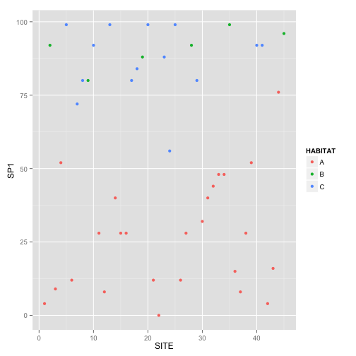 

```r
ggplot(veg,aes(y=SP2,x=SITE,col=HABITAT)) +
  geom_point()
```

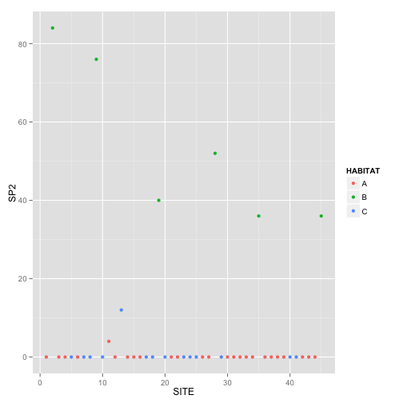 

We can do this for all species, or get it all in 1 graph.

'Melt' all the data (WHAT DOES THIS MEAN?, look at ML website, there is an entire workshop on data manipulation)
Tell R which **not** to melt


```r
veg.long <- melt(veg, id=c("SITE","HABITAT"))
```

and plot this


```r
ggplot(veg.long,aes(y=value,x=SITE,col=HABITAT)) +
  geom_point()+
  facet_grid(~variable) + 
  scale_color_manual("Habitat", values=c(1,2,3))
```

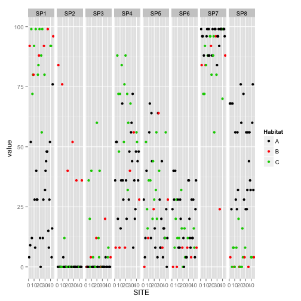 

Routinely look at the scatterplot matrix when using a PCA

```r
pairs(veg[,3:10])
```

 

Look at the correlations. If there are none, there is no use for the multivariate analysis.
Previously it was decided there is normality (no root transformation) and all species abundances are pretty similar (no need for wisconsis double)

```r
veg.pca <- rda(veg[,3:8], scale=T)
summary(veg.pca)
```

```
## 
## Call:
## rda(X = veg[, 3:8], scale = T) 
## 
## Partitioning of correlations:
##               Inertia Proportion
## Total               6          1
## Unconstrained       6          1
## 
## Eigenvalues, and their contribution to the correlations 
## 
## Importance of components:
##                          PC1    PC2   PC3    PC4     PC5     PC6
## Eigenvalue            2.1145 1.6293 1.026 0.6881 0.37475 0.16729
## Proportion Explained  0.3524 0.2716 0.171 0.1147 0.06246 0.02788
## Cumulative Proportion 0.3524 0.6240 0.795 0.9097 0.97212 1.00000
## 
## Scaling 2 for species and site scores
## * Species are scaled proportional to eigenvalues
## * Sites are unscaled: weighted dispersion equal on all dimensions
## * General scaling constant of scores:  4.03089 
## 
## 
## Species scores
## 
##         PC1     PC2     PC3     PC4      PC5      PC6
## SP1  1.3908 -0.2243  0.2724 -0.6922  0.08397 -0.40385
## SP2  0.3866 -1.4579  0.2414 -0.4590 -0.05777  0.40093
## SP3  1.3483  0.3447  0.1484  0.4782 -0.71491  0.09838
## SP4  0.9650  1.1450  0.2608 -0.1252  0.52452  0.32715
## SP5  0.3353  0.2231 -1.5296 -0.4326 -0.11197  0.08028
## SP6 -0.8838  0.8700  0.4651 -0.8614 -0.45351  0.07763
## 
## 
## Site scores (weighted sums of species scores)
## 
##              PC1       PC2       PC3      PC4       PC5      PC6
## sit1  -0.6585490  0.190825 -0.149543  0.21533 -0.305418  0.67162
## sit2   0.2599982 -2.139434  0.797118 -0.41673  0.071806  0.63326
## sit3  -0.7817050  0.576449  0.834689 -0.22735 -0.387186  1.08133
## sit4  -0.2994554  0.333995  0.561555 -0.31501  0.123720 -0.12758
## sit5   1.3270402  0.671516 -0.415591  0.07571 -0.307122  0.50509
## sit6  -0.8975271  0.288366 -0.306465 -0.58939 -1.333506  0.28180
## sit7   0.4900761  0.555901  0.333147 -0.03256 -0.190083  0.33374
## sit8  -0.1215680  0.256118  0.511248 -0.65085  0.074294 -0.94362
## sit9   0.2556887 -1.933925  0.406433 -0.25346 -0.214644  0.75990
## sit10  1.1266901  0.542340  0.019573  0.31085 -0.972880  0.13978
## sit11 -0.5977716 -0.007462 -0.880802 -0.51968 -1.037559 -0.11177
## sit12 -0.3019922  0.021723 -1.490541  0.32270  0.082796  0.69930
## sit13  0.6676492  0.260883 -0.002259 -0.64818  1.207949  0.29695
## sit14 -0.0004378  0.206693  0.312763  0.54649  1.225624  0.41606
## sit15 -0.4345117  0.315307 -1.038354 -0.62594 -0.602221  0.43758
## sit16 -0.4512056  0.036094 -0.622597 -0.05155 -0.374827 -0.12164
## sit17 -0.1311865  0.380213  0.472268 -0.86681 -0.005554 -0.71838
## sit18  0.3609632  0.452306 -0.316137 -0.64265  1.035721 -0.04933
## sit19  0.2632869 -1.134512  0.079091 -0.19220 -0.888116 -0.69613
## sit20  1.7867028  0.617880  0.243710  1.13875 -1.147647  0.56573
## sit21 -0.4818018 -0.051929  0.041161  0.74079  0.234646  0.18301
## sit22 -0.5557644 -0.443341 -0.005527  1.48220  0.329133 -0.27843
## sit23  0.5361026  0.439180  0.064398 -0.29816  0.380143 -0.19516
## sit24  0.0917134 -0.169932 -1.074232  0.19601  0.109516 -0.76915
## sit25  1.1405132  0.216093  0.325529  0.77481 -0.845117 -0.69456
## sit26 -0.4745417 -0.310460  0.231720  1.22021  0.416907 -0.30372
## sit27 -0.0296869  0.056627 -1.326768  0.27523  0.585653  0.48313
## sit28  0.4830471 -0.930951 -0.895183 -1.18929  0.250785  0.95007
## sit29  0.3119277  0.286993 -0.305522 -0.37155  1.012206 -0.30260
## sit30 -0.4656747  0.585149  0.184704 -0.61504 -0.222721  0.77949
## sit31 -0.4388351  0.568786  0.787395 -0.47568  0.003037  0.52325
## sit32 -0.3243824  0.107897  0.504253  0.15531  0.241721 -0.33576
## sit33  0.0580617  0.329380  0.183848  0.19716  1.142336  0.47149
## sit34 -0.3072332 -0.428729 -0.820859  0.26360 -0.342769 -1.46590
## sit35  0.8405312 -0.579708  0.723234  0.09452  0.090565  0.34321
## sit36 -0.6342016  0.202904  0.629945  0.30347 -0.507813  0.29440
## sit37 -0.6322064 -0.234428 -0.038303  0.83249 -0.150113 -0.23819
## sit38 -0.4612701 -0.216709  0.035390  0.60562 -0.008500 -0.62230
## sit39 -0.3300389  0.286902  0.544522 -0.30281  0.029920 -0.25864
## sit40  0.2395652  0.145981  0.538299 -0.21008  0.553371 -1.13499
## sit41  0.5162813  0.102943 -0.814345 -0.33006  0.300483 -0.91755
## sit42 -0.3484638 -0.058629 -0.285806  1.01988  0.660144  0.60781
## sit43 -0.6581764  0.100812  0.672645  0.41892 -0.118763  0.10880
## sit44 -0.2659736  0.384972  0.725686 -0.87301 -0.214861 -0.76096
## sit45  0.3283221 -0.881078  0.024508 -0.49203  0.014943 -0.52042
```

```r
screeplot(veg.pca)
```

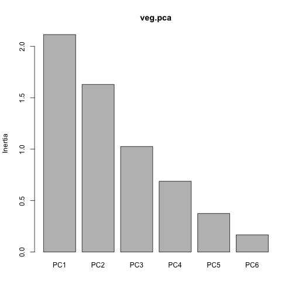 

Based on the 3 rules, we're going to keep 3 PC's

Now extract the component loadings for the species, i.e. which species contributed to which PC. 

```r
veg.pca$CA$v
```

```
##            PC1        PC2         PC3         PC4         PC5        PC6
## SP1  0.5811875 -0.1067730  0.16343547 -0.50709692  0.08335119 -0.6000122
## SP2  0.1615551 -0.6940706  0.14484404 -0.33626028 -0.05734343  0.5956735
## SP3  0.5634255  0.1640967  0.08901105  0.35028269 -0.70967440  0.1461685
## SP4  0.4032721  0.5450851  0.15644914 -0.09170221  0.52067860  0.4860680
## SP5  0.1401257  0.1062027 -0.91764352 -0.31691589 -0.11114708  0.1192760
## SP6 -0.3693360  0.4141752  0.27899841 -0.63106164 -0.45018515  0.1153443
```

Now an ordination plot to see how sites relate to each other

```r
biplot(veg.pca,scaling=2)
```

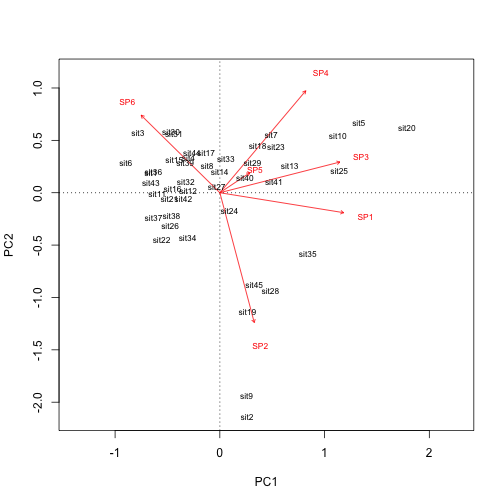 

The scaling command only determines if the plot is scaled to the variable or the object

```r
biplot(veg.pca,scaling=1)
```

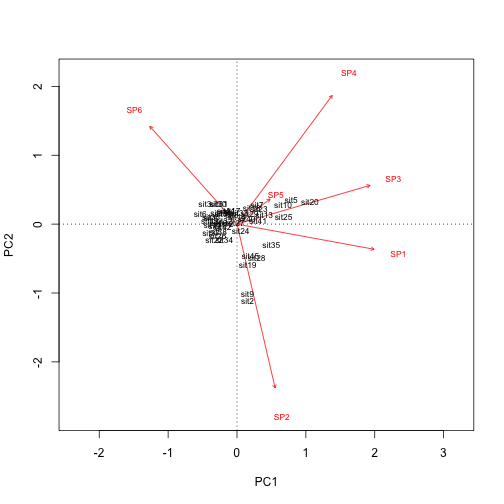 

Now extract the object scores (in this case the coordinates for the sites). Get the scores and make a new column with the variable and object names, which makes it easier to plot

```r
newdata.sites <- as.data.frame(scores(veg.pca,choice=1:3,scaling=2)$sites)
newdata.sites$Sites <- rownames(newdata.sites)
head(newdata.sites)
```

```
##             PC1        PC2        PC3 Sites
## sit1 -0.6585490  0.1908254 -0.1495430  sit1
## sit2  0.2599982 -2.1394345  0.7971181  sit2
## sit3 -0.7817050  0.5764486  0.8346894  sit3
## sit4 -0.2994554  0.3339951  0.5615552  sit4
## sit5  1.3270402  0.6715160 -0.4155914  sit5
## sit6 -0.8975271  0.2883658 -0.3064650  sit6
```

```r
newdata.species <- as.data.frame(scores(veg.pca,choice=1:3,scaling=2)$species)
newdata.species$Species <- rownames(newdata.species)
head(newdata.sites)
```

```
##             PC1        PC2        PC3 Sites
## sit1 -0.6585490  0.1908254 -0.1495430  sit1
## sit2  0.2599982 -2.1394345  0.7971181  sit2
## sit3 -0.7817050  0.5764486  0.8346894  sit3
## sit4 -0.2994554  0.3339951  0.5615552  sit4
## sit5  1.3270402  0.6715160 -0.4155914  sit5
## sit6 -0.8975271  0.2883658 -0.3064650  sit6
```


```r
ggplot(newdata.sites,aes(y=PC1,x=PC2)) +
  geom_text(aes(label=Sites)) + 
  geom_text(data=newdata.species,aes(label=Species),color='red') +
  geom_segment(data=newdata.species,aes(yend=0,xend=0),color='red',
               arrow=arrow(ends='first',length = unit(0.3,"cm"))) +
  theme_classic() + theme(panel.background=element_rect(color='black'))
```

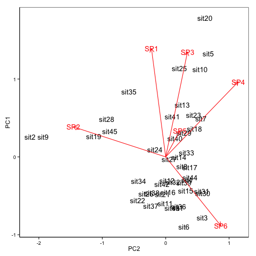 

Now we re-draw this with the sites labeled on their habitat


```r
newdata.sites$Habitat <- veg$HABITAT
```


```r
g1<-ggplot(newdata.sites,aes(y=PC1,x=PC2)) +
    geom_text(aes(label=Habitat,color=Habitat)) +
    geom_hline(yintercept=0, linetype='dotted') +
    geom_vline(xintercept=0,linetype='dotted') +
    coord_equal() +
    theme_classic() + theme(panel.background=element_rect(color='black'))
```

Add to this plot and put the arrows on

```r
g1 <- g1 + 
  geom_segment(data=newdata.species,aes(yend=0,xend=0),color='grey',
               arrow=arrow(ends='first',length = unit(0.3,"cm"))) +
  geom_text(data=newdata.species,aes(label=Species),color='grey') 
```

So let's now check if the species differ significantly between habitat PC.

Get out the site scores


```r
veg.scores <- scores(veg.pca,choice=1:3,display="sites")
```

Run the model, this will run 3 separate anova's for PC1, 2 and 3

```r
summary(lm(veg.scores~veg$HABITAT))
```

```
## Response PC1 :
## 
## Call:
## lm(formula = PC1 ~ veg$HABITAT)
## 
## Residuals:
##      Min       1Q   Median       3Q      Max 
## -0.72708 -0.20127 -0.04361  0.12370  1.19081 
## 
## Coefficients:
##              Estimate Std. Error t value Pr(>|t|)    
## (Intercept)  -0.43093    0.07335  -5.875 6.01e-07 ***
## veg$HABITATB  0.83608    0.16673   5.015 1.02e-05 ***
## veg$HABITATC  1.02682    0.12243   8.387 1.62e-10 ***
## ---
## Signif. codes:  0 '***' 0.001 '**' 0.01 '*' 0.05 '.' 0.1 ' ' 1
## 
## Residual standard error: 0.3668 on 42 degrees of freedom
## Multiple R-squared:  0.6523,	Adjusted R-squared:  0.6357 
## F-statistic:  39.4 on 2 and 42 DF,  p-value: 2.319e-10
## 
## 
## Response PC2 :
## 
## Call:
## lm(formula = PC2 ~ veg$HABITAT)
## 
## Residuals:
##      Min       1Q   Median       3Q      Max 
## -0.87283 -0.16558  0.04033  0.21573  0.68689 
## 
## Coefficients:
##              Estimate Std. Error t value Pr(>|t|)    
## (Intercept)   0.11365    0.06678   1.702   0.0962 .  
## veg$HABITATB -1.38025    0.15179  -9.093 1.77e-11 ***
## veg$HABITATC  0.22624    0.11145   2.030   0.0487 *  
## ---
## Signif. codes:  0 '***' 0.001 '**' 0.01 '*' 0.05 '.' 0.1 ' ' 1
## 
## Residual standard error: 0.3339 on 42 degrees of freedom
## Multiple R-squared:  0.7118,	Adjusted R-squared:  0.6981 
## F-statistic: 51.87 on 2 and 42 DF,  p-value: 4.493e-12
## 
## 
## Response PC3 :
## 
## Call:
## lm(formula = PC3 ~ veg$HABITAT)
## 
## Residuals:
##      Min       1Q   Median       3Q      Max 
## -1.46193 -0.27785  0.06977  0.53286  0.86330 
## 
## Coefficients:
##               Estimate Std. Error t value Pr(>|t|)
## (Intercept)  -0.028612   0.123444  -0.232    0.818
## veg$HABITATB  0.217812   0.280591   0.776    0.442
## veg$HABITATC -0.001382   0.206033  -0.007    0.995
## 
## Residual standard error: 0.6172 on 42 degrees of freedom
## Multiple R-squared:  0.01525,	Adjusted R-squared:  -0.03164 
## F-statistic: 0.3253 on 2 and 42 DF,  p-value: 0.7241
```

So there is a statistical difference between habitat A-B and A-C for PC1 and PC2. PC3 doesn't seem to be associated with habitat at all.

What if we don't have habitat data, but environmental data

```r
env <- read.csv('env.csv', strip.white=T)
head(env)
```

```
##   Moisture   pH
## 1    3.921 5.02
## 2   15.393 6.82
## 3    1.897 5.07
## 4    5.669 3.95
## 5    8.076 2.00
## 6    2.043 4.88
```

Now combine this data with the previous PCA

```r
summary(veg.lm1 <- lm(veg.scores ~ Moisture+pH, data=env))
```

```
## Response PC1 :
## 
## Call:
## lm(formula = PC1 ~ Moisture + pH, data = env)
## 
## Residuals:
##      Min       1Q   Median       3Q      Max 
## -0.51714 -0.22310 -0.01044  0.13627  1.25932 
## 
## Coefficients:
##             Estimate Std. Error t value Pr(>|t|)    
## (Intercept)  0.34441    0.20937   1.645    0.107    
## Moisture     0.14210    0.01612   8.818 4.17e-11 ***
## pH          -0.26634    0.04365  -6.101 2.84e-07 ***
## ---
## Signif. codes:  0 '***' 0.001 '**' 0.01 '*' 0.05 '.' 0.1 ' ' 1
## 
## Residual standard error: 0.3321 on 42 degrees of freedom
## Multiple R-squared:  0.715,	Adjusted R-squared:  0.7014 
## F-statistic: 52.67 on 2 and 42 DF,  p-value: 3.575e-12
## 
## 
## Response PC2 :
## 
## Call:
## lm(formula = PC2 ~ Moisture + pH, data = env)
## 
## Residuals:
##      Min       1Q   Median       3Q      Max 
## -0.82418 -0.28588  0.01495  0.23460  0.81412 
## 
## Coefficients:
##             Estimate Std. Error t value Pr(>|t|)    
## (Intercept)  1.84950    0.24184   7.648 1.75e-09 ***
## Moisture    -0.09735    0.01862  -5.229 5.04e-06 ***
## pH          -0.29547    0.05043  -5.859 6.33e-07 ***
## ---
## Signif. codes:  0 '***' 0.001 '**' 0.01 '*' 0.05 '.' 0.1 ' ' 1
## 
## Residual standard error: 0.3836 on 42 degrees of freedom
## Multiple R-squared:  0.6197,	Adjusted R-squared:  0.6015 
## F-statistic: 34.21 on 2 and 42 DF,  p-value: 1.526e-09
## 
## 
## Response PC3 :
## 
## Call:
## lm(formula = PC3 ~ Moisture + pH, data = env)
## 
## Residuals:
##      Min       1Q   Median       3Q      Max 
## -1.48145 -0.26851  0.07042  0.46405  0.86671 
## 
## Coefficients:
##             Estimate Std. Error t value Pr(>|t|)
## (Intercept) -0.37561    0.38714   -0.97    0.337
## Moisture     0.01938    0.02980    0.65    0.519
## pH           0.06052    0.08072    0.75    0.458
## 
## Residual standard error: 0.614 on 42 degrees of freedom
## Multiple R-squared:  0.02535,	Adjusted R-squared:  -0.02106 
## F-statistic: 0.5462 on 2 and 42 DF,  p-value: 0.5832
```

**NOTE**: it is not a good idea to match species data with environmental data!


Now we can overlay on the previous figure evironmental data, which is called an environmental fit (this is awesome!):

```r
(data.envfit <- envfit(veg.pca, env=env$Moisture))
```

```
## 
## ***VECTORS
## 
##           PC1      PC2     r2 Pr(>r)    
## [1,]  0.77432 -0.63279 0.7711  0.001 ***
## ---
## Signif. codes:  0 '***' 0.001 '**' 0.01 '*' 0.05 '.' 0.1 ' ' 1
## Permutation: free
## Number of permutations: 999
```

From this output we want to extract our scores, so we can put them on our graph.

```r
newdata.env <- as.data.frame(data.envfit$vectors$arrows)
g1 + geom_segment(data=newdata.env,aes(yend = 0, xend = 0), color = 'blue',
                  arrow = arrow(ends = 'first',length = unit(0.3,"cm")))
```

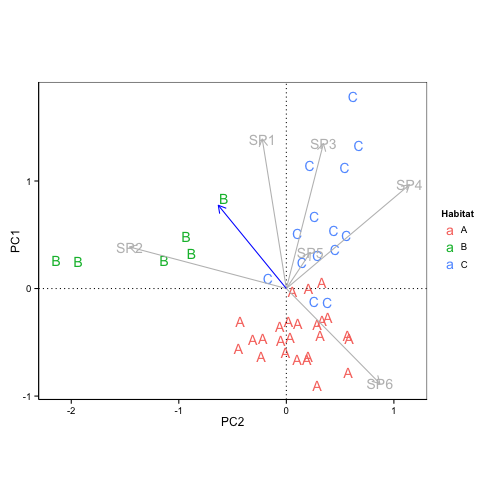 

---
Above analyses however assume linearity of the correlations. This causes sites to be similar when they are not. As you are measuring beyond the range of your species, sites become similar because they have no species in it. 

So in this case we need to do **Correspondence Analysis**.
This rearranges the array of variables and object to make the best match to the correspondence axis. And the next best fit  
```
data.ce <- cca(data)
```

Now, just like before, we can make the ordination plot. 


```r
veg.ca <- cca(veg[,3:10])
summary(veg.ca, display=NULL)
```

```
## 
## Call:
## cca(X = veg[, 3:10]) 
## 
## Partitioning of mean squared contingency coefficient:
##               Inertia Proportion
## Total          0.5501          1
## Unconstrained  0.5501          1
## 
## Eigenvalues, and their contribution to the mean squared contingency coefficient 
## 
## Importance of components:
##                          CA1    CA2     CA3     CA4     CA5     CA6
## Eigenvalue            0.2601 0.1558 0.05324 0.04563 0.01794 0.01086
## Proportion Explained  0.4728 0.2833 0.09678 0.08295 0.03261 0.01975
## Cumulative Proportion 0.4728 0.7561 0.85284 0.93579 0.96840 0.98815
##                            CA7
## Eigenvalue            0.006518
## Proportion Explained  0.011850
## Cumulative Proportion 1.000000
## 
## Scaling 2 for species and site scores
## * Species are scaled proportional to eigenvalues
## * Sites are unscaled: weighted dispersion equal on all dimensions
```

```
display=NULL stops R from producing all the scores
```

Now extract the scores

```r
veg.scores <- scores(veg.ca,choice=1:2,display="sites")
```
Now we can run the ANOVA and regression etc.


**Redundancy analysis**: constrain the axis in the PCA to not be able to rotate in multi-dimentional space but constrain them to for example environmental variables. If you input 2 variables, the analysis will make up the other axis based on the data (as in PCA).

Besides giving the proportion of data explained by constrained variables and other PC axis, it will also give the Permutation ANOVA, so it is tested if these invdividual variables determine all your traits.

Permutation tests are sometimes the only option for some analyses, but they are not very powerful. This is because the power depends on the number of permutations. If there are only 10 permutations for example, we can at the best obtain a p-value of .1


```r
veg.rda<- rda(veg[,-1:-2]~Moisture+pH,data=env, scale=T)
summary(veg.rda,display=NULL)
```

```
## 
## Call:
## rda(formula = veg[, -1:-2] ~ Moisture + pH, data = env, scale = T) 
## 
## Partitioning of correlations:
##               Inertia Proportion
## Total           8.000     1.0000
## Constrained     3.601     0.4501
## Unconstrained   4.399     0.5499
## 
## Eigenvalues, and their contribution to the correlations 
## 
## Importance of components:
##                         RDA1   RDA2    PC1    PC2    PC3     PC4     PC5
## Eigenvalue            2.5733 1.0273 1.2065 0.9194 0.8745 0.50547 0.42967
## Proportion Explained  0.3217 0.1284 0.1508 0.1149 0.1093 0.06318 0.05371
## Cumulative Proportion 0.3217 0.4501 0.6009 0.7158 0.8251 0.88832 0.94203
##                           PC6    PC7     PC8
## Eigenvalue            0.24168 0.1408 0.08126
## Proportion Explained  0.03021 0.0176 0.01016
## Cumulative Proportion 0.97224 0.9898 1.00000
## 
## Accumulated constrained eigenvalues
## Importance of components:
##                         RDA1   RDA2
## Eigenvalue            2.5733 1.0273
## Proportion Explained  0.7147 0.2853
## Cumulative Proportion 0.7147 1.0000
## 
## Scaling 2 for species and site scores
## * Species are scaled proportional to eigenvalues
## * Sites are unscaled: weighted dispersion equal on all dimensions
## * General scaling constant of scores:
```

We had 8 species of plants, so the total intertia is 8. Moisture and pH determint 45% of the variation.

```r
plot(veg.rda,scaling=2)
```

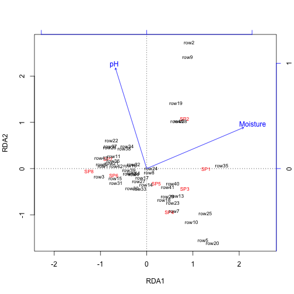 

```r
anova(veg.rda,step=1000) 
```

```
## Permutation test for rda under reduced model
## Permutation: free
## Number of permutations: 999
## 
## Model: rda(formula = veg[, -1:-2] ~ Moisture + pH, data = env, scale = T)
##          Df Variance      F Pr(>F)    
## Model     2   3.6006 17.187  0.001 ***
## Residual 42   4.3994                  
## ---
## Signif. codes:  0 '***' 0.001 '**' 0.01 '*' 0.05 '.' 0.1 ' ' 1
```

```r
anova(veg.rda,by="margin",step=1000) #margin command will seperate test for both constraint variables
```

```
## Permutation test for rda under reduced model
## Marginal effects of terms
## Permutation: free
## Number of permutations: 999
## 
## Model: rda(formula = veg[, -1:-2] ~ Moisture + pH, data = env, scale = T)
##          Df Variance      F Pr(>F)    
## Moisture  1   2.4371 23.266  0.001 ***
## pH        1   1.2626 12.054  0.001 ***
## Residual 42   4.3994                  
## ---
## Signif. codes:  0 '***' 0.001 '**' 0.01 '*' 0.05 '.' 0.1 ' ' 1
```

Now do model selection

```r
drop1(veg.rda)
```

```
## Single term deletions
## 
## Model:
## veg[, -1:-2] ~ Moisture + pH
##          Df    AIC
## <none>      71.654
## Moisture  1 89.491
## pH        1 81.008
```

Neither dropped, so both are important

So need to look if you need to do PCA/RDA (contraint by Euclidean distances) or CA/ CCA (constraint by chi^2 distances).

---

**Q-mode analyses**

Euclindean distance:
```d(jk) = sqrt(sum((y(ji) - y(ki))^2))```

- No maximum value

Bray-Curus distance
- scales 0 - 1 (0 is identical)
- only shared characteristics are included

**Multi-dimensional scaling**
- transformation
- choose number of dimensions
- random configuration
- measure Kiskal's stress: measure each distance in the random configuration and compare how well this correspnds to the original distance matrix
- iterate - gradient descent: shuffle data and see if stress is reduced. 
- iterate until rules are met

Rules
- stress is below threshold (<0.2)
- maximum number of iterations
- stress is not reduced

Axis have no real meaning

To optimalize this procedure, one can use a prior for site position taken from a PCA as a starting point. 

**Prorustes rotation**: Measures how much the axis had to rotate to get a better fit

packageMDS will do all these step
- transform and scale
- generate disimilarity (Eucl or Bray)
- PCoA for starting configuration
- up to 20 random starts
- procrusted used to determine final configuration
- final scores are scales so they give PCA-like axes rotation

``` data.nmds <- metaMDS(data[,-1]) ```


```r
macnally <-read.csv('macnally_full.csv')
head(macnally)
```

```
##                 HABITAT GST EYR   GF  BTH GWH WTTR WEHE WNHE SFW WBSW   CR
## Reedy Lake        Mixed 3.4 0.0  0.0  0.0 0.0  0.0  0.0 11.9 0.4  0.0  1.1
## Pearcedale  Gipps.Manna 3.4 9.2  0.0  0.0 0.0  0.0  0.0 11.5 8.3 12.6  0.0
## Warneet     Gipps.Manna 8.4 3.8  0.7  2.8 0.0  0.0 10.7 12.3 4.9 10.7  0.0
## Cranbourne  Gipps.Manna 3.0 5.0  0.0  5.0 2.0  0.0  3.0 10.0 6.9 12.0  0.0
## Lysterfield       Mixed 5.6 5.6 12.9 12.2 9.5  2.1  7.9 28.6 9.2  5.0 19.1
## Red Hill          Mixed 8.1 4.1 10.9 24.5 5.6  6.7  9.4  6.7 0.0  8.9 12.1
##              LK  RWB AUR STTH   LR WPHE YTH  ER PCU ESP SCR RBFT BFCS WAG
## Reedy Lake  3.8  9.7 0.0  0.0  4.8 27.3   0 5.1   0 0.0 0.0  0.0  0.6 1.9
## Pearcedale  0.5 11.6 0.0  0.0  3.7 27.6   0 2.7   0 3.7 0.0  1.1  1.1 3.4
## Warneet     1.9 16.6 2.3  2.8  5.5 27.5   0 5.3   0 0.0 0.0  0.0  1.5 2.1
## Cranbourne  2.0 11.0 1.5  0.0 11.0 20.0   0 2.1   0 2.0 0.0  5.0  1.4 3.4
## Lysterfield 3.6  5.7 8.8  7.0  1.6  0.0   0 1.4   0 3.5 0.7  0.0  2.7 0.0
## Red Hill    6.7  2.7 0.0 16.8  3.4  0.0   0 2.2   0 3.4 0.0  0.7  2.0 0.0
##             WWCH NHHE  VS CST  BTR AMAG  SCC RWH  WSW STP YFHE WHIP GAL
## Reedy Lake     0  0.0 0.0 1.7 12.5  8.6 12.5 0.6  0.0 4.8  0.0    0 4.8
## Pearcedale     0  6.9 0.0 0.9  0.0  0.0  0.0 2.3  5.7 0.0  1.1    0 0.0
## Warneet        0  3.0 0.0 1.5  0.0  0.0  0.0 1.4 24.3 3.1 11.7    0 0.0
## Cranbourne     0 32.0 0.0 1.4  0.0  0.0  0.0 0.0 10.0 4.0  0.0    0 2.8
## Lysterfield    0  6.4 0.0 0.0  0.0  0.0  0.0 7.0  0.0 0.0  6.1    0 0.0
## Red Hill       0  2.2 5.4 0.0  0.0  0.0  0.0 6.8  0.0 0.0  0.0    0 0.0
##              FHE BRTH SPP SIL GCU MUSK MGLK BHHE RFC YTBC LYRE CHE OWH TRM
## Reedy Lake  26.2    0 0.0 0.0 0.0 13.1  1.7  1.1   0    0    0   0   0  15
## Pearcedale   0.0    0 1.1 0.0 0.0  0.0  0.0  0.0   0    0    0   0   0   0
## Warneet      0.0    0 4.6 0.0 0.0  0.0  0.0  0.0   0    0    0   0   0   0
## Cranbourne   0.0    0 0.8 0.0 0.0  0.0  1.4  0.0   0    0    0   0   0   0
## Lysterfield  0.0    0 5.4 0.0 0.0  0.0  0.0  0.0   0    0    0   0   0   0
## Red Hill     0.0    0 3.4 2.7 1.4  0.0  0.0  0.0   0    0    0   0   0   0
##             MB STHR LHE FTC PINK OBO YR LFB SPW RBTR DWS BELL LWB CBW GGC
## Reedy Lake   0    0   0 0.0    0 0.0  0 2.9   0    0 0.4  0.0   0   0   0
## Pearcedale   0    0   0 2.3    0 0.0  0 0.0   0    0 0.0  0.0   0   0   0
## Warneet      0    0   0 0.0    0 0.0  0 0.0   0    0 3.5  0.0   0   0   0
## Cranbourne   1    0   0 0.0    0 0.0  0 0.0   0    0 5.5  0.0   4   0   0
## Lysterfield  0    0   0 2.1    0 1.4  0 0.0   0    0 0.0 22.1   0   0   0
## Red Hill     0    0   0 0.0    0 0.0  0 0.0   0    0 0.0  0.0   0   0   0
##             PIL SKF RSL PDOV CRP JW BCHE RCR GBB RRP LLOR YTHE  RF SHBC
## Reedy Lake    0 1.9 6.7    0   0  0    0   0 0.0 4.8    0    0 0.0  0.0
## Pearcedale    0 0.0 0.0    0   0  0    0   0 0.0 0.0    0    0 0.0  0.0
## Warneet       0 0.0 0.0    0   0  0    0   0 0.0 0.0    0    0 0.0  1.4
## Cranbourne    0 0.0 0.8    0   0  0    0   0 0.0 0.0    0    0 0.0  0.0
## Lysterfield   0 0.0 0.0    0   0  0    0   0 0.7 0.0    0    0 0.0  0.7
## Red Hill      0 0.0 0.0    0   0  0    0   0 0.0 0.0    0    0 1.4  0.0
##             AZKF SFC YRTH ROSE BCOO LFC WG PCOO WTG NMIN NFB DB RBEE HBC
## Reedy Lake     0 0.0    0    0    0 0.0  0  1.9   0  0.2   0  0    0   0
## Pearcedale     0 0.0    0    0    0 0.0  0  0.0   0  0.0   0  0    0   0
## Warneet        0 0.0    0    0    0 1.8  0  0.0   0  5.8   0  0    0   0
## Cranbourne     0 0.0    0    0    0 0.0  0  0.0   0  3.1   0  0    0   0
## Lysterfield    0 0.0    0    0    0 0.0  0  0.0   0  0.0   0  0    0   0
## Red Hill       0 3.4    0    0    0 0.0  0  0.0   0  0.0   0  0    0   0
##             DF PCL FLAME WWT WBWS LCOR KING
## Reedy Lake   0 9.1     0   0    0    0    0
## Pearcedale   0 0.0     0   0    0    0    0
## Warneet      0 0.0     0   0    0    0    0
## Cranbourne   0 0.0     0   0    0    0    0
## Lysterfield  0 0.0     0   0    0    0    0
## Red Hill     0 0.0     0   0    0    0    0
```

Do square-root transformation and wisconsin double d

```r
macnally.std <- wisconsin(sqrt(macnally[,-1]))
```

Bray-Curtis

```r
macnally.dist <- vegdist(macnally.std,"bray")
```

Multi-dimensional scaling

```r
macnally.mds <- metaMDS(macnally.dist,k=3)
```

```
## Run 0 stress 0.07449633 
## Run 1 stress 0.07449632 
## ... New best solution
## ... procrustes: rmse 0.0002375264  max resid 0.0009301435 
## *** Solution reached
```

```r
macnally.mds <- metaMDS(macnally.dist,k=2)
```

```
## Run 0 stress 0.1175806 
## Run 1 stress 0.1175806 
## ... procrustes: rmse 6.350047e-05  max resid 0.0003283079 
## *** Solution reached
```

View stress-plot

```r
stressplot(macnally.mds)
```

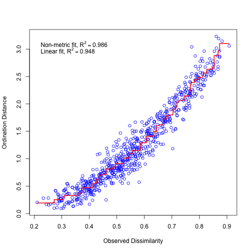 

Ordination plot

```r
ordiplot(macnally.mds, display="sites",type="n")
text(macnally.mds,lab=macnally$HABITAT,
     col=as.numeric(macnally$HABITAT))
ordihull(macnally.mds, macnally$HABITAT,kind="se",conf=0.95,lwd=2,draw="polygon")
```

```
## Warning in match.fun(FUN)(...): "kind" is not a graphical parameter
```

```
## Warning in match.fun(FUN)(...): "conf" is not a graphical parameter
```

```
## Warning in match.fun(FUN)(...): "kind" is not a graphical parameter
```

```
## Warning in match.fun(FUN)(...): "conf" is not a graphical parameter
```

```
## Warning in match.fun(FUN)(...): "kind" is not a graphical parameter
```

```
## Warning in match.fun(FUN)(...): "conf" is not a graphical parameter
```

```
## Warning in match.fun(FUN)(...): "kind" is not a graphical parameter
```

```
## Warning in match.fun(FUN)(...): "conf" is not a graphical parameter
```

```
## Warning in match.fun(FUN)(...): "kind" is not a graphical parameter
```

```
## Warning in match.fun(FUN)(...): "conf" is not a graphical parameter
```

```
## Warning in match.fun(FUN)(...): "kind" is not a graphical parameter
```

```
## Warning in match.fun(FUN)(...): "conf" is not a graphical parameter
```

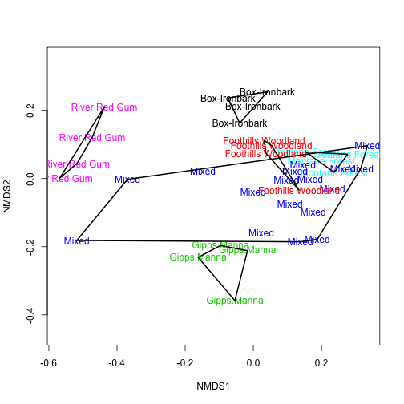 

Fit an ordination hull over this plot that will put circles around the habitats

```r
ordiplot(macnally.mds, display="sites",type="n")
text(macnally.mds,lab=macnally$HABITAT,
     col=as.numeric(macnally$HABITAT))
ordihull(macnally.mds, macnally$HABITAT,kind="se",conf=0.95,lwd=2,draw="polygon")
```

```
## Warning in match.fun(FUN)(...): "kind" is not a graphical parameter
```

```
## Warning in match.fun(FUN)(...): "conf" is not a graphical parameter
```

```
## Warning in match.fun(FUN)(...): "kind" is not a graphical parameter
```

```
## Warning in match.fun(FUN)(...): "conf" is not a graphical parameter
```

```
## Warning in match.fun(FUN)(...): "kind" is not a graphical parameter
```

```
## Warning in match.fun(FUN)(...): "conf" is not a graphical parameter
```

```
## Warning in match.fun(FUN)(...): "kind" is not a graphical parameter
```

```
## Warning in match.fun(FUN)(...): "conf" is not a graphical parameter
```

```
## Warning in match.fun(FUN)(...): "kind" is not a graphical parameter
```

```
## Warning in match.fun(FUN)(...): "conf" is not a graphical parameter
```

```
## Warning in match.fun(FUN)(...): "kind" is not a graphical parameter
```

```
## Warning in match.fun(FUN)(...): "conf" is not a graphical parameter
```

 

Rather than a hull, we can draw an elipse, as a density measurement. Can do the same with the ordination plots in the PCA.

```r
ordiplot(macnally.mds, display="sites",type="n")
text(macnally.mds,lab=macnally$HABITAT,
     col=as.numeric(macnally$HABITAT))
ordiellipse(macnally.mds,
            macnally$HABITAT,kind="se",conf=0.95,lwd=2,draw="polygon",col='grey90')
ordiellipse(macnally.mds,
            macnally$HABITAT,kind="se",conf=0.80,lwd=2,draw="polygon",col='grey90')
ordiellipse(macnally.mds,
            macnally$HABITAT,kind="se",conf=0.50,lwd=2,draw="polygon",col='grey90')
```

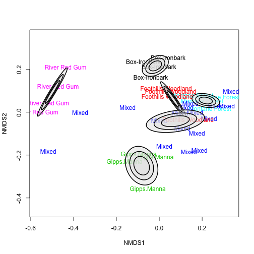 

But we can't just take these scores and put them in an ANOVA, as they're not independent from each other.

```r
habitat <- model.matrix(~-1+macnally$HABITAT)
```

Change the labels

```r
colnames(habitat) <- gsub("macnally\\$HABITAT","",colnames(habitat))
envfit <- envfit(macnally.mds,env=habitat)
envfit
```

```
## 
## ***VECTORS
## 
##                       NMDS1    NMDS2     r2 Pr(>r)    
## Box-Ironbark       -0.02789  0.99961 0.2940  0.003 ** 
## Foothills Woodland  0.31838  0.94796 0.0325  0.580    
## Gipps.Manna        -0.10672 -0.99429 0.4032  0.001 ***
## Mixed               0.50275 -0.86443 0.1574  0.047 *  
## Montane Forest      0.78935  0.61395 0.1145  0.105    
## River Red Gum      -0.86464  0.50239 0.5619  0.001 ***
## ---
## Signif. codes:  0 '***' 0.001 '**' 0.01 '*' 0.05 '.' 0.1 ' ' 1
## Permutation: free
## Number of permutations: 999
```

---

Expanding the dataset! More species and more environmental data!

Start with two seperate datafiles, one for species, one for environmental data

```r
vareveg <- read.csv('vareveg.csv',strip.white=T)
vareenv <- read.csv('vareenv.csv',strip.white=T)
head (vareveg)
```

```
##   SITE C.vul Emp.nig Led.pal Vac.myr Vac.vit Pin.syl Des.fle Bet.pub
## 1   18  0.55   11.13    0.00    0.00   17.80    0.07    0.00       0
## 2   15  0.67    0.17    0.00    0.35   12.13    0.12    0.00       0
## 3   24  0.10    1.55    0.00    0.00   13.47    0.25    0.00       0
## 4   27  0.00   15.13    2.42    5.92   15.97    0.00    3.70       0
## 5   23  0.00   12.68    0.00    0.00   23.73    0.03    0.00       0
## 6   19  0.00    8.92    0.00    2.42   10.28    0.12    0.02       0
##   Vac.uli Dip.mon Dic.sp Dic.fus Dic.pol Hyl.spl Ple.sch Pol.pil Pol.jun
## 1    1.60    2.07   0.00    1.62    0.00     0.0    4.67    0.02    0.13
## 2    0.00    0.00   0.33   10.92    0.02     0.0   37.75    0.02    0.23
## 3    0.00    0.00  23.43    0.00    1.68     0.0   32.92    0.00    0.23
## 4    1.12    0.00   0.00    3.63    0.00     6.7   58.07    0.00    0.00
## 5    0.00    0.00   0.00    3.42    0.02     0.0   19.42    0.02    2.12
## 6    0.00    0.00   0.00    0.32    0.02     0.0   21.03    0.02    1.58
##   Pol.com Poh.nut Pti.cil Bar.lyc Cla.arb Cla.ran Cla.ste Cla.unc Cla.coc
## 1    0.00    0.13    0.12    0.00   21.73   21.47    3.50    0.30    0.18
## 2    0.00    0.03    0.02    0.00   12.05    8.13    0.18    2.65    0.13
## 3    0.00    0.32    0.03    0.00    3.58    5.52    0.07    8.93    0.00
## 4    0.13    0.02    0.08    0.08    1.42    7.63    2.55    0.15    0.00
## 5    0.00    0.17    1.80    0.02    9.08    9.22    0.05    0.73    0.08
## 6    0.18    0.07    0.27    0.02    7.23    4.95   22.08    0.25    0.10
##   Cla.cor Cla.gra Cla.fim Cla.cri Cla.chl Cla.bot Cla.ama Cla.sp Cet.eri
## 1    0.23    0.25    0.25    0.23    0.00    0.00    0.08   0.02    0.02
## 2    0.18    0.23    0.25    1.23    0.00    0.00    0.00   0.00    0.15
## 3    0.20    0.48    0.00    0.07    0.10    0.02    0.00   0.00    0.78
## 4    0.38    0.12    0.10    0.03    0.00    0.02    0.00   0.02    0.00
## 5    1.42    0.50    0.17    1.78    0.05    0.05    0.00   0.00    0.00
## 6    0.25    0.18    0.10    0.12    0.05    0.02    0.00   0.00    0.00
##   Cet.isl Cet.niv Nep.arc Ste.sp Pel.aph Ich.eri Cla.cer Cla.def Cla.phy
## 1    0.00    0.12    0.02   0.62    0.02       0       0    0.25       0
## 2    0.03    0.00    0.00   0.85    0.00       0       0    1.00       0
## 3    0.12    0.00    0.00   0.03    0.00       0       0    0.33       0
## 4    0.00    0.00    0.00   0.00    0.07       0       0    0.15       0
## 5    0.00    0.02    0.00   1.58    0.33       0       0    1.97       0
## 6    0.00    0.02    0.00   0.28    0.00       0       0    0.37       0
```

Start with a Mantel test. This is equivelent to correlation, except that this is a multivariate correlation. This is a Q-mode analysis, in that the starting point is a dissimilarity matrix. 

Do a sqrt transformation wisconsin double and make sure to exclude the column site

```r
vareveg.std <- wisconsin(sqrt(vareveg[,-1]))
```

Make a dissimililarity matrix. 

```r
vareveg.dist <- vegdist(vareveg.std,"bray")
```

For the environmental data, we're going to preform a standardization

```r
vareenv.std <- decostand(vareenv[,-1],"standardize")
```
Now, everything is on the same scale, whether it was mol/L or something else.

And fit a Euclidean distance (everything is already standardized)

```r
vareenv.dist <- vegdist(vareenv.std,"euc")
```

The Mantel grabs the 2 matrixes, correlates the two and gets the R values. It then shuffles one of those columns (and again and again) and checks if the R value of the randomized data has an R value similar or greater to the original configuration. Using these permutations (999 + 1x the origional data), it produces an R-value.

```r
mantel(vareveg.dist,vareenv.dist)
```

```
## 
## Mantel statistic based on Pearson's product-moment correlation 
## 
## Call:
## mantel(xdis = vareveg.dist, ydis = vareenv.dist) 
## 
## Mantel statistic r: 0.4021 
##       Significance: 0.001 
## 
## Upper quantiles of permutations (null model):
##   90%   95% 97.5%   99% 
## 0.153 0.198 0.235 0.275 
## Permutation: free
## Number of permutations: 999
```


```r
par(mar=c(4,4,0,0))
plot(vareenv.dist,vareveg.dist,ann=F,axes=F,type="n")
points(vareenv.dist,vareveg.dist,pch=16)
axis(1)
axis(2)
```

 

```r
box(bty="1")
```

```
## Error in box(bty = "1"): invalid value specified for graphical parameter "bty"
```


```r
str(mantel(vareveg.dist,vareenv.dist))
```

```
## List of 7
##  $ call        : language mantel(xdis = vareveg.dist, ydis = vareenv.dist)
##  $ method      : chr "Pearson's product-moment correlation"
##  $ statistic   : num 0.402
##  $ signif      : num 0.001
##  $ perm        : num [1:999] -0.1335 0.0436 -0.0697 0.0272 0.1227 ...
##  $ permutations: int 999
##  $ control     :List of 12
##   ..$ within     :List of 6
##   .. ..$ type    : chr "free"
##   .. ..$ constant: logi FALSE
##   .. ..$ mirror  : logi FALSE
##   .. ..$ ncol    : NULL
##   .. ..$ nrow    : NULL
##   .. ..$ call    : language Within()
##   .. ..- attr(*, "class")= chr "Within"
##   ..$ plots      :List of 7
##   .. ..$ strata    : NULL
##   .. ..$ type      : chr "none"
##   .. ..$ mirror    : logi FALSE
##   .. ..$ ncol      : NULL
##   .. ..$ nrow      : NULL
##   .. ..$ plots.name: chr "NULL"
##   .. ..$ call      : language Plots()
##   .. ..- attr(*, "class")= chr "Plots"
##   ..$ blocks     : NULL
##   ..$ nperm      : num 999
##   ..$ complete   : logi FALSE
##   ..$ maxperm    : num 9999
##   ..$ minperm    : num 99
##   ..$ all.perms  : NULL
##   ..$ make       : logi TRUE
##   ..$ observed   : logi FALSE
##   ..$ blocks.name: chr "NULL"
##   ..$ call       : language how(nperm = 999)
##   ..- attr(*, "class")= chr "how"
##  - attr(*, "class")= chr "mantel"
```

```r
hist(mantel(vareveg.dist,vareenv.dist)$perm)
```

 

This histogram shows that reshuffling of the data (randomizations) produce a significantly different distribution that the real data.

Do a permanova, a multivariate permutation anova. 
First check for multi-colinearity

```r
vif(lm(1:nrow(vareenv)~P+Mg+Fe+Mn+Baresoil+Humdepth,data=vareenv))
```

```
##        P       Mg       Fe       Mn Baresoil Humdepth 
## 2.541382 2.040383 1.526896 2.332602 1.680090 2.340681
```

So we can indeed include all the variables


```r
adonis(vareveg.dist~P+Mg+Fe+Mn+Baresoil+Humdepth,data=vareenv.std)
```

```
## 
## Call:
## adonis(formula = vareveg.dist ~ P + Mg + Fe + Mn + Baresoil +      Humdepth, data = vareenv.std) 
## 
## Permutation: free
## Number of permutations: 999
## 
## Terms added sequentially (first to last)
## 
##           Df SumsOfSqs  MeanSqs F.Model      R2 Pr(>F)   
## P          1   0.17610 0.176099  1.8821 0.06913  0.033 * 
## Mg         1   0.14966 0.149657  1.5995 0.05875  0.086 . 
## Fe         1   0.19967 0.199672  2.1340 0.07838  0.019 * 
## Mn         1   0.30015 0.300155  3.2079 0.11782  0.002 **
## Baresoil   1   0.05070 0.050702  0.5419 0.01990  0.919   
## Humdepth   1   0.08062 0.080622  0.8617 0.03165  0.559   
## Residuals 17   1.59062 0.093566         0.62438          
## Total     23   2.54753                  1.00000          
## ---
## Signif. codes:  0 '***' 0.001 '**' 0.01 '*' 0.05 '.' 0.1 ' ' 1
```

We can also put in *interactions*

Adonis works a little different with categorical data, so that is next.

```r
dune <- read.csv('dune.csv',strip.white=T)
head(dune)
```

```
##   MANAGEMENT Belper Empnig Junbuf Junart Airpra Elepal Rumace Viclat
## 1         BF      3      0      0      0      0      0      0      0
## 2         SF      0      0      3      0      0      0      0      0
## 3         SF      2      0      0      0      0      0      0      0
## 4         SF      0      0      0      3      0      8      0      0
## 5         HF      0      0      0      0      0      0      6      0
## 6         SF      0      0      0      0      0      0      0      0
##   Brarut Ranfla Cirarv Hyprad Leoaut Potpal Poapra Calcus Tripra Trirep
## 1      0      0      0      0      5      0      4      0      0      5
## 2      0      2      0      0      2      0      2      0      0      2
## 3      2      0      2      0      2      0      4      0      0      1
## 4      4      2      0      0      0      0      0      3      0      0
## 5      6      0      0      0      3      0      3      0      5      5
## 6      0      0      0      0      0      0      4      0      0      0
##   Antodo Salrep Achmil Poatri Chealb Elyrep Sagpro Plalan Agrsto Lolper
## 1      0      0      3      7      0      4      0      0      0      5
## 2      0      0      0      9      1      0      2      0      5      0
## 3      0      0      0      5      0      4      5      0      8      5
## 4      0      0      0      2      0      0      0      0      7      0
## 5      3      0      2      4      0      0      0      5      0      6
## 6      0      0      1      2      0      4      0      0      0      7
##   Alogen Brohor
## 1      2      4
## 2      5      0
## 3      2      3
## 4      4      0
## 5      0      0
## 6      0      0
```

And go through it

```r
dune.dist <- vegdist(wisconsin(sqrt(dune[,-1])),"bray")
```

Look at the adonis

```r
adonis(dune.dist~MANAGEMENT,data=dune)
```

```
## 
## Call:
## adonis(formula = dune.dist ~ MANAGEMENT, data = dune) 
## 
## Permutation: free
## Number of permutations: 999
## 
## Terms added sequentially (first to last)
## 
##            Df SumsOfSqs MeanSqs F.Model      R2 Pr(>F)   
## MANAGEMENT  3    1.3415 0.44716  2.5521 0.32364  0.004 **
## Residuals  16    2.8034 0.17521         0.67636          
## Total      19    4.1449                 1.00000          
## ---
## Signif. codes:  0 '***' 0.001 '**' 0.01 '*' 0.05 '.' 0.1 ' ' 1
```

So we know that the Management has an impact, but we don't know which one of the management is actually influencing that.

First, we are changing the order of all the management practises (so for example compare everything to natural management)


```r
dune$MANAGEMENT <- factor(dune$MANAGEMENT,
                          levels=c("NM","SF","BF","HF"))
```

Now 'dummy-code' the levels of Management with a model matrix

```r
mm <- model.matrix(~MANAGEMENT,data=dune)
head(mm)
```

```
##   (Intercept) MANAGEMENTSF MANAGEMENTBF MANAGEMENTHF
## 1           1            0            1            0
## 2           1            1            0            0
## 3           1            1            0            0
## 4           1            1            0            0
## 5           1            0            0            1
## 6           1            1            0            0
```

Turn this in a data frame, that is needed for the analysis.

```r
mm <- data.frame(mm)
```

Now get the individual effects of each level of the categorical variable.

```r
dune.adonis <- adonis(dune.dist~MANAGEMENTBF+MANAGEMENTHF+MANAGEMENTSF,data=mm)
dune.adonis
```

```
## 
## Call:
## adonis(formula = dune.dist ~ MANAGEMENTBF + MANAGEMENTHF + MANAGEMENTSF,      data = mm) 
## 
## Permutation: free
## Number of permutations: 999
## 
## Terms added sequentially (first to last)
## 
##              Df SumsOfSqs MeanSqs F.Model      R2 Pr(>F)   
## MANAGEMENTBF  1    0.2734 0.27340  1.5604 0.06596  0.170   
## MANAGEMENTHF  1    0.3863 0.38630  2.2047 0.09320  0.067 . 
## MANAGEMENTSF  1    0.6818 0.68178  3.8911 0.16449  0.005 **
## Residuals    16    2.8034 0.17521         0.67636          
## Total        19    4.1449                 1.00000          
## ---
## Signif. codes:  0 '***' 0.001 '**' 0.01 '*' 0.05 '.' 0.1 ' ' 1
```

So the conclusion is Biological Farming (BF) doesn't alter the vegetation community, little evidence Hobby farming (HF) changes community, and SF has the greatest evidence.


Classification trees also start with distance matrixes. 

---
Final part: **saving graphics**

Bitmap units are pixels, all the other (pdf etc) are vector based.

Turn graphics devices off with ```dev.off()```

When you create a bitmap format, make sure that the resolution is at least 400.
```
png(file='junk.png',width=10,height=10,units='cm',res=400)
ggplot(curdies, aes(y=DUGESIA,x=SEASON)) + geom_boxplot() + facet_wrap(~SITE)
```

Encapsulated postscript

```
postscript(file='junk2.png',width=10,height=10,paper='special',horizontal=FALSE)
g1
```

Do need a special application to view a postscript

The ```paper='special' ``` command will make sure the image is not printed in the middle of the A4 paper, but is cropped and depending on size

```
pdf(file='junk3.pdf',width=400,height=400,paper='special')
g1
```


